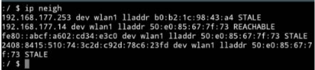
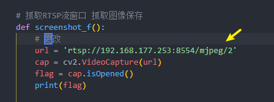

# 2023.04.21
ESP32-cam烧录RTSP流的代码，查看相应的ip，访问对应的rtsp视频流地址

安卓手机打开终端模拟器输入命令：`ip neigh`


查看手机热点 根据IPV6的地址判断哪个属于ESP32-cam，可以利用potplayer或者VLC客户端访问相应的rtsp视频流地址

```
rtsp://192.168.177.253:8554/mjpeg/2
```


如果能够成功访问，则将对应的服务器 ip 更改，以便接下来进行图像帧的抓取和yolo算法识别


python服务器启动一直等待 关键字符串“1”的消息到来 ，触发一连串的动作将识别的信息发布出去；

并将识别画面的图像信息在Django的work页面进行引用；

Django的work页面截止-2023.04.20 加入了发布关键字符串“1”的消息，也能请求识别 并将识别带有标记框的页面再次刷新后更新出来
这里有几点需要说明：
1. 其实是可以请求不带有识别框的画面帧的 但是为了增加工作量 我直接选择了请求带有识别信息的，如果是不带有识别信息的 也可以将Django的work页面发布的消息改为其他的字符串，比如“2”，之后在python服务器代码中 加入字符串的判断，少调用一些函数 ，直接返回抓拍的图像就行了（也就是不调用yolo函数）
2. 可以选择优化的地方：Django的work页面中，每次我刷新或者重新点击这个work页面的按钮，都会在Django的view函数重新发布消息，但是我请求之后还要再点击一次 ，图像才能刷新，但是这样第二次想刷新上一次的图像的时候，又会发布主题消息，多了一次请求。 但是问题不是很大。


# 2023.04.21 
语音播报成功实现
组合播报前方（yolo识别之后的）发来的8位字符，比如：00000000


