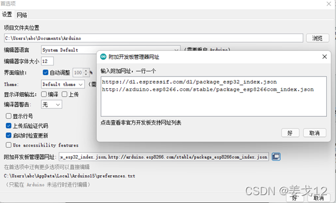
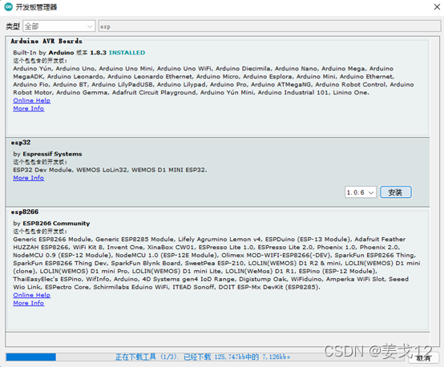
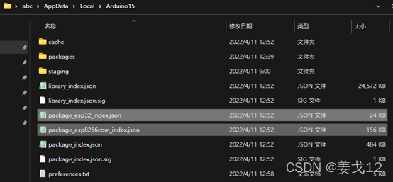
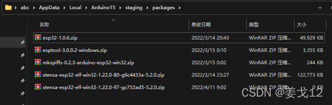
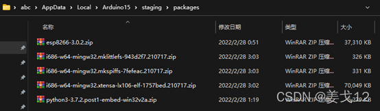
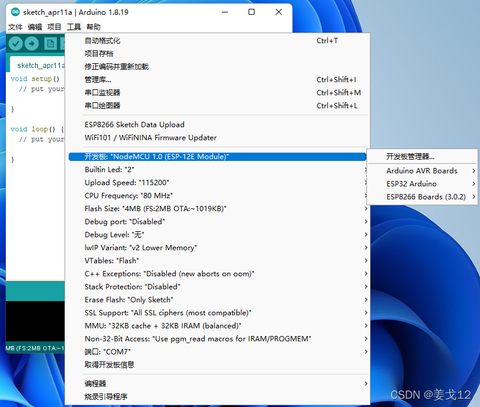
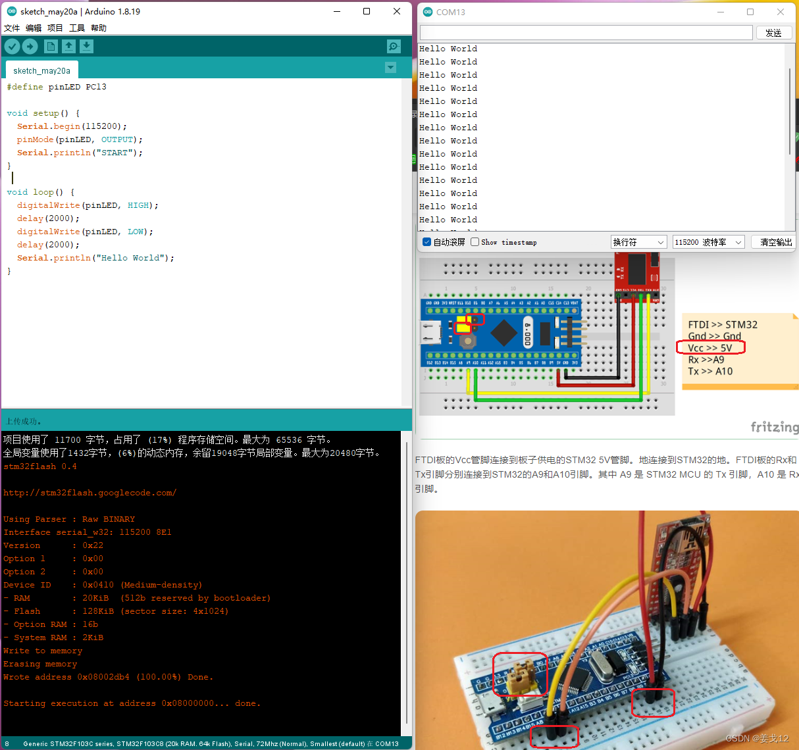
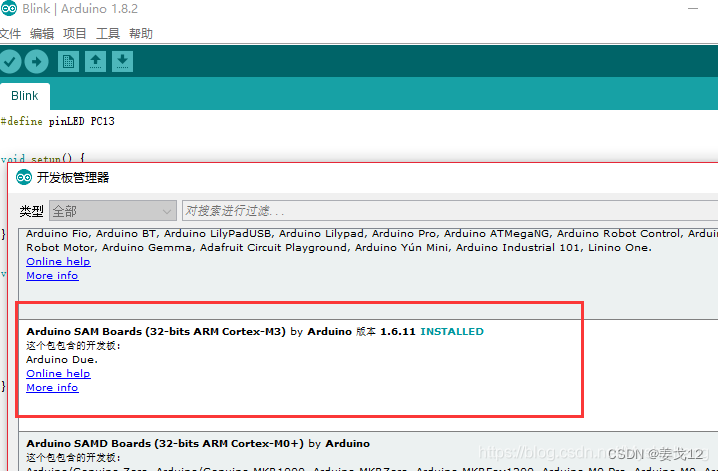
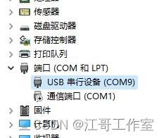

# Arduino 同时支持 ESP8266 / ESP32 / ESP32-C3 / STM32

Arduino IDE 安装 ：                                               

[Arduino](https://so.csdn.net/so/search?q=Arduino&spm=1001.2101.3001.7020).cc 下载 zip 包，解压到 D：的某个位置，然后后关联 .ino 即可。_这个非必须，喜欢安装版的就去装吧，个人不喜欢用安装版，因为以后重装系统 IDE 不受影响，这zip版可以看为“准绿色版”，也可以多版本共存，几年用下来没什么不适。_

运行一次 IDE 先， 可以看到官方支持的很多[开发板](https://so.csdn.net/so/search?q=%E5%BC%80%E5%8F%91%E6%9D%BF&spm=1001.2101.3001.7020)都可以选择了，但是没有ESP。

此时，可以看到 IDE 首次运行自动创建了两个目录（ abc 为 windows用户名）。

```erlang
%LOCALAPPDATA%\Arduino15
%userprofile%\documents\Arduino\libraries
```

_之所以前面称“准绿色版”，就是重装系统时，需要把这两个目录里面所有内容备份到 D盘，装完系统后再恢复回去，完成开发环境的恢复。_

还有个sketch 默认保存目录，一般立即修改为D盘某处，避免重装时忘记备份而。。。

也有人不关心这些，那是对windows很有信心，电脑也用不坏的人。

添加 ESP8266 / ESP32 开发板同时支持：          

找到--首选项--附加开发板管理器网址—**最右边的小按钮**—这里添加两行。如果不是添加两行，只在按钮前粘贴一行，那么就是“猴子掰玉米”，只能保留一个的支持。。。被坑了很久。

```cobol
https://dl.espressif.com/dl/package_esp32_index.json
http://arduino.esp8266.com/stable/package_esp8266com_index.json
```



开发板管理器 搜 esp， 可以看到下图 **两个开发板同框**。      



如果网络能够访问 github，**依次**安装即可（不能同时），后面不用看了。

如果网络不能访问 github，或网速过慢，先点一个的安装，看到下载开始或出错就点另外一个安装。

这两次并没有真的安装环境，但是准备好了需要的目录结构。

 

如果其他地方下载的安装包里有下图这些zip文件（一个字符都不能错），那么放到对应位置，上面的安装步骤即可在校验文件之后继续。注意不同的开发板环境的版本，对应的文件版本也不同，即使同一开发板环境版本，个别文件也有可能更新，上图的两个json文件里面有对应的文件下载列表。

ESP32-1.0.6 需要 4 个文件，下图第四个因为版本更新在线下载了新版，截图时没有删除



ESP8266-3.0.2 需要 5 个文件

 

最后的效果图：



ESP32-C3 支持                                     

C3 比较新，上面的步骤做出来，ESP32最高只能选到1.0.6。没有C3支持。 （如果IDE换到2.0倒是可以）

刚才测试了一下，把 “附加开发板管理器网址” 用 arduino.cn 提供的，可以下载到 ESP32-2.0.2 

[https://www.arduino.cn/package\_esp32\_index.json](https://www.arduino.cn/package_esp32_index.json "https://www.arduino.cn/package_esp32_index.json")

下面是我打的包，是整个 arduino15 目录 ， 如仔细看上面的而文字应该找到放哪里的 。

把这目录放到 C:\\Users\\abc\\AppData\\Local\\ 里面 ，立即可用，不需要去安装开发板了。[奶牛快传 | ESP32+ESP2866https://cowtransfer.com/s/f8263046a3f141](https://cowtransfer.com/s/f8263046a3f141 "奶牛快传 | ESP32+ESP2866")  

  STM32 支持                                       

1.  github 搜 arduino\_stm32, 有多个相同的， 选时间最近的即可， 解压到 arduinoIDE的目录的 hardware下面。

2.  安装下图这个开发板，会自动安装到 arduino15 目录 

3.  具体百度下有很多详细文章可参考





上图接线为串口下载方式，实测有些折腾：下载时需要先跳线并按一次复位才能开始下载程序，下载后不用按键能够自动开始执行程序；但是，复位后如不把跳线跳回去则进入下载等待，不会执行程序。

翻出之前买的 ST-Link v2， 下载程序方便多了，任何情况强制下载程序，不用跳线和复位，掉电也自动执行程序，不过。。。不带串口功能。只用 OLED TFT 的程序首选。

据说 J-Link 是最好的，暂时没有，没法测试。

\----------------------------------------------------------------------------------------------------------

**注意**：在 arduino里 ，STM 默认串口 居然是虚拟USB串口，需要在windows装其驱动才能使用，不能用于下载。下载连接的 PA9 PA10 是 硬件串口1 ，  **Serial****1.begin()**    这样用，这点很多资料包括例程都没说清楚，一上来就是 Serial.begin()，我把图上几个串口都接了遍，都没看到输出，坑我好久，实在没法干脆把 I2C OLED 调试好，不用串口看数据 。

另外还有 硬件串口2 、硬件串口3 可用。

这样看来，想一条USB线插上后和UNO一样的方便是不太可能了。

不想做选择题，干脆把 ST-Link v2  串口  同时接上（串口可以不接电源线，只多两条 Rx Tx 到 PA9 PA10）。勉强做到UNO的体验，随时点击下载。某些 串口调试 和 下载 都比较频繁时可以这么干，不就多两条线嘛。

测试了一下波特率上限，Ch340可以支持到3000000，CP2102x 只能到921600。

附一个 STM32 的文章，不是 Arduino 环境，不过启动模式这些写得还算清楚。

[如何使用串口来给STM32下载程序 - 走看看 (zoukankan.com)http://t.zoukankan.com/whik-p-10567287.html](http://t.zoukankan.com/whik-p-10567287.html "如何使用串口来给STM32下载程序 - 走看看 (zoukankan.com)")

对了，还有一个 bootloader 模式，不过上面的测试已经能够上传程序了，就没去实验。 STM32对我只是验证一些特定的程序而已，不会大量用， 毕竟追求功能性能 ESP32便宜又大碗。

\----------------------------------------------------------------------------------------------------------

2022-12-06 更新：

上面关于串口这段是当时的总结，现在看来是有错漏的。

STM32F103C8T6 这个核心板，也叫Bluepill。

板上有一个usb接口，但是不能直接用于烧录/下载程序。

我用 ST-Linkv2 接SW口，下载程序比较方便。

如有遇到下载错误（遇到好几次了），可以按住复位键后再点下载，再放开。

在Keil环境，如果写入 VCP 例程， 板载USB口就可以用了。

Arduino  更简单，用 Serial.begin()就行了。上传完程序windows10会自动检测到硬件并装好驱动。有意思的是这个虚拟USB串口可以适配任意波特率，原理未查到。

