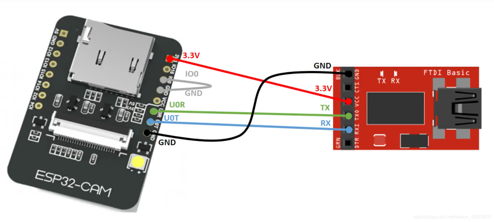

# ESP32-CAM 摄像头学习_墨客inkor的博客-CSDN博客

### 目录

*   *   [Arduino环境配置](#Arduino_1)
    *   [硬件连接](#_12)
    *   [程序修改](#_15)

## [Arduino](https://so.csdn.net/so/search?q=Arduino&spm=1001.2101.3001.7020)环境配置

首先我们要先去下载Arduino，大家可以去官网下，也可以在Arduino中文社区进行下载，这是中文社区网址https://www.arduino.cn/。  
下载好软件之后，打开软件，点击工具—管理库，搜索[esp32](https://so.csdn.net/so/search?q=esp32&spm=1001.2101.3001.7020)，进行安装  
  
如果没有搜到的话，就转到文件—首选项，将https://dl.espressif.com/dl/package\_esp32\_index.json和http://arduino.[esp8266](https://so.csdn.net/so/search?q=esp8266&spm=1001.2101.3001.7020).com/stable/package\_esp8266com\_index.json添加进去，然后再搜索，应该就能搜到了  
  
在安装完库之后，选择工具—开发板，选择如图开发板（可能不一样，根据个人情况进行选择）  
  
之后再打开文件—示例，找到如图的实例，如果没找到说明库没安装正确  
  
如果你成功的打开了示例，那么就可以进行下一步了。

## 硬件连接

  
你可以使用FTDI与ESP32进行连接，如果你手头上没有的话，实测使用USB转TTL也可以正常烧录，需要注意的是烧程序的时候IO0一定要和GND短接，不然无法烧录，烧录结束需要将线移去，这个之后会讲。

## 程序修改

需要修改的地方有两处，第一你需要把CAMERA\_MODEL\_AI\_THINKER宏定义的屏蔽给去掉，把语句前面的//给去掉就行，还有就是你需要将ssid =后面字符串的改为你电脑现在连接的wifi名称，password =后面的改为wifi密码  
  
然后将你的FTDI或者USB转TTl与电脑相连，再点击工具，将设置改为我的设置，注意：你的端口不一定是COM8。  
  
然后就可以点击箭头烧程序了，注意：这个时候IO0一定要和GND短接  
当出现Connecting时，需要你按一下ESP32上的开关程序才能进行烧录  
  
等待程序烧录完成，将IO0和GND短接的杜邦线取下来，然后打开串口监视器  
将波特率设为115200，然后按一下ESP32上的按钮，过一会就会生成IP地址  
  
进入浏览器，打开地址，点击Start Steam即可看到图像  
  
在视频传输的过程中，ESP32也会通过串口发送视频帧率等信息，可在串口监视器中查看  
在程序烧录完成后只需连接ESP32的+5V和GND即可进行远程图传