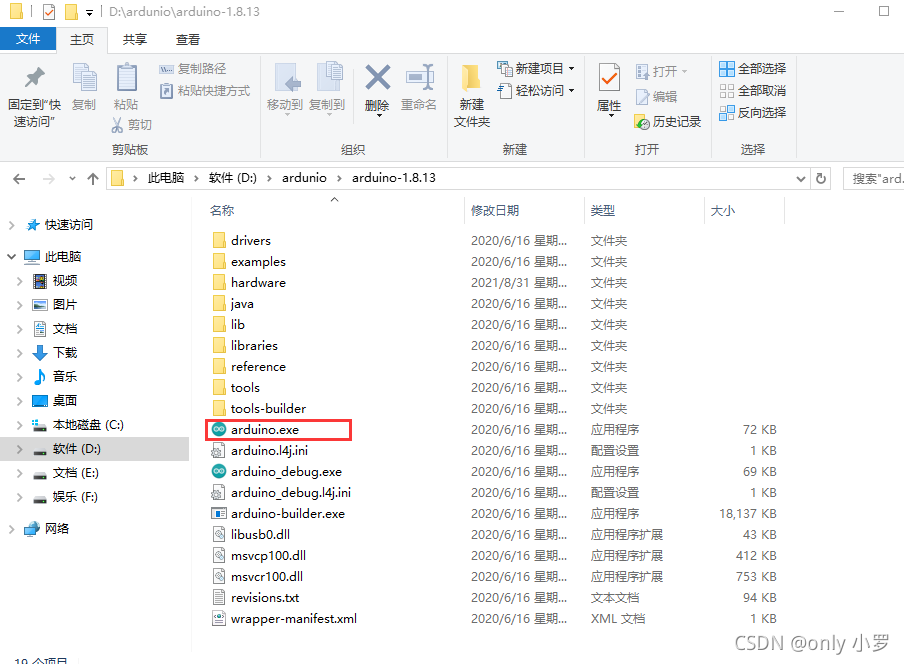
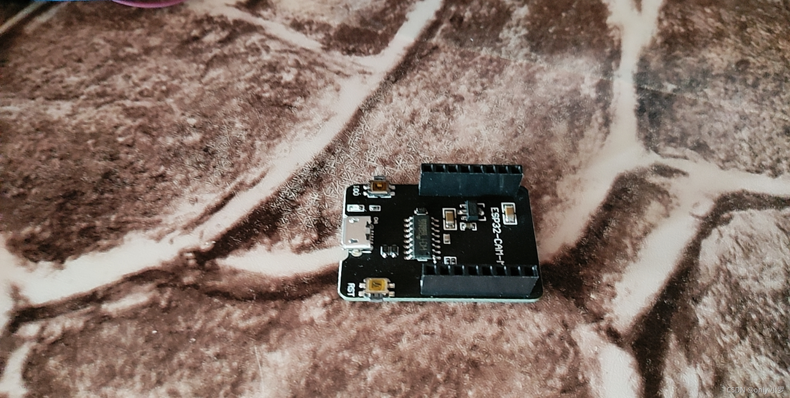
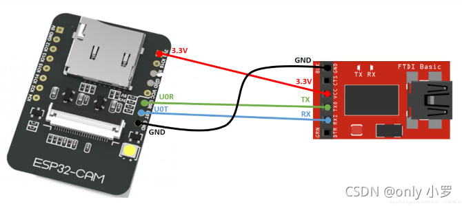
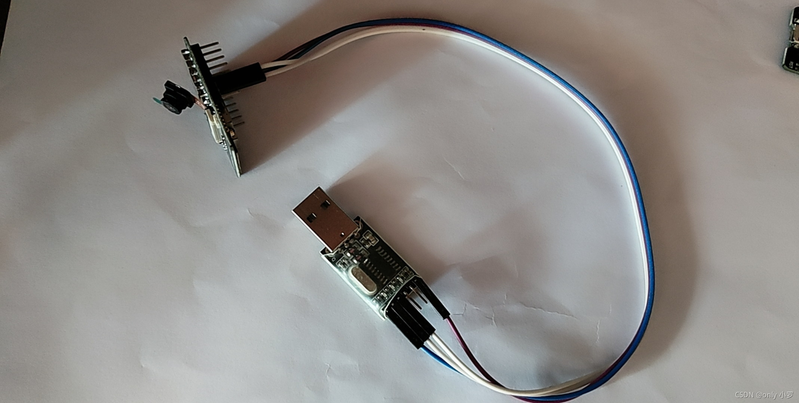
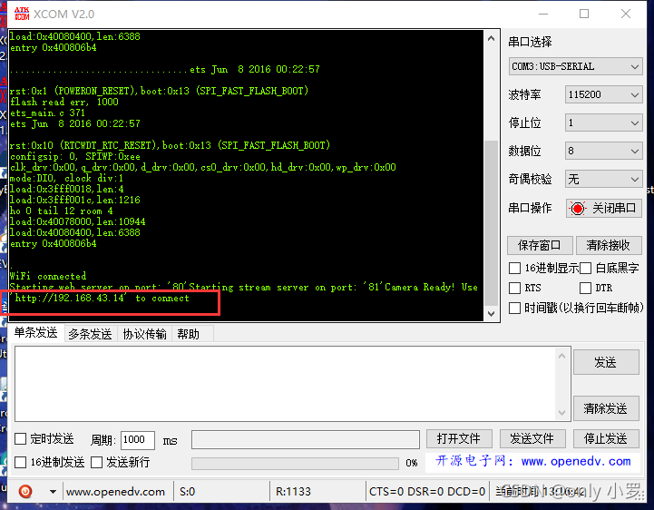
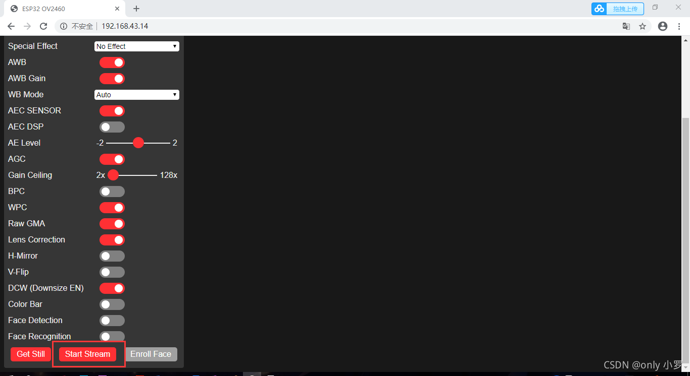
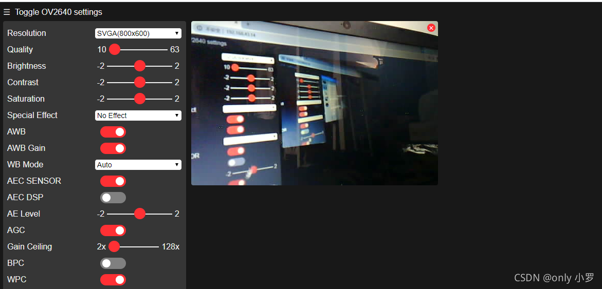

# ESP32_CAM使用注意事项（小白上手）

**ESP32\_CAM使用注意事项（纯小白上手！！！）**  
买了一个esp32\_cam的板子，最近想着测试一下，所以开始搞了搞，遇到一些问题，都得到了解决，这里记录一下我所遇到的问题，供大家参考。

串口打印这一串东西：  
\[E\]\[camera.c:1113\] camera\_probe(): Detected camera not supported.  
\[E\]\[camera.c:1379\] esp\_camera\_init(): Camera probe failed with error 0x20004

# 一、使用工具

1.ESP32\_CAM开发板一个；  
2.usb\_ttl串口通信模块一个；  
3.ESP32\_CAM烧录底座一个（可以不使用）；  
4.几根杜邦线；  
5.arduino开发软件；

# 二、上手操作

1.IDE安装包点这里https://pan.baidu.com/s/19UH0ONY7NcQ1vYw8c2-f3g  
提取码：abcd  
2.安装步骤简单解压后找到exe执行文件可以了。  
  
3.打开软件后，安装[esp32](https://so.csdn.net/so/search?q=esp32&spm=1001.2101.3001.7020)库及程序下载步骤可以参考这篇文章  
https://blog.csdn.net/akk41397/article/details/106419396/

# 注意事项

1.这里我使用的是直接能下载的模块，不用向USB\_TTL模块那样要让开发板IO0接地，这个模块省去了懒人不想接线的麻烦，正好适合我（当然使用USB\_TTL模块也能够较为方便的下载）；  

2._**这个模块只能下载程序使用，运行程序是不能使用的，因为这个模块默认把IO0接地了，模块左边的IO0按键并没用什么用处，按不按下都是接地状态**_（就是因为这个错误导致我这个小白测试了几个晚上都无法使用，还以为这个模能够的将IO0自动在高低电平间切换）**（这个注意事项是我写本篇文章主要想说的地方）**。

3.使用完本模块拷玩程序后拔掉模块，将模块按照下面的图片接线顺序接好就可以使用了。

  
接好线后的样子：  
选择好对应的端口号打开，然后再按一下开发板的rst复位按键就可以使用了，网址出来以后在浏览器中打开即可\*\*（建议使用谷歌浏览器，这里也是一个小坑，我开始使用的360浏览器，但是打开网站后不能够运行）\*\*  
  
点击start stream运行即可（Special Effect这一栏可以选择视频大小）  

这是运行的效果\[开始套娃\]  
  
_**第一次写文章，欢迎大家指出不对的地方。**_