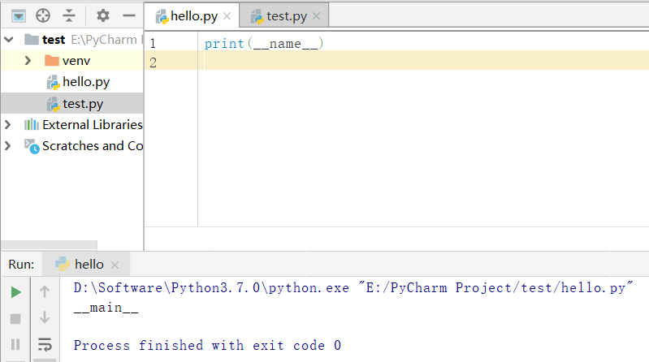
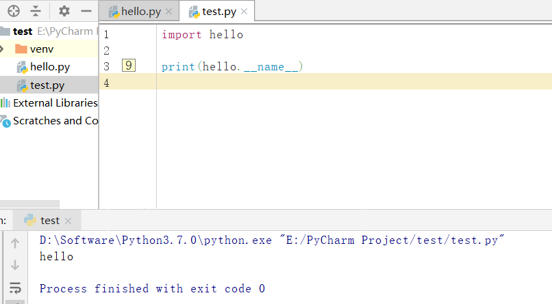

# Python中“if __name__=='__main__':”详细解析

### 引言

学过Java、C、C++的程序员应该都知道，每次开启一个程序，都必须写一个主函数作为程序的入口，也就是我们常说的main函数。如下所示， **main()就是Java中的一个main函数。**

```java
public class HelloWorld {

    public static void main(String[] args) {

        System.out.println("HelloWorld");

    }

}
```

与Java、C、C++等几种语言不同的是，**Python是一种解释型脚本语言**，在执行之前不同要将所有代码先编译成中间代码，Python程序运行时是从模块顶行开始，逐行进行翻译执行，所以，最顶层（没有被缩进）的代码都会被执行，所以Python中并不需要一个统一的main()作为程序的入口。在某种意义上讲，“if \_\_name\_\_==’\_\_main\_\_:”也像是一个标志，象征着Java等语言中的程序主入口，告诉其他程序员，代码入口在此——这是“if \_\_name\_\_==’\_\_main\_\_:”这条代码的意义之一。

### 1\. \_\_name\_\_的理解

1.1 为什么使用\_\_name\_\_属性？

Python解释器在导入模块时，会将模块中<span style="background:#ff4d4f">没有缩进的代码全部执行一遍</span>（模块就是一个独立的Python文件）。开发人员通常会在模块下方增加一些测试代码，为了避免这些测试代码在模块被导入后执行，可以利用\_\_name\_\_属性。

1.2 \_\_name\_\_属性。

\_\_name\_\_属性是Python的一个内置属性，记录了一个字符串。

*   <span style="background:#ff4d4f">若是在当前文件，\_\_name\_\_ 是\_\_main\_\_。</span>
*   在hello文件中打印本文件的\_\_name\_\_属性值，显示的是\_\_main\_\_



*   若是导入的文件，\_\_name\_\_是模块名。
*   test文件导入hello模块，在test文件中打印出hello模块的\_\_name\_\_属性值，显示的是hello模块的模块名。



因此\_\_name\_\_ == '\_\_main\_\_' 就表示在当前文件中，可以在if \_\_name\_\_ == '\_\_main\_\_':条件下写入测试代码，如此可以避免测试代码在模块被导入后执行。

### 2\. 模块导入

我们知道，当我们把模块A中的代码在模块B中进行import A时，只要B模块代码运行到该import语句，模块A的代码会被执行。

模块A：

```plain
# 模块A

a = 100

print('你好，我是模块A……')

print(a)
```

模块B：

```plain
# 模块B

from package01 import A

b = 200

print('你好，我是模块B……')

print(b)
```

运行模块B时，输出结果如下：

```plain
你好，我是模块A……
100
你好，我是模块B……
200
```

如果在模块A中，我们有部分的代码不想在被导入到B时直接被运行，但在直接运行A时可直接运行，那该怎么做呢？那就可以用到“if \_\_name\_\_==’\_\_main\_\_:”这行代码了，我们队上面用到的A模块代码进行修改：

A模块代码修改为：

```plain
# 模块A

a = 100

print('你好，我是模块A……')

if __name__=='__main__':

    print(a)
```

B模块不做修改，直接执行B模块，输出结果如下：

```plain
你好，我是模块A……
你好，我是模块B……
200
```

看到了吗，A模块中的a的值就没有再被输出了。所以，当你要导入某个模块，但又不想改模块的部分代码被直接执行，那就可以这一部分代码放在“if \_\_name\_\_=='\_\_main\_\_':”内部。

## 3\. **“\_\_name\_\_”与“\_\_main\_\_”**

看到现在也许心中还是疑惑，那么现在我们来说一说“if\_\_name\_\_=='\_\_main\_\_':”的原理。

“\_\_name\_\_”是Python的内置变量，用于指代当前模块。我们修改上面用到的A模块和B模块，在模块中分别输出模块的名称：

模块A：

```plain
# 模块A

print('你好，我是模块A……')

print('模块A中__name__的值：{}'.format(__name__))

print('-------------------------')
```

模块B：

```plain
# 模块B

from package01 import A

print('你好，我是模块B……')

print('模块B中__name__的值：{}'.format(__name__))
```

执行A模块时，输出结果：

```plain
你好，我是模块A……
模块A中__name__的值：__main__
-------------------------
```

执行B模块时，输出结果：

```plain
你好，我是模块A……
模块A中__name__的值：package01.A
-------------------------
你好，我是模块B……
模块B中__name__的值：__main__
```

发现神奇之处了吗？当哪个模块被直接执行时，该模块“\_\_name\_\_”的值就是“\_\_main\_\_”，当被导入另一模块时，“\_\_name\_\_”的值就是模块的真实名称。用一个类比来解释一下：记得小时候要轮流打算教室，轮到自己的时候（模块被直接执行的时候），我们会说今天是“我”（\_\_main\_\_）值日，称呼其他人时，我们就会直接喊他们的名字。所以，“\_\_main\_\_”就相当于当事人，或者说第一人称的“我”。

所以，当运行“if \_\_name\_\_=='\_\_main\_\_':”语句时，如果当前模块时被直接执行，\_\_name\_\_的值就是\_\_main\_\_，条件判断的结果为True，“if \_\_name\_\_=='\_\_main\_\_':”下面的代码块就会被执行。

[\[1\]](#ref_1)[\[2\]](#ref_2)

## 参考

1.  [^](#ref_1_0)Python中“if \_\_name\_\_=='\_\_main\_\_':”理解与总结 [https://www.cnblogs.com/chenhuabin/p/10118199.html](https://www.cnblogs.com/chenhuabin/p/10118199.html)
2.  [^](#ref_2_0)if \_\_name\_\_ == '\_\_main\_\_': [https://www.cnblogs.com/wanao/p/13098783.html](https://www.cnblogs.com/wanao/p/13098783.html)