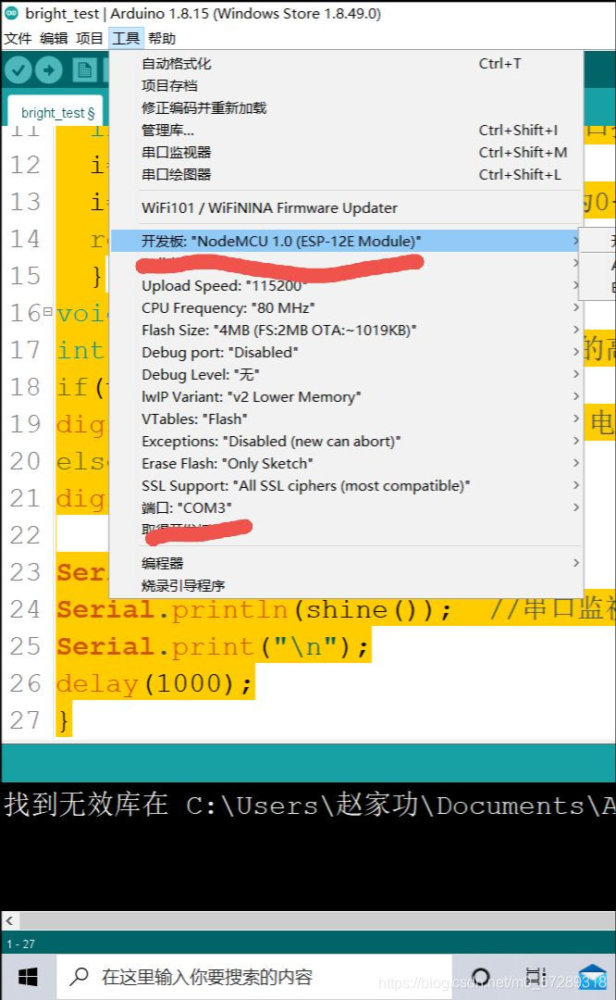

用esp8266nodemcu+光照传感器实现室内亮度变暗时esp8266自带led灯亮 （身边没有其他的led灯）
# 前些天学习[arduino](https://so.csdn.net/so/search?q=arduino&spm=1001.2101.3001.7020)编程时做的一个简单的小玩意，以后会进一步将这个项目增加更多的功能，这个是入门，接下来讲解一下项目的过程

首先，用到一个esp8266nodemcu开发板，arduinoIDE软件，跳线若干，还需要加一个四个引脚的光照传感器（可以输出光照强度模拟量）  
看到这个文章的小伙伴建议去b站或者其他博主哪里去学习配置好arduino的环境，光照传感器没有特殊的库函数，不需要下载多余的库函数，arduino上自带的就可以

那么我们直接来上代码

```c
int LED = LED_BUILTIN;//定义esp8266内置的led灯
void setup() {               
  Serial.begin(115200);   //定义波特率 
 pinMode(LED,OUTPUT);
pinMode(D2,INPUT); //将光感DO口接到D2
      
}

int shine()
{
  int i=analogRead(A0);//光感模拟口接esp8266AO口
  i=1023-i;
  i=i/10.23-1;   //将光照强度设置为0-99
  return i;
  }
void loop() {
int v=digitalRead(D2);  //读出D2的高低电平赋值给v
if(v==0)
digitalWrite(LED,HIGH);//当DO输出电平时，控制内置led亮灭
else
digitalWrite(LED,LOW);

Serial.print("光照强度： ");
Serial.println(shine());  //串口监视器显示光照强度
Serial.print("\n");
delay(1000);
}
```

在代码的注释下我们很容易的找到[esp8266](https://so.csdn.net/so/search?q=esp8266&spm=1001.2101.3001.7020)与光照传感器的对应的接口

在这里顺便提供一下接口的编号  
  
那么我们开始具体的步骤

* * *

1.  打开arduinoIDE写入代码，编译上传，烧录程序  
    2.  
    注意自己的开发板选择正确的型号

2.硬件连接

我们的光照传感器有四个引脚： vcc（电源），gnd（接地），AO（光照强度模拟量），DO（数字量）。

vcc和gnd分别接在esp8266的 3.3v和Gnd上  
DO口接在 ESP8266的D2口上  
AO口接在esp8266的AO口上


  


最后还有几点，代码中的这一部分

```c
int shine()
{
  int i=analogRead(A0);//光感模拟口接esp8266AO口
  i=1023-i;
  i=i/10.23-1;   //将光照强度设置为0-99
  return i;
  }
```

esp8266模拟口接收到的范围为0-3.3v，但是这个引脚有十位的分辨率，也就是2的十次方，我们可以或者0到1023之间的值，所以这段代码是把光照强度范围设定为0-99

其次 模块在环境光线亮度达不到设定阈值（过暗）时，D0输出高电平，反之，低电平。  
那么怎么设定阈值呢？？？？  
  
拿螺丝刀调这个电位器，具体怎么调，自己摸索吧！！！