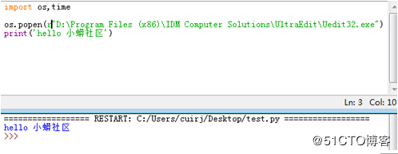
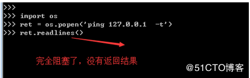
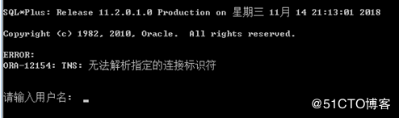

# [638]python os.popen() 方法

### 概述

os.popen() 方法用于从一个命令打开一个管道。  
在Unix，Windows中有效

### 语法

popen()方法语法格式如下：

```
os.popen(command[, mode[, bufsize]])
```

### 参数

*   command – 使用的命令。
*   mode – 模式权限可以是 ‘r’(默认) 或 ‘w’。
*   bufsize – 指明了文件需要的缓冲大小：0意味着无缓冲；1意味着行缓冲；其它正值表示使用参数大小的缓冲（大概值，以字节为单位）。负的bufsize意味着使用系统的默认值，一般来说，对于tty设备，它是行缓冲；对于其它文件，它是全缓冲。如果没有改参数，使用系统的默认值。

### 返回值

返回一个文件描述符号为fd的打开的文件对象

### 实例

以下实例演示了 popen() 方法的使用：

```
#!/usr/bin/python3
import os, sys

# 使用 mkdir 命令
a = 'mkdir nwdir'
b = os.popen(a,'r',1)
print (b)
```

执行以上程序输出结果为：

```
open file 'mkdir nwdir', mode 'r' at 0x81614d0
```

* * *

[python](https://so.csdn.net/so/search?q=python&spm=1001.2101.3001.7020)调用Shell脚本，有两种方法：os.system()和os.popen(),  
前者返回值是脚本的退出状态码，后者的返回值是脚本执行过程中的输出内容

假定有一个shell脚本test.sh：

```
song@ubuntu:~$ vi test.sh
#!/bin/bash
echo 'hello python!'
echo 'hello world!'
exit 1
```

os.system(command)：该方法在调用完shell脚本后，返回一个16位的二进制数，低位为杀死所调用脚本的信号号码，高位为脚本的退出状态码，即脚本中“exit 1”的代码执行后，os.system函数返回值的高位数则是1，如果低位数是0的情况下，则函数的返回值是0x0100,换算为十进制得到256。

要获得os.system的正确返回值，可以使用位移运算（将返回值右移8位）还原返回值：

```
>>> import os
>>> os.system("./test.sh")
hello python!
hello world!
256
>>> n=os.system("./test.sh")
hello python!
hello world!
>>> n
256
>>> n>>8
1
>>> 
```

os.popen(command):这种调用方式是通过管道的方式来实现，函数返回一个file对象，里面的内容是脚本输出的内容（可简单理解为echo输出的内容），使用os.popen调用test.sh的情况：

```
>> import os
>>> os.popen("./test.sh")
<open file './test.sh', mode 'r' at 0x7f6cbbbee4b0>
>>> f=os.popen("./test.sh")
>>> f
<open file './test.sh', mode 'r' at 0x7f6cbbbee540>
>>> f.readlines()
['hello python!\n', 'hello world!\n']
>>> 
```

像调用”ls”这样的shell命令，应该使用popen的方法来获得内容，对比如下：

```
>>> import os
>>> os.system("ls")   #直接看到运行结果
Desktop    Downloads     Music     Public     Templates  Videos
Documents  examples.desktop  Pictures  systemExit.py  test.sh
0    #返回值为0，表示命令执行成功
>>> n=os.system('ls')
Desktop    Downloads     Music     Public     Templates  Videos
Documents  examples.desktop  Pictures  systemExit.py  test.sh
>>> n
0
>>> n>>8   #将返回值右移8位，得到正确的返回值
0
>>> f=os.popen('ls') #返回一个file对象，可以对这个文件对象进行相关的操作
>>> f
<open file 'ls', mode 'r' at 0x7f5303d124b0>
>>> f.readlines()
['Desktop\n', 'Documents\n', 'Downloads\n', 'examples.desktop\n', 'Music\n', 'Pictures\n', 'Public\n', 'systemExit.py\n', 'Templates\n', 'test.sh\n', 'Videos\n']
>>> 
```

os.popen（）可以实现一个“管道”，从这个命令获取的值可以继续被使用。因为它返回一个文件对象，可以对这个文件对象进行相关的操作。

* * *

### 知识点梳理

1．  返回值是文件对象

注意：**返回值是文件对象**，既然是文件对象，使用完就应该关闭，对吧？！不信网上搜一下，一大把文章提到这个os.popen都是忘记关闭文件对象的。 所以，推荐的写法是：

```
with os.popen(command, "r") as p:
    r = p.read()
```

至于with的用法就不多讲了，使用它，不需要显式的写p.close()。

2．  非阻塞

通俗的讲，非阻塞就是os.popen不会等cmd命令执行完毕就继续下面的代码了，不信？！看下面代码实例：



从上面实例可知，os.popen执行打开Uedit32.exe这个工具，但从实际执行结果看，Uedit32.exe还没打开，就直接进入了下一条语句，打印了“hello 小蟒社区”。在某些应用场景，可能这并不是你期望的行为，那如何让命令执行完后，再执行下一句呢？

处理方法是使用read()或readlines()对命令的执行结果进行读操作。

3．  完全阻塞

上面写了该函数是非阻塞的，现在怎么又变成完全阻塞的呢？感觉一头雾水了吧。本质上os.popen是非阻塞的，为了实现阻塞的效果，我们使用read()或readlines()对命令结果进行读，由此产生了阻塞的效果。但是，如果你的命令执行无法退出或进入交互模式，这种“读”将形成完全阻塞的情况，表现的像程序卡住了。

看下面代码实例1：



os.popen执行了ping  127.0.0.1  -t 该命令会一直执行，除非CTRL+C强制退出，因而，执行readlines读取命令输出时会造成卡住。

代码实例2：

使用os.popen执行sqlplus命令对数据库进行操作的场景，如果sqlplus执行失败，会进入交互模式，如图所示，此时使用readlines()读取执行结果时也会卡死，效果如上图：



总结

os.popen()在大多数场景都是挺好用方便的，但是也有坑！！ 具体应用中，需要注意下。

建议：  
1. 在需要读取命令执行结果时，避免在命令无法退出或进入交互模式的场景应用os.popen;

2.os.popen()无法满足需求时，可以考虑subprocess.Popen();

参考：https://www.runoob.com/python/os-popen.html  
https://blog.csdn.net/fanren224/article/details/84828162  
https://blog.51cto.com/2681882/2317053

文章知识点与官方知识档案匹配，可进一步学习相关知识

[Python入门技能树](https://edu.csdn.net/skill/python/python-3-131?utm_source=csdn_ai_skill_tree_blog)[基本技能](https://edu.csdn.net/skill/python/python-3-131?utm_source=csdn_ai_skill_tree_blog)[操作系统和环境](https://edu.csdn.net/skill/python/python-3-131?utm_source=csdn_ai_skill_tree_blog)269741 人正在系统学习中