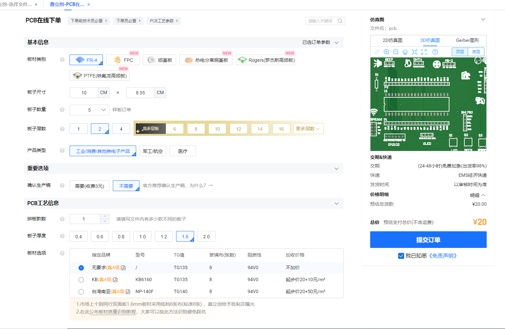
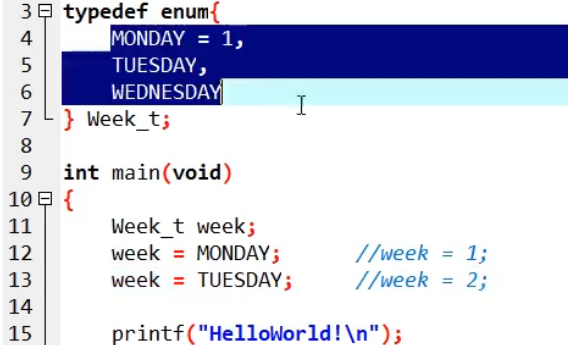
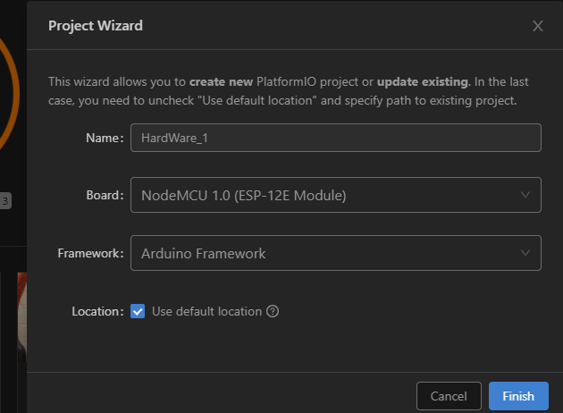
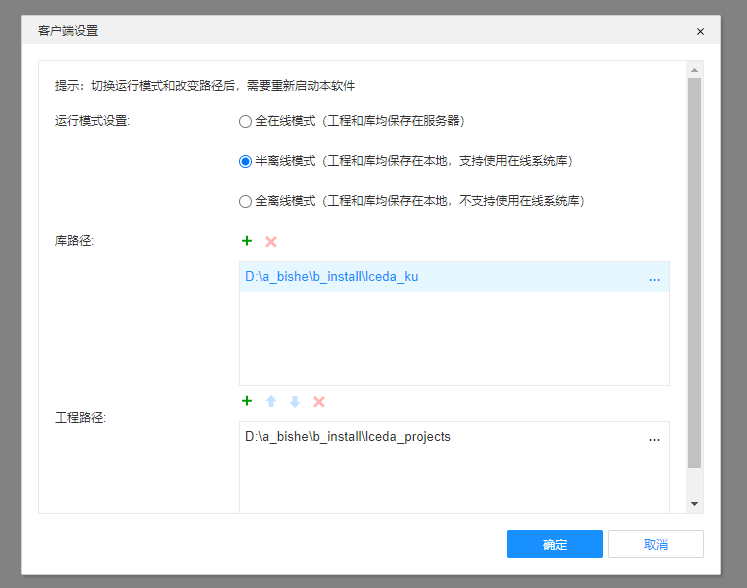

# 【视频教程】
[《STM32F103C8T6快速入门》（第一阶段）使用具体芯片型号：stm32f103C8T6，以最小的成本零基础快速学习STM32单片机（完结）_哔哩哔哩_bilibili](https://www.bilibili.com/video/BV1Gb4y1m7kt/?spm_id_from=333.337.search-card.all.click&vd_source=055c0f614d8dec2c3bf7aff0db5e54cb)

# 【上手】快速上手
## 基础知识
### C8T6 与 ST-link的连接
四条对应相连即可
ST-Link的引脚含义在表面就有标注  


然后只要将名字相同的引脚用杜邦线连接起来就可以了（我用的是4根杜邦线就够）  
需要注意的是：有可能电脑的某个USB接口不可以使用，这时候就需要换一个USB接口


### 系统结构图


### STM系列命名规范
[STM32系列芯片命名规则——简明_Liam_AI的博客-CSDN博客_stm32命名规则](https://blog.csdn.net/ST_Liam/article/details/108922753)


### 在线安装支持芯片包（离线）


### 安装驱动 安装目录自带
STlink驱动


Jlink驱动


USB转串口驱动【CH340驱动】


百度网盘江科大文件夹有CH340的驱动


安装成功后


## 片上外设


### I²C
I²C（Inter-Integrated Circuit）是内部整合电路的称呼，是一种串行通讯总线，使用多主从架构，由飞利浦公司在1980年代为了让主板、嵌入式系统或手机用以连接低速周边装置而发展。I²C（读作"I-squared-C" ），还有可选的拼写方式是I2C（读作I-two-C）以及IIC（读作I-I-C），在中国则多以"I方C"称之。  
　　 I2C（Inter－Integrated Circuit）总线是由PHILIPS公司开发的两线式串行总线，用于连接微控制器及其外围设备。是微电子通信控制领域广泛采用的一种总线标准。它是同步通信的一种特殊形式，具有接口线少，控制方式简单，器件封装形式小，通信速率较高等优点。I2C 总线支持任何IC 生产过程(CMOS、双极性）。通过串行数据（SDA）线和串行时钟 （SCL）线在连接到总线的器件间传递信息。每个器件都有一个唯一的地址识别（无论是微控制器——MCU、LCD 驱动器、存储器或键盘接口），而且都可以作为一个发送器或接收器（由器件的功能决定）。LCD 驱动器只能作为接收器，而存储器则既可以接收又可以发送数据。除了发送器和接收器外，器件在执行数据传输时也可以被看作是主机或从机（见表1）。主机是初始化总线的数据传输并产生允许传输的时钟信号的器件。此时，任何被寻址的器件都被认为是从机。  
　　特征：  
　　1、只要求两条总线线路：一条串行数据线SDA，一条串行时钟线SCL；  
　　2、每个连接到总线的器件都可以通过唯一的地址和一直存在的简单的主机/从机关系软件设定地址，主机可以作为主机发送器或主机接收器；  
　　3、它是一个真正的多主机总线，如果两个或更多主机同时初始化，数据传输可以通过冲突检测和仲裁防止数据被破坏；  
　　4、串行的8 位双向数据传输位速率在标准模式下可达100kbit/s，快速模式下可达400kbit/s，高速模式下可达3.4Mbit/s；  
　　5、连接到相同总线的IC 数量只受到总线的最大电容400pF 限制。

## 创建工程
基于寄存器
基于库函数【标准库】
基于HAL库【很方便】

这个比较适合快速上手STM32的情况，但是这种方式隐藏了底层逻辑

**库函数位置**
D:\Desktop\stm32江科大\固件库\STM32F10x_StdPeriph_Lib_V3.5.0\STM32F10x_StdPeriph_Lib_V3.5.0\Libraries\CMSIS\CM3\DeviceSupport\ST\STM32F10x\startup\arm


那这些就是STM32的启动文件，STM32的程序就是从启动文件开始执行的


完整的内核寄存器和外围寄存器 刚才添加的是外围寄存器 


[[2-2] 新建工程_哔哩哔哩_bilibili](https://www.bilibili.com/video/BV1th411z7sn?p=4&spm_id_from=pageDriver&vd_source=055c0f614d8dec2c3bf7aff0db5e54cb)


### 默认自动复位并执行


### 仓库


### 创建之后添加文件


### 关于下载的两种连接方式


如果用串口下载 需要另外的串口下载工具 下载hex文件
但是如果我们用STlink 或者 官方的连接线就不用了  直接就是load就能下载进入hex文件到开发板当中。

### 关于注释中文出现？？


### 引入路径 .c .h


### C/C++ # if 0 语言注释

> 本文由 [简悦 SimpRead](http://ksria.com/simpread/) 转码， 原文地址 [blog.csdn.net](https://blog.csdn.net/weixin_39386156/article/details/90301133)

C/C++ 语言注释常的两种方法是：

①单行注释： //

②多行注释： /* …… */

今天学到了一种之前不熟悉的语言注释方法简单介绍一下，就是用 if 条件注释代码：

**# if 0 或 # if 1 注释：**

当想注释屏蔽掉大块代码段时，用 "/*…*/" 做大段注释，需要防止被注释掉的代码段中有[嵌套](https://so.csdn.net/so/search?q=%E5%B5%8C%E5%A5%97&spm=1001.2101.3001.7020)的 "/*…*/"，一旦出现 "/**/" 嵌套 "/**/" 的情况，有可能会导致你注释掉的代码区域并不是想要的区域范围。因此用 # if 0 要比使用 /* */ 要方便不少。

情况一：如有一段不想要的代码，可以直接用 "#if 0 ... # endif" 形式来注释，效果等同于 "/* */"

```
#if 0
 
    ...code...
 
#endif
```

情况二：选择结构的条件编译。如果常量为真（非 0），就执行程序段 1，否则执行程序段 2。

```
#if 常量
 
    ...code 1...
 
#else
 
    ...code 2...
 
#endif
```

情况三：嵌套情况。如果常量 a 为真（非 0），就执行程序段 1。当常量 a 为 0 且常量 b 为真时，执行程序段 2；当常量 a 为 0 且常量 b 为 0 时，执行程序段 3。

```
#if 常量a
 
　　  ...code 1...
 
#else
 
        #if 常量b
 
　　        ...code 2...
 
        #else
 
　　        ...code 3...
 
　　    #endif
 
#endif
```

试用之后发现比 /*…*/ 方法方便不少。


## 串口助手

### SSCOM V5.13.1使用方法


# 【软件】需要借助的设计软件
## AD PCB设计
[Altium Designer - PCB设计软件](https://www.altium.com.cn/altium-designer/)


## PCB板子打印
嘉立创下单助手PC端：[下载嘉立创客户端 (jlc.com)](https://www.jlc.com/home/appDownloadsWithConfig.html?init=pc&x=0.43233852339744827)
[下载嘉立创PCB下单客户端-嘉立创PCB打样专业工厂-线路板打样 (jlc.com)](https://www.jlc.com/portal/appDownloadsWithConfig.html?init=android)

账号注册：[深圳嘉立创科技集团股份有限公司-专业PCB厂家-PCB打样-PCB报价 (jlc.com)](https://www.jlc.com/?ui=jlc)
账号：17806187221
密码：ha *** 0

短信回馈：【嘉立创】感谢您注册为嘉立创客户，您的客户编号是5409231A，密码是h *** 0，建议定时更换密码，欢迎登录！

下单助手本地安装地址：D:\a_bishe\b_install\pcb嘉立创下单助手


### 下单截图



# 清单相关
## 发票抬头和税号

```
名称（抬头）：齐鲁工业大学
识别号：1237000049557147XT
```

发票的抬头，就是“购物人名称”。英译：invoice title。如自己购买，就写自己的名字。如单位购买，报销，就写单位名称。

纳税人识别号是税务登记证上的号码，通常简称为“税号”，每个企业的纳税人识别号都是唯一的。这个属于每个人自己且终身不变的数字代码很可能成为我们的第二张“身份证”。  


> [发票抬头和税号是指的什么？_百度知道 (baidu.com)](https://zhidao.baidu.com/question/630090602410093124.html)


## 购物清单
C8T6最小系统板 未开发票  14.5
LED 超声波  DHT11  BH1750光敏  ESP-01S 杜邦线   59.64（已开发票）
CP2102 ST-LINK 连接器插头 面包板 按钮 震动传感器 蜂鸣器 光照强度传感器  73.36（已开发票）


# stm32f103c8t6最小系统引脚及功能原理图等

[(4条消息) stm32f103c8t6最小系统引脚及功能原理图_stm32f103c8t6引脚图及功能_岁月哥的博客-CSDN博客](https://blog.csdn.net/baidu_38915797/article/details/125454802)


# 容忍5V
带FT的可以容忍5V


# 新建引入目录两个
先在文件目录下新建文件夹 hardware
然后在三个方块的地方也新建一个名字一样的
然后在魔术棒里面配置引入路径


---
新建项目
[[3-4] 按键控制LED&光敏传感器控制蜂鸣器_哔哩哔哩_bilibili](https://www.bilibili.com/video/BV1th411z7sn/?p=8&spm_id_from=pageDriver&vd_source=055c0f614d8dec2c3bf7aff0db5e54cb)


# 嵌入式
## GPIO
GPIO输入：光敏
GPIO输出：高低电平 


寄存器都是32b的 但是端口都是16b的，因此寄存器只有低16b对应的有端口


---

`GPIO_InitStructure.GPIO_Mode = GPIO_Mode_Out_PP;`
推挽模式PP 高低电平都有驱动能力
开漏输出OD 高电平没有驱动能力

推挽输出可以输出强高低电平（高电平为3.3V），一般用来连接数字器件。在STM32的应用中，除了必须用开漏模式的场合，我们都习惯使用推挽输出模式。

[(6条消息) STM32-GPIO介绍_stm32gpio_KevinFlyn的博客-CSDN博客](https://blog.csdn.net/qq_44016222/article/details/123206403#:~:text=STM32%E7%9A%84GPIO%E5%85%B1%E6%9C%898%E7%A7%8D%E5%B7%A5%E4%BD%9C%E6%A8%A1%E5%BC%8F%EF%BC%8C%E5%88%86%E5%88%AB%E6%98%AF%E8%BE%93%E5%85%A5%E6%A8%A1%E5%BC%8F%E7%9A%84%E6%A8%A1%E6%8B%9F%E8%BE%93%E5%85%A5%E3%80%81%E4%B8%8A%E6%8B%89%E8%BE%93%E5%85%A5%E3%80%81%E4%B8%8B%E6%8B%89%E8%BE%93%E5%85%A5%E5%92%8C,%E6%B5%AE%E7%A9%BA%E8%BE%93%E5%85%A5%20%E4%BB%A5%E5%8F%8A%E8%BE%93%E5%87%BA%E6%A8%A1%E5%BC%8F%E7%9A%84%E6%8E%A8%E6%8C%BD%E8%BE%93%E5%87%BA%E3%80%81%E5%BC%80%E6%BC%8F%E8%BE%93%E5%87%BA%E3%80%81%E6%8E%A8%E6%8C%BD%E5%A4%8D%E7%94%A8%E8%BE%93%E5%87%BA%E5%92%8C%E5%BC%80%E6%BC%8F%E5%A4%8D%E7%94%A8%E8%BE%93%E5%87%BA)


## 蜂鸣器试验
[[3-2] LED闪烁&LED流水灯&蜂鸣器_哔哩哔哩_bilibili](https://www.bilibili.com/video/BV1th411z7sn/?p=6&spm_id_from=pageDriver&vd_source=055c0f614d8dec2c3bf7aff0db5e54cb)


## 库函数参考手册


## 3.3 按键控制试验 GPIO输入

[[3-3] GPIO输入_哔哩哔哩_bilibili](https://www.bilibili.com/video/BV1th411z7sn/?p=7&vd_source=055c0f614d8dec2c3bf7aff0db5e54cb)

按下去接通  松开两个引脚断开
一般一个引脚接入一个PAX口，另外一个接入GND 

按键松开 悬空 


### 四种按键模式
一般用前两种

---
1.按键按下  引脚低电平
按键另一端接GND   上拉输入模式   按下引脚为低电平 松手为高电平
然后可以读取这个引脚的电平 来控制另外传感器 LED的开关


---
2.按键按下  引脚低电平
按键另一端接GND   浮空输入或者上拉输入
按键悬空 引脚高电平 ； 按键按下  引脚低电平
如果是上拉输入 内外两个上拉电阻工作 ，这个时候往上拉的力气更大，高电平更强更稳定


---
3.按键另一端接入3V3 下拉输入模式 。 要求单片机有下拉输入的模式，一般单片机没有
按键按下为高电平，松开为低电平 内部电阻拉到GND相当于


---
4.按键按下为高电平，松开为低电平 


---
传感器模块接线
D0随便接入一个端口，比如PA0，用于读取数字量
AO模拟输出呢。我们之后学ADC模数转换器的时候再用，现在还是不用接的


### C语言知识补充
---
C语言数据类型
stdint是新版keil库函数使用的
最后一列ST关键字是老版本的 现在不用这个了，虽然还支持。  
推荐 ： 现在主要就是看倒数第二行 用这一列的关键字


---
C语言宏定义


首先，宏定义的新名字在左边，typedef的新名字在右边
然后是，宏定义不需要分号，typedef后面必须加分号
还有就是宏定义任何名字都可以换，而typedef只能专门给变量类型换名字
给变量类型换名字一般用typedef

---


---
枚举




枚举只能定义已经举出来的数据类型 ，如上图。只能在给定的参数列表里面选择进行赋值。


上图中的这些其实都是枚举类型的。可以右键去看定义的地方有枚举定义。


---

# bat助手使用


# VScode开发硬件平台
## VSCODE驱动ESP
[03-VScode嵌入式开发之入门教程-PlatfromIO介绍_哔哩哔哩_bilibili](https://www.bilibili.com/video/BV1kf4y117Pf?p=3&vd_source=055c0f614d8dec2c3bf7aff0db5e54cb)





编译 看是否有错误


识别串口了


烧录代码


串口监视器


串口输出波特率问题


包地址：


项目默认存放地址：

## VSCODE驱动STM32F103
[15-VScode嵌入式开发之STM32入门-STM32F103驱动LED_哔哩哔哩_bilibili](https://www.bilibili.com/video/BV1kf4y117Pf?p=15&vd_source=055c0f614d8dec2c3bf7aff0db5e54cb)


## Arduino ESP32-cam 截图
Arduino 下载地址：
[下载 – 太极创客 (taichi-maker.com)](http://www.taichi-maker.com/homepage/download/)

几个常用的附加开发板地址：

`原来`


附加开发板管理器地址：
https://github.com/esp8266/Arduino/releases/download/3.0.2/package_esp8266com_index.json


---
## espcam
现在
[ESP32-CAM-摄像头学习](0101%20毕设仓库/ESP32-CAM-摄像头学习.md)

👍
[(1条消息) ESP32-CAM 摄像头学习_墨客inkor的博客-CSDN博客](https://blog.csdn.net/weixin_45825635/article/details/106081995)
[(8条消息) arduino-esp32-cam环境配置和例程使用_esp32 can_阿坤不咕的博客-CSDN博客](https://blog.csdn.net/akk41397/article/details/106419396)

ESP32-CAM 附加开发板地址：https://dl.espressif.com/dl/package_esp32_index.json


下载的时候 ESP32-cam的io0要接GND，下载结束后，必须断开io0和GND的连接。

在arduino IDE 点击烧录上传，然后需要按一下esp32-cam的reset按键，程序才会下载。下载完成后，断开IO0的连线，再按一下reset按键，就退出下载模式了，即可正常使用。


```
#include "esp_camera.h"
#include <WiFi.h>

//
// WARNING!!! Make sure that you have either selected ESP32 Wrover Module,
//            or another board which has PSRAM enabled
//

// Select camera model
//#define CAMERA_MODEL_WROVER_KIT
//#define CAMERA_MODEL_ESP_EYE
//#define CAMERA_MODEL_M5STACK_PSRAM
//#define CAMERA_MODEL_M5STACK_WIDE
#define CAMERA_MODEL_AI_THINKER

#include "camera_pins.h"

const char* ssid = "cbxg";
const char* password = "12345678";

void startCameraServer();

void setup() {
  Serial.begin(115200);
  Serial.setDebugOutput(true);
  Serial.println();

  camera_config_t config;
  config.ledc_channel = LEDC_CHANNEL_0;
  config.ledc_timer = LEDC_TIMER_0;
  config.pin_d0 = Y2_GPIO_NUM;
  config.pin_d1 = Y3_GPIO_NUM;
  config.pin_d2 = Y4_GPIO_NUM;
  config.pin_d3 = Y5_GPIO_NUM;
  config.pin_d4 = Y6_GPIO_NUM;
  config.pin_d5 = Y7_GPIO_NUM;
  config.pin_d6 = Y8_GPIO_NUM;
  config.pin_d7 = Y9_GPIO_NUM;
  config.pin_xclk = XCLK_GPIO_NUM;
  config.pin_pclk = PCLK_GPIO_NUM;
  config.pin_vsync = VSYNC_GPIO_NUM;
  config.pin_href = HREF_GPIO_NUM;
  config.pin_sscb_sda = SIOD_GPIO_NUM;
  config.pin_sscb_scl = SIOC_GPIO_NUM;
  config.pin_pwdn = PWDN_GPIO_NUM;
  config.pin_reset = RESET_GPIO_NUM;
  config.xclk_freq_hz = 20000000;
  config.pixel_format = PIXFORMAT_JPEG;
  //init with high specs to pre-allocate larger buffers
  if(psramFound()){
    config.frame_size = FRAMESIZE_UXGA;
    config.jpeg_quality = 10;
    config.fb_count = 2;
  } else {
    config.frame_size = FRAMESIZE_SVGA;
    config.jpeg_quality = 12;
    config.fb_count = 1;
  }

#if defined(CAMERA_MODEL_ESP_EYE)
  pinMode(13, INPUT_PULLUP);
  pinMode(14, INPUT_PULLUP);
#endif

  // camera init
  esp_err_t err = esp_camera_init(&config);
  if (err != ESP_OK) {
    Serial.printf("Camera init failed with error 0x%x", err);
    return;
  }

  sensor_t * s = esp_camera_sensor_get();
  //initial sensors are flipped vertically and colors are a bit saturated
  if (s->id.PID == OV3660_PID) {
    s->set_vflip(s, 1);//flip it back
    s->set_brightness(s, 1);//up the blightness just a bit
    s->set_saturation(s, -2);//lower the saturation
  }
  //drop down frame size for higher initial frame rate
  s->set_framesize(s, FRAMESIZE_QVGA);

#if defined(CAMERA_MODEL_M5STACK_WIDE)
  s->set_vflip(s, 1);
  s->set_hmirror(s, 1);
#endif

  WiFi.begin(ssid, password);

  while (WiFi.status() != WL_CONNECTED) {
    delay(500);
    Serial.print(".");
  }
  Serial.println("");
  Serial.println("WiFi connected");

  startCameraServer();

  Serial.print("Camera Ready! Use 'http://");
  Serial.print(WiFi.localIP());
  Serial.println("' to connect");
}

void loop() {
  // put your main code here, to run repeatedly:
  delay(10000);
}

```


# Arduino的库地址
在编译器导入的库所在地址：


arduino安装地址：


---
arduino常用库地址：
//本地常用库地址
D:\c_projectpath\c_ArduinoProjects\1_Projects\libraries

//第三方库文件
C:\Users\徐先森\Documents\Arduino\libraries


//arduino自带库文件
D:\b_a_ArduinoEsp8266\Arduino\hardware\arduino\avr\libraries


c_cpp 补充自带库和三方库
                "D:/b_a_ArduinoEsp8266/Arduino/hardware/arduino/avr/libraries",
                "C:/Users/徐先森/Documents/Arduino/libraries",


D:\c_projectpath\c_ArduinoProjects\1_Projects\libraries\pubsubclient-2.8\src\PubSubClient.h

这个问题是由于VSCode找不到对应的文件导致的，解决方法是，进入项目文件夹中的.vscode文件夹（用VSCode打开项目文件夹会自动新建），将c_cpp_properties.json当中的
解决思路是在Arduino安装目录当中查找所需的头文件路径，添加到includePath当中。
例如上面的错误信息是缺少avr/pgmspace.h，通过搜索发现该文件位于

C:\Program Files (x86)\Arduino\hardware\tools\avr\avr\include\avr\pgmspace.h

---
## 更改默认主题


[Arduino IDE更改主题、颜色背景、字体等等_arduino ide主题包_Young hai的博客-CSDN博客](https://blog.csdn.net/weixin_40409165/article/details/104000623)

`默认主题文件`
```
#FUNCTIONS COLOR 			#D35400 - ORANGE			KEYWORD1
#FUNCTIONS COLOR			#D35400 - ORANGE			KEYWORD2
#STRUCTURE COLORS 			#728E00 - GREEN			KEYWORD3
#CONSTANTS COLOR 				#00979C - BLUE				LITERAL1
#VARIABLES COLOR 				#00979C - BLUE				LITERAL2

#ERROR COLOR					#A61717 - RED
#COMMENTS // COLOR			#95A5A6 - LIGHT GREY
#COMMENTS /**/ COLOR		#434F54	- DARK GREY

# GUI - STATUS
status.notice.fgcolor = #002325
status.notice.bgcolor = #17A1A5
status.error.fgcolor = #FFFFFF
status.error.bgcolor = #E34C00
status.edit.fgcolor = #000000
status.edit.bgcolor = #F1B500
status.font = SansSerif,plain,12

# GUI - TABS
# (tab images are stored in the lib/theme folder)
header.bgcolor = #17A1A5
header.text.selected.color = #005B5B
header.text.unselected.color = #007e82
header.text.font = SansSerif,plain,12

# GUI - CONSOLE
console.font = Monospaced,plain,11
console.font.macosx = Monaco,plain,10
console.color = #000000
console.output.color = #eeeeee
console.error.color = #E34C00

# GUI - BUTTONS
buttons.bgcolor = #006468
buttons.status.font = SansSerif,plain,12
buttons.status.color = #ffffff

# GUI - PLOTTING
plotting.bgcolor = #ffffff
plotting.color = #ffffff
plotting.gridcolor = #f0f0f0
plotting.boundscolor = #000000
plotting.graphcolor.size = 8
plotting.graphcolor.00 = #0000FF
plotting.graphcolor.01 = #FF0000
plotting.graphcolor.02 = #009900
plotting.graphcolor.03 = #FF9900
plotting.graphcolor.04 = #CC00CC
plotting.graphcolor.05 = #666666
plotting.graphcolor.06 = #00CCFF
plotting.graphcolor.07 = #000000

# GUI - LINESTATUS   
linestatus.color = #ffffff
linestatus.bgcolor = #006468

# EDITOR - DETAILS

# foreground and background colors
editor.fgcolor = #000000
editor.bgcolor = #ffffff

# highlight for the current line
editor.linehighlight.color=#e2e2e2
# highlight for the current line
editor.linehighlight=false

# caret blinking and caret color
editor.caret.color = #333300

# color to be used for background when 'external editor' enabled
editor.external.bgcolor = #c8d2dc

# selection color
editor.selection.color = #ffcc00

# area that's not in use by the text (replaced with tildes)
editor.invalid.style = #7e7e7e,bold

# little pooties at the end of lines that show where they finish
editor.eolmarkers = false
editor.eolmarkers.color = #999999

# bracket/brace highlighting
editor.brackethighlight = true
editor.brackethighlight.color = #006699


# TEXT - KEYWORDS

# FUNCTIONS
editor.keyword1.style = #d35400,bold
editor.data_type.style = #d35400,bold

# METHODS
editor.keyword2.style = #D35400,plain
editor.function.style = #d35400,plain

# STRUCTURES
editor.keyword3.style = #5E6D03,plain
editor.reserved_word.style = #5E6D03,plain


# TEXT - LITERALS
editor.literal1.style = #00979C,plain
editor.literal2.style = #00979C,plain
editor.variable.style = #00979C,plain
editor.reserved_word_2.style = #00979C,plain
editor.literal_boolean.style = #00979C,plain
editor.literal_char.style = #00979C,plain
editor.literal_string_double_quote.style = #005C5F,plain
editor.preprocessor.style = #5E6D03,plain

# http://www.arduino.cc/
editor.url.style = #0000ff,underlined

# e.g. + - = /
editor.operator.style = #434f54,plain


# ?? maybe this is for words followed by a colon
# like in case statements or goto
editor.label.style = #7e7e7e,bold


# TEXT - COMMENTS
editor.comment1.style = #434F54,plain
editor.comment2.style = #95a5a6,plain


# LINE STATUS - editor line number status bar at the bottom of the screen
linestatus.font	   = SansSerif,plain,10
linestatus.height  = 20

```


---


# CubeIDE hal开发
安装地址 ： C:\ST\STM32CubeIDE_1.8.0


工作空间：C:\Users\徐先森\STM32CubeIDE\workspace_1.8.0


汉化包地址：[Index of /eclipse/technology/babel/update-site/ (ustc.edu.cn)](http://mirrors.ustc.edu.cn/eclipse/technology/babel/update-site/)

复制完整语言language地址：[Index of /eclipse/technology/babel/update-site/R0.19.2/2021-12/ (ustc.edu.cn)](http://mirrors.ustc.edu.cn/eclipse/technology/babel/update-site/R0.19.2/2021-12/)


## 创建项目


### 图形界面


CubeMX原本是一款独立的软件，后来ST公司把其整合到CubeIDE当中的


以设置RCC为例


---

端口设置


### 3.2时钟设置
可以分频设置最右边外设的频率


### 3.3 工程管理


### 3.4 编程界面


## 图形化编程


# PCB设计

[嘉立创PCB-哔哩哔哩_Bilibili](https://search.bilibili.com/all?keyword=%E5%98%89%E7%AB%8B%E5%88%9BPCB&from_source=webtop_search&spm_id_from=333.1007&search_source=2)



---
title: ESP8266固件烧录软件flash_download_tools的安装过程_esp8266烧录软件_新手程序员攀爬之路的博客-CSDN博客
url: https://blog.csdn.net/qq_42455308/article/details/104555160
clipped_at: 2023-04-03 11:02:25
category: 网页裁剪
tags: 
 - ESP8266
---
# ESP8266相关知识

## ESP8266固件烧录软件flash_download_tools的安装过程
flash_download_tools的安装过程

**给出我百度网盘中的资源：[flash\_download\_tools安装包](https://pan.baidu.com/s/1Du0sLRqDQkCweQNHiGQ65Q)  
提取码：6etw**  
解压压缩包后再解压下图中高亮区域（黄色）文件：  
  
解压后双击打开下图高亮区域（黄色）文件：  
  
打开后出现下面界面  
  
等待一会儿出现窗口  
  
点击第一个[ESP8266](https://so.csdn.net/so/search?q=ESP8266&spm=1001.2101.3001.7020) DownloadTool  
  
在刷入固件时，选择自己所要刷入的固件，然后填写好地址，选择好相应的参数，**最重要的时选择好端口COM**然后点击START就可以刷入固件，刷入成功后会在上路绿的区域得到提示信息。

---
title: ESP8266简介：三种编程方式_@嵌入式爱好者@的博客-CSDN博客
url: https://blog.csdn.net/qq_35105528/article/details/89452512
clipped_at: 2023-04-03 10:55:19
category: 网页裁剪
tags: 
 - ESP8266
---


## ESP8266简介：三种编程方式

随着互联网的日益发展，智能家居的观念也逐渐深入人心。想要玩转智能家居，就离不开互联网，今天给大家介绍一款模块——[ESP8266](https://so.csdn.net/so/search?q=ESP8266&spm=1001.2101.3001.7020)。小编将手把手教大家利用8266实现家电的控制。  
ESP8266 可以用来做串口透传，PWM 调控，远程控制开关：控制插座、开关、电器等。该模块有三种工作模式，大家可以根据自己的具体情况来选择：

STA 模式：ESP8266 模块通过路由器连接互联网，手机或电脑通过互联网实现对设备的远程控制。

AP 模式：ESP8266 模块作为热点，手机或电脑直接与模块连接，实现局域网无线控制。

STA+AP 模式：两种模式的共存模式，即可以通过互联网控制可实现无缝切换，方便操作。  
ESP8266有几种不同的使用方式，适用于不同水平的开发工作者。下面给大家介绍：  


1、使用AT指令进行操作：这是最常见的方式，也是最简单是一种方式。无需编程，使用PC端的串口助手配合简单的指令就可以实现，也可以配合单片机发送指令使用。

2、LUA语言编程：这是一种单独8266编程的方式，可以不依靠单片机和串口调试软件，直接把程序编写到8266内部。  


3、Arduino 开发环境编程：这个接触过Arduino的都会比较熟悉。可以直接在Arduino ide的环境下使用Arduino的开发方式进行开发。个人比较推荐这种方式，因为比较容易接受与理解。arduino相关资料也比较多。  


---
title: ESP8266三种工作模式_esp8266的工作模式_林中明月间的博客-CSDN博客
url: https://blog.csdn.net/qq_39171574/article/details/104830755
clipped_at: 2023-04-03 10:54:57
category: 网页裁剪
tags: 
 - ESP8266
---


## ESP8266三种工作模式

三种工作模式即STA、AP、STA+AP;

对于前两种都比较好理解，主要是第三种的用途。今天看到，积累一下。

*   STA模式(Station)：工作在STA模式下的8266就像是一个接收机一样，它可以接收来自无线路由器发出的信号，实现了8266通过接收路由器的信号而能够连接互联网，如果把8266安装在硬件设备上，就可以实现硬件设备的远程控制。可以理解为此时8266是主动去连接别人，即此时的8266是一个客户端，为主动去连接他人的模式。
*   AP模式(Wireless Access Point)：无线接入点的简称。工作在AP模式下的8266就像是一个热点一样，手机、电脑等都可以连接到此“热点”，从而实现了手机、电脑等设备可以和8266进行局域网的无线通信。此模式下的8266是一个无线网络的创建者，可以理解为此时8266是被别人连接，即此时的8266是一个服务器端，为被他人连接的模式。
*   **STA+AP模式:两种模式共存,既可以通过路由器连接到互联网,也可以作为WiFi热点,使其他设备连接到这个模块,实现广域网与局域网的无缝切换。**

