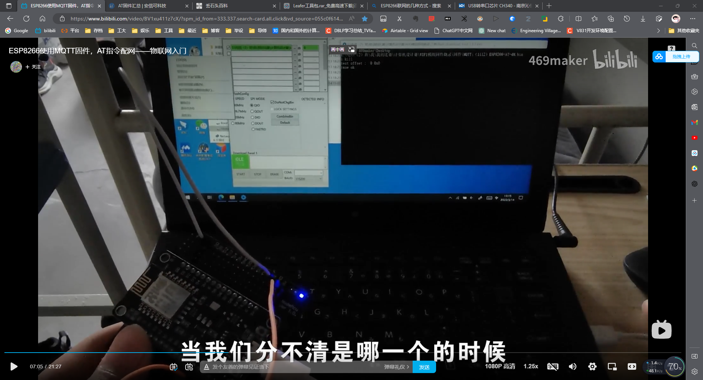
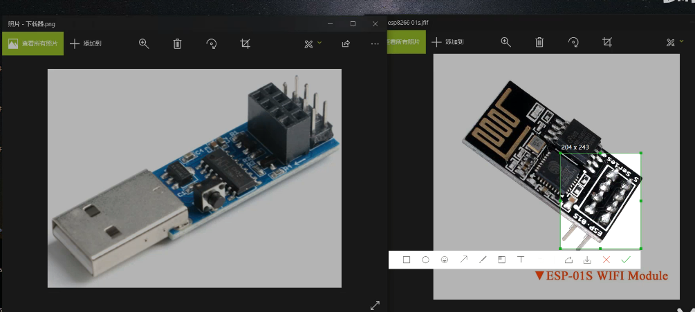

[丢石头百科 (diustou.com)](https://wiki.diustou.com/cn/%E9%A6%96%E9%A1%B5)

# ESP8266使用MQTT固件，AT指令配网——物联网入门
视频教程：[ESP8266使用MQTT固件，AT指令配网——物联网入门_哔哩哔哩_bilibili](https://www.bilibili.com/video/BV1xu411z7cX/?spm_id_from=333.337.search-card.all.click&vd_source=055c0f614d8dec2c3bf7aff0db5e54cb)
固件下载地址：[ESP8266系列模组专题 | 安信可科技 (ai-thinker.com)](https://docs.ai-thinker.com/esp8266)



安信可固件
[AT固件汇总 | 安信可科技 (ai-thinker.com)](https://docs.ai-thinker.com/%E5%9B%BA%E4%BB%B6%E6%B1%87%E6%80%BB)

ESP8266固件烧录软件flash_download_tools的安装过程
[(5条消息) ESP8266固件烧录软件flash_download_tools的安装过程_esp8266烧录软件_新手程序员攀爬之路的博客-CSDN博客](https://blog.csdn.net/qq_42455308/article/details/104555160)
烧录软件:ESP Download Tool v3.8.5.zip
[文件:ESP Download Tool v3.8.5.zip - 丢石头百科 (diustou.com)](https://wiki.diustou.com/cn/%E6%96%87%E4%BB%B6:ESP_Download_Tool_v3.8.5.zip)

串口与网络调试助手下载
[文件:Sscom5.13.1.zip - 丢石头百科 (diustou.com)](https://wiki.diustou.com/cn/%E6%96%87%E4%BB%B6:Sscom5.13.1.zip)

---

有的自带USB转串口的芯片 直接USB线连接就可以了 就不用CH340单独芯片的插口了
[USB转串口芯片 CH340 - 南京沁恒微电子股份有限公司 (wch.cn)](https://www.wch.cn/product/CH340.html)


# 阿里云MQTT测试

[(2条消息) 阿里云MQTT服务器搭建与测试(全图文，非常详细)_C是最好的编程语言的博客-CSDN博客](https://blog.csdn.net/wwwqqq2014/article/details/121079802)

```
{ 
	"ProductKey": "ibhmDR0YAgl",
	"DeviceName": "DeviceName_MR",
	"DeviceSecret": "597d2769b5342f83ad4e80e5bc025869"
}
```

信息备用

Broker Address：ibhmDR0YAgl.iot-as-mqtt.cn-shanghai.aliyuncs.com
Broker Port	  ：1883
Client ID     ：960919993|securemode=3,signmethod=hmacsha1|

![[201903040009images.aasts/image-20230317144841972.png]]


User Name：DeviceName_MR&ibhmDR0YAgl
PASSWORD：9BA0BEDA3F0430D8811483DB852443490D014F75


![[201903040009images.aasts/image-20230317145244378.png]]


设备名称：DeviceName_MR

发布：/sys/ibhmDR0YAgl/DeviceName_MR/thing/event/property/post
订阅：/sys/ibhmDR0YAgl/DeviceName_MR/thing/event/property/post_reply
真订阅：/sys/ibhmDR0YAgl/DeviceName_MR/thing/service/property/set


![[201903040009images.aasts/image-20230317150018374.png]]


# ESP01S
[AT指令太麻烦了吧？ 试试在ESP8266上开发的MQTT串口透传固件，还有免费的MQTT服务器使用哦_哔哩哔哩_bilibili](https://www.bilibili.com/video/BV1bh411Y7C4/?spm_id_from=333.788.recommend_more_video.0&vd_source=055c0f614d8dec2c3bf7aff0db5e54cb)


---
# python中使用mqtt以及执行逻辑补充
[Python中-if-__name__==-__main__-详解](0101%20毕设仓库/Python中-if-__name__==-__main__-详解.md)

if __name__ == '__main__':
	run()


```python
# -*- coding: utf-8 -*-

  

from paho.mqtt import client as mqtt_client

import time

  

broker = 'broker.emqx.io'

port = 1883

topic = "cc36e70148924ef2bb2e1d477c24675f"

client_id = f'43f90020d29d491c9e671db1ee5b8db7'

  

def connect_mqtt() -> mqtt_client:

    def on_connect(client, userdata, flags, rc):

        if rc == 0:

            print("Connected to MQTT Broker!")

        else:

            print("Failed to connect, return code %d\n", rc)

    client = mqtt_client.Client(client_id)

    client.on_connect = on_connect

    client.connect(broker, port)

    return client

  
  

def subscribe(client: mqtt_client):

    def on_message(client, userdata, msg):

        print(f"Received `{msg.payload.decode()}` from `{msg.topic}` topic")

    client.subscribe(topic)

    client.on_message = on_message

  
  

def run():

    client = connect_mqtt()

    subscribe(client)

    client.loop_forever()

  
  

if __name__ == '__main__':

    run()
```


Python解释器在导入模块时，会将模块中<font color="#ffff00">没有缩进的代码全部执行一遍</font>（模块就是一个独立的Python文件）

\_\_name\_\_属性是Python的一个内置属性，记录了一个字符串。

*   若是在当前文件，\_\_name\_\_ 是\_\_main\_\_。
*   在hello文件中打印本文件的\_\_name\_\_属性值，显示的是\_\_main\_\_


---

# ESP8266连接MQTT服务器发送数据 #待办
[(1条消息) 13-ESP8266连接MQTT服务器发送数据_mqtt发送数据_盐池虾的博客-CSDN博客](https://blog.csdn.net/dangerqsq/article/details/129336855)

[如何在 Python 中使用 MQTT - 知乎 (zhihu.com)](https://zhuanlan.zhihu.com/p/187481769)

封装使用
[MQTT在Python中的使用mqtt-paho(简单实例, 回调函数,回调参数，qos安全等级)详解及回调函数的正确用法_mqtt python_XC_SunnyBoy的博客-CSDN博客](https://blog.csdn.net/XC_SunnyBoy/article/details/115790445)


# ESP8266订阅MQTT
[【零基础学物联网】MQTT篇 1-8 ESP8266订阅MQTT主题 - 哔哩哔哩 (bilibili.com)](https://www.bilibili.com/read/cv8565906)


---


# GPS mqtt.fx测试
订阅发布的主题：cc36e70148924ef2bb2e1d477c24675f_gps
发布GPS定位模拟 齐鲁工业大学24楼经纬度：
发布格式：【纬度，经度】
36.56167324381701,116.80781175110624

Latitude=36.560219 Longitude=116.804184
36.560219,116.804184

Latitude=36.56035614013673 Longitude=116.80419158935548
36.56035614013673,116.80419158935548

英文字符串 中间用英文逗号隔开 后台会划分

---


# 主题梳理
`GPS模块`
- Django前端订阅的主题，接收开发板发送来的信息； 
- 开发板2 GPS模块采集到经纬度发布到这个主题
订阅发布的主题：cc36e70148924ef2bb2e1d477c24675f_gps


`图像识别模块 摄像头部分`

- python服务器订阅下面这个主题 等待发布识别命令
- 开发板2 按钮向这个主题发布 识别命令
topic_button = "cc36e70148924ef2bb2e1d477c24675f_button" # 订阅这个主题 等待按键发布“1”

- python服务器将识别信息发布到这个主题
- 开发板2 订阅这个主题 接收识别的信息 并进行下一步的播报
topic_mp3 = "cc36e70148924ef2bb2e1d477c24675f_mp3" # 将识别信息发布到这个主题


`开发板1`
开发板订阅 订阅主题 收到on 电灯 off灭灯 ：cc36e70148924ef2bb2e1d477c24675f_shou

开发板发布 将超声波 水位 上传到这个主题：cc36e70148924ef2bb2e1d477c24675g


