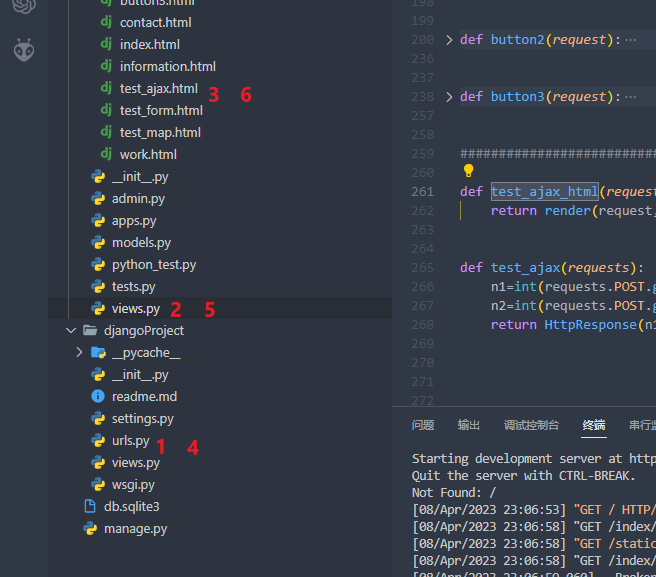
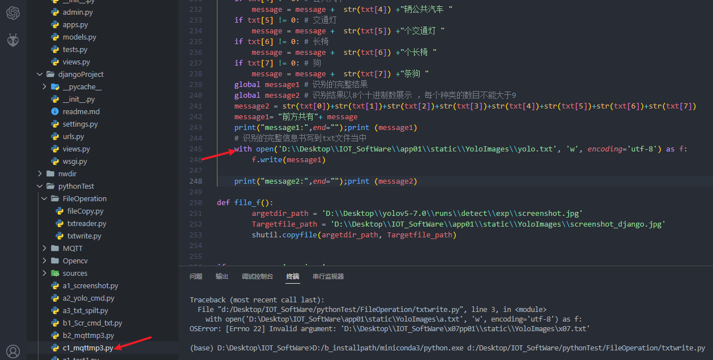

# Django在物联网项目中的作用
Django在物联网项目中可以扮演多种角色，这取决于具体的应用场景和需求。以下是一些可能的用例：

1.  Web API后端：物联网系统通常需要从传感器、设备或其他数据源收集大量数据，并进行预处理、存储和分析。Django提供了一个灵活、高效的Web框架，可以帮助开发人员构建专门的API端点来处理这些数据。例如，可以使用Django的ORM（对象关系映射器）和视图来定义和处理RESTful API，并使用Django REST framework等第三方库来增强功能。
    
2.  数据存储和管理：Django包含一个内置的ORM，可以轻松地将数据存储到关系型数据库中，如MySQL、PostgreSQL或SQLite等。在物联网项目中，这非常有用，因为传感器和设备产生的数据通常需要持久化存储，并支持复杂的查询和分析。Django ORM还提供了各种高级功能，如数据迁移、事务管理和模型继承等。
    
3.  管理界面：Django还包括一个内置的自动生成后台管理应用程序的工具，称为Django Admin。使用Django Admin，可以轻松地创建一个易于使用的管理界面，以便管理数据、用户、权限等。这对于物联网项目来说尤其有用，因为管理员可以使用Django Admin轻松地浏览和编辑设备、传感器、用户和其他数据，而不需要编写任何额外的代码。
    
4.  `实时通信`：物联网系统通常要求实时收集和处理大量的数据，并在必要时向其他系统或设备发送命令。Django并不是一个专门用于实时通信的框架，但是它可以与其他强大的Python库（如Flask-SocketIO、Django Channels等）结合使用，以构建实时的Web应用程序。例如，可以使用Django Channels来建立WebSocket连接，并通过这种方式实现高效的实时通信。
    

总之，Django在物联网项目中具有广泛的应用前景，可帮助开发人员轻松构建高质量、稳健的Web应用程序，并提高生产力和协作效率。


# Django的工作流程
Django的工作流程通常包括以下步骤：

1.  客户端请求：浏览器向Django服务器发送HTTP请求，请求特定的页面或API。
    
2.  URL路由：Django中的URLConf将URL分派给对应的视图函数进行处理。这可以使用Django中的URL路由器（URL router）来完成，也可以自定义URLConf以进行更高级的路由。
    
3.  视图函数：Django中的视图函数是用于处理客户端请求并返回响应的Python函数。在视图函数中，可能会查询数据库、执行业务逻辑，然后构建一个响应对象来返回给客户端。
    
4.  模板渲染：如果需要在响应中包含HTML页面，则视图函数通常会使用Django模板引擎来将数据填充到HTML模板中，并生成最终的HTML输出。
    
5.  响应结果：视图函数可以构建各种类型的响应，如HTML、JSON、XML等。无论响应类型如何，响应都由Django框架传递回客户端，实现数据交互。
    
6.  中间件：在整个请求-响应周期中，Django提供了一些类似插件的功能，称为中间件。开发人员可以选择添加中间件，以实现各种目的，例如安全性检查、缓存控制、日志记录等。
    
7.  ORM操作：在处理请求期间，视图函数可能会与数据库交互。Django提供了一个内置的ORM（对象关系映射器），可以将数据库表映射到Python类中，并使用各种高级查询API来简化数据访问。
    
8.  安全性检查：Django在开箱即用时，提供了许多内置安全功能来防止各种攻击，例如CSRF（跨站请求伪造）、XSS（跨站脚本）和SQL注入等。
    
9.  自动化管理界面：除了处理普通HTTP请求之外，Django还包括一个自动生成后台管理应用程序的工具，称为Django Admin。使用Django Admin，管理员可以轻松地管理数据、用户、权限等信息，而无需编写任何额外的代码。
    

总之，这些步骤描述了一个基本的Django工作流程，展示了Django如何接收HTTP请求，将其路由到相应的视图函数，执行必要的操作然后返回响应。Django框架的强大之处，是它能够支持各种类型的应用程序，并提供方便的工具和功能帮助开发人员创建高效、安全、可扩展的Web应用程序。


# 前端相关
## Django版本太高


```
django4.0+不再支持 from [django](https://so.csdn.net/so/search?q=django&spm=1001.2101.3001.7020).conf.urls import url。  
我选择的解决办法是降低 django 的版本  
pip install django==3.2 -i https://pypi.tuna.tsinghua.edu.cn/simple
```

![[201903040009images.aasts/image-20230317173315452.png]]


pip install -i http://pypi.douban.com/simple/  paho


pip3 install paho.mqtt 顺利解决


### 修改注释mysql版本不够的提醒
D:\b_installpath\miniconda3\Lib\site-packages\django\db\backends\base

---

警告 ：(models.W042) Auto-created primary key used when not defining a primary key type
[(7条消息) (models.W042) Auto-created primary key used when not defining a primary key type_weixin_43973977的博客-CSDN博客](https://blog.csdn.net/weixin_43973977/article/details/123814751)


---


## Django 的admin页面改进

[【Django后台美化】 默认的后台管理太丑？两步拥有一个炫酷的后台管理！simpleui_哔哩哔哩_bilibili](https://www.bilibili.com/video/BV1w4411g7ba/?spm_id_from=333.788.recommend_more_video.0&vd_source=055c0f614d8dec2c3bf7aff0db5e54cb)


simpleui基于vue + element开发. 使用simpleui 只需两步 , 1. pip install django-simpleui 2. 从settings.py, INSTALL_APPS里面第一行插入'simpleui', 重启Django即可完成. 项目开源地址: https://github.com/newpanjing/simpleui


[(3条消息) django之十八--admin管理后台的配置和登录_django管理员登录_进击的雷神的博客-CSDN博客](https://blog.csdn.net/LYX_WIN/article/details/114528488)

## Django返回多个值
[(8条消息) django中关于视图view的传值，取值，返回值等_django的view.py传递参数_QIUKHOMING#的博客-CSDN博客](https://blog.csdn.net/jereying/article/details/114081313)
return render(request, 'booktest/show_postarg.html', {'name':name, 'gender':gender, 'hobbys':hobbys})


# HTML基础标签
## html5网页中视频相关
[html5网页中怎么加入视频？怎么为网页添加视频？ | w3c笔记 (w3cschool.cn)](https://www.w3cschool.cn/article/37868804.html)

[如何让Video标签定义的视频水平居中-慕课网 (imooc.com)](https://class.imooc.com/course/qadetail/6647)


## 文本区元素 < texta rea> 


[< textarea>：文本区元素 - HTML（超文本标记语言） | MDN (mozilla.org)](https://developer.mozilla.org/zh-CN/docs/Web/HTML/Element/textarea)

## Form 属性
在这个form表单中的所有标签信息，都会有将自己信息提交给后端的能力。

[HTML form action 属性 | 菜鸟教程 (runoob.com)](https://www.runoob.com/tags/att-form-action.html)

### html表单提交
html表单提交，哪些标签的哪些值会被提交给[服务器](https://cloud.tencent.com/product/cvm?from=20065&from_column=20065)呢？

1、只能为`input、textarea、select`三类类型的标签。只有这些标签用户才可能修改值，< la be l >、< p >、< fo n t >等标签仅供显示用，没有提交到服务器的必要。当input=submit的时候，只有被点击的按钮的value才会被提交；

2、input标签有title、type、disabled、value等属性，但只有value属性的值才会提交到服务器，其他属性都是供显示用的，用户并不能修改；

3、标签必须设定name属性。如果要将标签的value属性值提交到服务器，则必须为标签设定name属性，提交到服务器的时候将会以“name=value"的键值对的方式提交到服务器。name是给服务器用的，id是给Dom用的。对于RadioButton，同name的为一组，选中的RadioButton的value被提交到服务器；

4、要提交的标签必须放到form标签内。只有放到form标签内的标签才可能会被提交到服务器，form之外的input标签会被忽略掉。

5、要使得文件上载能够成功，必须要做到：
-   input type=file标签必须出现在form标签中
-   必须为input type=file标签指定name标签属性的值
-   form标签的method属性必须设置为post
-   form标签enctype属性必须设置为multipart/form-data


### input type="submit" 和"button"区别

在一个页面上画一个按钮，有四种办法：

-   < input type="button" /> 这就是一个按钮。如果你不写javascript 的话，按下去什么也不会发生。  
    
-   < input type="submit" />这样的按钮用户点击之后会<font color="#ffff00">自动提交 form</font>，除非你写了javascript 阻止它。  
    
-   < button> 这个按钮放在 form 中也会点击自动提交，比前两个的优点是按钮的内容不光可以有文字，还可以有图片等多媒体内容。（当然，前两个用图片背景也可以做到）。它的缺点是不同的浏览器得到的 value 值不同；可能还有其他的浏览器兼容问题。
-   其他标签，例如 a, img, span, div，然后用图片把它伪装成一个按钮。


原来：< input class="btn btn-success"   required="required" type="submit" value="提交"/>
后来： < button type="submit">Submit Now</button >

----
---
title: html 提交按钮(input submit)
url: https://blog.csdn.net/claroja/article/details/113576751
clipped_at: 2023-04-05 12:12:08
category: 网页裁剪
tags: 
 - form表单提交
---

### 提交按钮(input submit)

[submit](https://so.csdn.net/so/search?q=submit&spm=1001.2101.3001.7020)默认是提交表单,跳转页面或刷新(跳转到本页),可以用`prevent`来阻止

```html
<form>
    <input name="key">
    <input type="submit" value="提交">
</form>
```

提交为:

```html
localhost?key=输入内容
```

这里只提交了第一个`input`元素的key和value(name指定的key,value是输入内容)  
第二个`input`没有提交

但是当我们给第二个`input`加上`name`属性时也会提交

```html
<form>
    <input name="key">
    <input name='input2' value='提交' type='submit'>
</form>
```

提交为:

```html
localhost?key=输入内容&input2=提交
```

所以再form表单中,一定要注意type=submit时,一定不能加name属性

参考:  
https://www.cnblogs.com/cui-ting/p/10910959.html


## 关于css样式表里面什么时候用.和#

`设置class的时候用的是.，当设置id的时候是#`
Class可以反复使用，而id在一个页面中仅能被使用一次。有可能在很大部分浏览器中反复使用同一个id不会出现问题，但在标准上这绝对是错误的使用，而且很可能导致某些浏览器的现实问题。
在实际应用的时候，Class可能对文字的排版等比较有用，而ID则对宏观布局和设计放置各种元素较有用。

直接上代码：

当设置

.exam{color:yellow;}，用的调用是：< p class="exam">

#exam{color:yellow;}，这时候用的是：< p id="exam">

综上：只有一个独立样式的元素适合用id，而有多个元素拥有同样的样式的话适合使用class。


## HTML空格占位符号
[HTML中空格占位符的几种方式 - 雏鸟 - 博客园 (cnblogs.com)](https://www.cnblogs.com/miaomi/p/10688392.html)

&#8195;    一个空白（2个字符宽度），分号不能少


## HTML取色器
[HTML 取色器 | 菜鸟工具 (runoob.com)](https://c.runoob.com/front-end/5449/#a4a4a4)


## div标签居中方式
单独盒子 参考style  水平居中的简易实现方式


# 专题

## html根据经纬度绘制地图
    GPSW = 36.56167324381701

    GPSJ = 116.80781175110624


百度地图 无需key 根据经纬度
[(8条消息) html 打开百度地图，根据经纬度定位到某个地方（位置标注）_html打开地图_草字的博客-CSDN博客](https://blog.csdn.net/qq_42740797/article/details/116494272)


```
http://api.map.baidu.com/marker?location={{ weidu }},{{ jingdu }}&title=GPS定位当前位置&content=当前位置&output=html&src=webapp.baidu.openAPIdemo
```

---

高德地图 需要key 
[(8条消息) html 打开高德地图，根据经纬度定位到某个地方（位置标注）_高德地图的地图组件位置标注开发_草字的博客-CSDN博客](https://blog.csdn.net/qq_42740797/article/details/116493980)[位置标注-开发指南-地图组件 | 高德地图API (amap.com)](https://lbs.amap.com/api/lightmap/guide/point)

坐标拾取：[高德地图API (amap.com)](https://lbs.amap.com/tools/picker)
key名称：cbxgovo
key：4e040f6823e7e9fc25752d16b33a510a
安全密钥：2a55380e2a292e92c6bf28abbb705e9b

https://m.amap.com/navi/?dest=116.470098,39.992838&destName=阜通西&hideRouteIcon=1&key=您申请的Key


```
https://m.amap.com/navi/?dest=116.80781175110624,36.56167324381701&destName=GPS跟踪当前位置&hideRouteIcon=1&key=4e040f6823e7e9fc25752d16b33a510a
```


---

补充 html获取主机经纬度

```html
<!DOCTYPE html>
 
<html lang="en" xmlns="http://www.w3.org/1999/xhtml">
<head>
    <meta charset="utf-8" />
    <title>currentaddress</title>
</head>
<body>
    <p id="demo">获取当前位置</p>
    <button onclick="getLocation()">定位当前位置</button>
    <script>
    var x = document.getElementById("demo");
    function getLocation() {
        if (navigator.geolocation) {
            navigator.geolocation.watchPosition(showPosition)
			<!-- 通过HTML5的watchPosition()方法，不仅可以返回用户的当前位置，而且可以继续返回用户移动时的更新位置，从而实现类似GPS定位系统一样的功能。 -->
        }
        else {
            x.innerHTML="该浏览器不支持获取地理位置。"
        }
 
    }
    function showPosition(position) {
        x.innerHTML = "纬度为：" + position.coords.latitude + "    经度为：  " + position.coords.longitude;
    }
    </script>
</body>
</html>
```

## html显示画面1 - 不带识别

[摄像头视频画面接入，使用iframe标签嵌入到页面中（海康威视、萤石）_基于摄像头画面打标签_huangfuyk的博客-CSDN博客](https://blog.csdn.net/weixin_42881768/article/details/113766417)

`2023.04.09 思路一：html 利用 iframe标签实现ipcam显示`

```
    <div class="contact-map">

         地图显示 

         <iframe src="https://m.amap.com/navi/?dest=116.80781175110624,36.56167324381701&destName=GPS跟踪当前位置&hideRouteIcon=1&key=4e040f6823e7e9fc25752d16b33a510a"> </iframe> 

        <iframe src="http://192.168.124.87:8081/"> </iframe>

    </div>
```


## html显示画面2 - 带算法识别

[Python中os库里面的popen()方法_res = os.popen('curl -s cip.cc --connect-timeout 1_鲲鹏飞九万里的博客-CSDN博客](https://blog.csdn.net/hefrankeleyn/article/details/85098186#:~:text=%E6%A6%82%E8%BF%B0%20os.%20popen%20%28%29%20%E6%96%B9%E6%B3%95%20%E7%94%A8%E4%BA%8E%E4%BB%8E%E4%B8%80%E4%B8%AA%E5%91%BD%E4%BB%A4%E6%89%93%E5%BC%80%E4%B8%80%E4%B8%AA%E7%AE%A1%E9%81%93%E3%80%82%20%E5%9C%A8Unix%EF%BC%8CWindows%20%E4%B8%AD,%E4%BD%BF%E7%94%A8%E7%9A%84%E5%91%BD%E4%BB%A4%E3%80%82%20mode%20%E2%80%93%20%E6%A8%A1%E5%BC%8F%E6%9D%83%E9%99%90%E5%8F%AF%E4%BB%A5%E6%98%AF%20%E2%80%98r%E2%80%99%20%28%E9%BB%98%E8%AE%A4%29%20%E6%88%96%20%E2%80%98w%E2%80%99%E3%80%82)


## Django MQTT运行方式优化
[django mqtt发布 - 搜索 (bing.com)](https://www.bing.com/search?q=django+mqtt%E5%8F%91%E5%B8%83&cvid=f945b704c44845b8a3871262ce305be6&aqs=edge..69i57.5342j0j1&pglt=129&FORM=ANNTA1&PC=U531&mkt=zh-CN)


## 参考：ECharts调用接口获取后端数据的四种方法
[【ECharts】调用接口获取后端数据的四种方法_echarts获取后端数据_哇哦Q的博客-CSDN博客](https://blog.csdn.net/Qxn530/article/details/126648713)


## 参考：Echarts实现动态折线图的定时刷新


[Echarts实现动态折线图的定时刷新_echarts折线图动态刷新_给你两窝窝的博客-CSDN博客](https://blog.csdn.net/weixin_47382783/article/details/128603551)


## 图像再优化 0423已完成
python datetime与字符串、时间戳与字符串相互转换

[python datetime与字符串、时间戳与字符串相互转换_请利用datetime库将当前系统_zew1040994588的博客-CSDN博客](https://blog.csdn.net/elephantpretty/article/details/108699017)
```python
import datetime
time1 = datetime.datetime.now()
print(type(time1))
print(time1)#假设前端传的形式不符合后端要求
time1 = time1.strftime('%Y-%m-%d %H:%M:%S')#只取年月日，时分秒
print(type(time1))
print(time1)
```


[django 过滤器 、日期格式化参数_django html 过滤器 今天日期_bu110的博客-CSDN博客](https://blog.csdn.net/xyp84/article/details/7945094)


# Ajax的实现方式
## 1-什么是Ajax
AJAX（Asynchronous Javascript And XML）翻译成中文就是“异步Javascript和XML”。即使用Javascript语言与服务器进行异步交互，传输的数据为XML（当然，传输的数据不只是XML,现在更多使用json数据）

同步交互：客户端发出一个请求后，需要等待服务器响应结束后，才能发出第二个请求；
异步交互：客户端发出一个请求后，无需等待服务器响应结束，就可以发出第二个请求。
AJAX除了异步的特点外，还有一个就是：浏览器页面局部刷新；（这一特点给用户的感受是在不知不觉中完成请求和响应过程）

## ajax 的jquery实现方式 引入jquery

### jQuery 属性操作 - val() 方法
[jQuery 属性操作 - val() 方法 (w3school.com.cn)](https://www.w3school.com.cn/jquery/attributes_val.asp)


### 两处对应


# Ajax流转过程详解
参考处：
[9-Django高级之-Django与Ajax - 知乎 (zhihu.com)](https://zhuanlan.zhihu.com/p/380561088)


1、网址输入以下 url配置的 test_ajax 跳转到view视图层功能函数的功能函数 test_ajax_html 
这个函数只负责把写有ajax js函数的html页面显示出来
[127.0.0.1:8000/test_ajax/](http://127.0.0.1:8000/test_ajax/)


2、功能函数 test_ajax_html  跳转显示html页面后 输入1 + 2 点击计算。


html文件的ajax起作用 将请求转发到 /test_ajax_fx/ 网页，也就是 http://127.0.0.1:8000/test_ajax_fx


url映射文件 检测到访问这个网址之后，调用view的功能函数 test_ajax 实现计算


功能函数 test_ajax 计算完成后 通过httpresponse的形式将结果返回 填充在html含有ajax的前端


3、整体流动过程如下




# Django数据提交原理
只要在form中出现type = submit 就会向后台提交请求

`button2.html` 

如以下几种包裹在form中的情况
```
<button   type="submit" class="btn btn-success btn-block btn-lg">取样显示</button>
```


## 请求方式 好几种情况


# 开发进度
## 0405


## 0424


# work页面 html 显示图像 带算法识别 ♥

识别完成后加一个识别图像的移动操作 在Django中显示
```python
import shutil
argetdir_path = 'D:\\Desktop\\yolov5-7.0\\runs\\detect\\exp\\screenshot.jpg'
Targetfile_path = 'D:\\Desktop\\IOT_SoftWare\\app01\\static\\YoloImages\\screenshot_django.jpg'
shutil.copyfile(argetdir_path, Targetfile_path)
 
```


## 优化 显示识别信息文字 0424





# MPU6050 页面
，最下面是页脚部分。


```html
<html>
<head>
    <title>我的页面</title>
</head>
<body>
    <h1>我的页面</h1>
    <div class="box1" style="width: 25%; float: left;">
        盒子1
    </div>
    <div class="box2" style="width: 25%; float: left;">
        盒子2
    </div>
    <div class="box3" style="width: 25%; float: left;">
        盒子3
    </div>
    <div class="box4" style="width: 25%; float: left;">
        盒子4
    </div>
    <div class="footer" style="clear: both;">
        页脚
    </div>
</body>
</html>
```


`document.body.appendChild(renderer.domElement);`

上面的代码是将 Three.js 引擎渲染的内容添加到页面的 body 元素中，renderer 为 Three.js 的渲染器，domElement 是渲染器渲染的元素，可以通过修改 renderer 的参数来改变渲染出来的内容，例如：
renderer.setSize(width, height); // 设置渲染器的宽度和高度
renderer.setClearColor(color); // 设置渲染器的背景颜色
renderer.setPixelRatio(pixelRatio); // 设置渲染器的像素比
要将渲染的内容展示在 body 之外的位置，可以通过指定渲染器渲染到的元素来实现，例如：
var elem = document.getElementById('myCanvas');
renderer.render(scene, camera, elem); // 将渲染器渲染到指定的元素中


```
可以在代码中添加一个div，并将渲染器的domElement添加到div中：
<!DOCTYPE html>
<html>
<head>
	<title>3D图展示所处姿态</title>
</head>
<body>
	<div id="div1"></div>
	
	<script type="text/javascript" src="http://cdn.staticfile.org/three.js/r68/three.min.js"></script>
	
	<script type="text/javascript">
		// 创建场景
		var scene = new THREE.Scene();

		// 创建相机
		var camera = new THREE.PerspectiveCamera(45, window.innerWidth/window.innerHeight, 0.1, 1000);

		// 创建渲染器
		var renderer = new THREE.WebGLRenderer();
		renderer.setClearColor(new THREE.Color(0xEEEEEE));
		renderer.setSize(window.innerWidth, window.innerHeight);
		renderer.shadowMapEnabled = true;

		// 创建坐标轴
		var axes = new THREE.AxisHelper(20);
		scene.add(axes);

		// 创建灯光
		var spotLight = new THREE.SpotLight(0xffffff);
		spotLight.position.set(-40, 60, -10);
		scene.add(spotLight);

		// 创建几何体
		var cubeGeometry = new THREE.CubeGeometry(10, 10, 10);
		var cubeMaterial = new THREE.MeshLambertMaterial({color: 0xff0000});
		var cube = new THREE.Mesh(cubeGeometry, cubeMaterial);
		cube.position.x = 0;
		cube.position.y = 0;
		cube.position.z = 0;
		cube.castShadow = true;
		scene.add(cube);

		// 设置相机位置
		camera.position.x = 30;
		camera.position.y = 30;
		camera.position.z = 30;
		camera.lookAt(scene.position);

		// 添加到body中
		document.getElementById("div1").appendChild(renderer.domElement);

		// 加入加速度和角速度
		var xAccel = 0.02; // 加速度X轴
		var yAccel = 0.0005; // 加速度Y轴
		var zAccel = 0; // 加速度Z轴 默认带个0.165 代表一个G
		var xAngle = 0; // 角速度X轴
		var yAngle = 0; // 角速度Y轴
		var zAngle = 0; // 角速度Z轴

		// 渲染
		function render() {
			// 旋转
			cube.rotation.x += xAccel;
			cube.rotation.y += yAccel;
			cube.rotation.z += zAccel;
			// 移动
			cube.position.x += xAngle;
			cube.position.y += yAngle;
			cube.position.z += zAngle;

			requestAnimationFrame(render);
7
			renderer.render(scene, camera);
		}
		render();
	</script>
```


```
居中：

<div id="div1" style="height:200px; width:200px; margin:auto;"></div>
```


```
<canvas id="myCanvas" width="500px" height="500px" style="margin: 0 auto; display: block;"></canvas>
```


中


```
<div id="div1" style="width: 300px; height: 300px; border: 1px solid #ccc;"></div>

<script type="text/javascript">
		// 创建场景
		var scene = new THREE.Scene();

		// 创建相机
		var camera = new THREE.PerspectiveCamera(45, window.innerWidth/window.innerHeight, 0.1, 1000);

		// 创建渲染器
		var renderer = new THREE.WebGLRenderer();
		renderer.setClearColor(new THREE.Color(0xEEEEEE));
		renderer.setSize(window.innerWidth, window.innerHeight);
		renderer.shadowMapEnabled = true;

		// 创建坐标轴
		var axes = new THREE.AxisHelper(20);
		scene.add(axes);

		// 创建灯光
		var spotLight = new THREE.SpotLight(0xffffff);
		spotLight.position.set(-40, 60, -10);
		scene.add(spotLight);

		// 创建几何体
		var cubeGeometry = new THREE.CubeGeometry(10, 10, 10);
		var cubeMaterial = new THREE.MeshLambertMaterial({color: 0xff0000});
		var cube = new THREE.Mesh(cubeGeometry, cubeMaterial);
		cube.position.x = 0;
		cube.position.y = 0;
		cube.position.z = 0;
		cube.castShadow = true;
		scene.add(cube);

		// 设置相机位置
		camera.position.x = 30;
		camera.position.y = 30;
		camera.position.z = 30;
		camera.lookAt(scene.position);

		// 添加到body中
		//document.body.appendChild(renderer.domElement);
		document.getElementById("div1").appendChild(renderer.domElement);

		// 加入加速度和角速度
		var xAccel = 0.02; // 加速度X轴
		var yAccel = 0.0005; // 加速度Y轴
		var zAccel = 0; // 加速度Z轴 默认带个0.165 代表一个G
		var xAngle = 0; // 角速度X轴
		var yAngle = 0; // 角速度Y轴
		var zAngle = 0; // 角速度Z轴

		// 渲染
		function render() {
			// 旋转
			cube.rotation.x += xAccel;
			cube.rotation.y += yAccel;
			cube.rotation.z += zAccel;
			// 移动
			cube.position.x += xAngle;
			cube.position.y += yAngle;
			cube.position.z += zAngle;

			requestAnimationFrame(render);
			renderer.render(scene, camera);
		}
		render();
	</script>
```


# 拓展

## 前后端分离
[毕设必看！vue + django 前后端分离开发！原创！火星小刘没废话！_哔哩哔哩_bilibili](https://www.bilibili.com/video/BV1Cu411e7f8/?spm_id_from=333.337.search-card.all.click&vd_source=055c0f614d8dec2c3bf7aff0db5e54cb)


## Nginx+uwsgi+django+阿里云

[Nginx+Uswgi+Django+阿里云服务器_哔哩哔哩_bilibili](https://www.bilibili.com/video/BV1hN41197ne/?spm_id_from=333.337.search-card.all.click&vd_source=055c0f614d8dec2c3bf7aff0db5e54cb)
Nginx+uwsgi+django+阿里云服务器开发网站。
