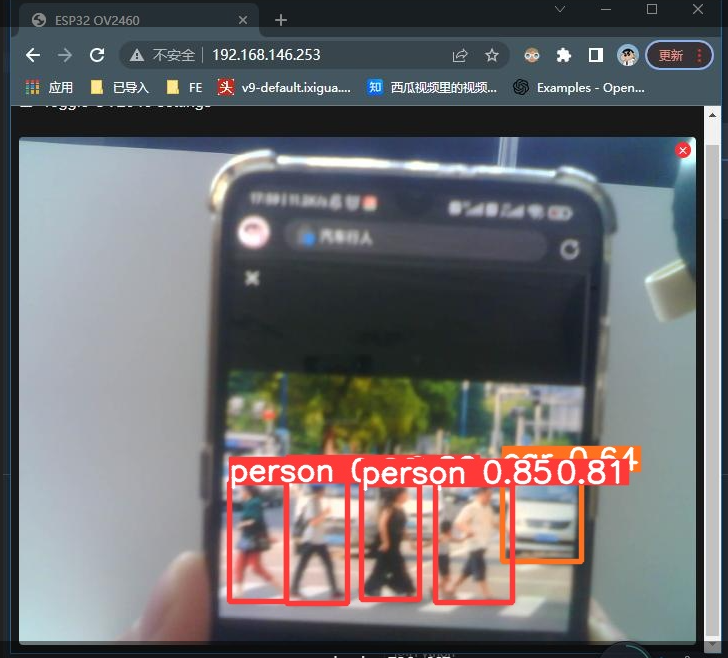
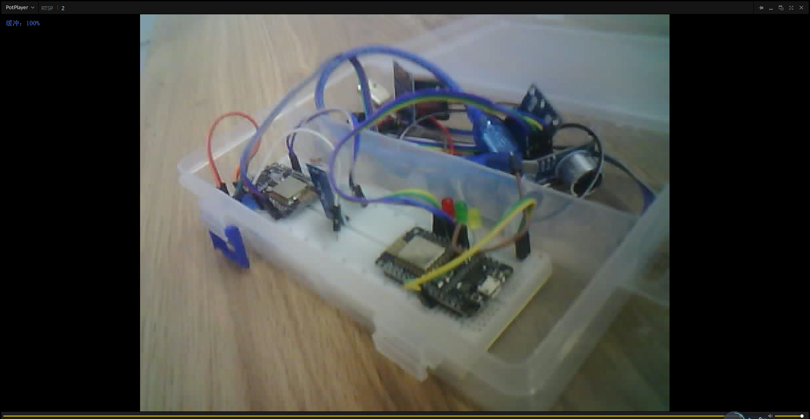
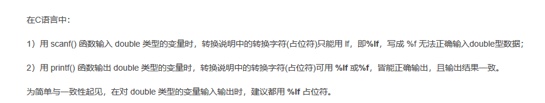

C8T6最小系统板 未开发票 14.5
LED 

主要功能
- `光敏传感器` 检测天黑 `LED`夜间发光 提示路人 无需联网

- `MPU-6050`跌倒检测预测 发布消息 提醒等级1 我在前端显示警告一星（提示可能发生跌倒）
- `ATGM336H` GPS定位 发布消息 经纬度 我在前端显示地图点位（图像标点）
- 主动求救`按钮`SOS  按下   发布消息 提醒等级2和目前的经纬度，经纬度这个可以省 不方便的话 我可以从网页查看也行 且 `sim卡模块`拨电话或者发短信 我在前端显示警告二星（提示用户主动求救）
- 超声波测量障碍物`HC-SR04` 检测距离前方的障碍物 小于50cm阈值 发布消息 前端我显示 且本地震动模块1震动
- `水位传感器` 检测拐杖底部的水位 大于1cm阈值 发布消息 前端我显示 且本地震动模块2震动

# 震动传感器 两个
蜂鸣器 
淘宝链接：[【优信电子】震动马达电机模块 直流电机手机震动器 振动马达报警-淘宝网 (taobao.com)](https://item.taobao.com/item.htm?id=584941055869&price=3.8&sourceType=item&sourceType=item&suid=8c78f1ae-ee56-4c37-a95c-64cd3a0e6b5f&shareUniqueId=21019090281&ut_sk=1.YaV48WG3xLkDACjC6cdD9B0Y_21646297_1681896637116.Copy.1&un=56d835173df514b90f8768acc41474bb&share_crt_v=1&un_site=0&spm=a2159r.13376460.0.0&sp_abtk=gray_1_code_simpleAndroid2&tbSocialPopKey=shareItem&sp_tk=U0RwUGRsQ0h4bjY%3D&cpp=1&shareurl=true&short_name=h.UHfpwIY&bxsign=scdDXQb31gSF-wluMVLQ3FSnZMOx-6_cRww8pybRWwuDBJEQsoXU3fPwR32VWa0A9vQMlcjd-4NuQuq-7dObJVmDtTiJEJAB4Vx3uGI7klZlp7uU0SZm6Q9hvW5Z0X09NJd&tk=SDpPdlCHxn6&app=chrome)


代码逻辑

```c
{
    pinMode(ledPin, OUTPUT);  
}

  
void loop()
 
{
    double water1;
    if (water1 < 10.00 ) {
        digitalWrite(ledPin, HIGH);   // 引脚高电平，开始震动
     }
```


# 按钮
按下去接通  松开两个引脚断开

一般一个引脚接入一个PAX口，另外一个接入GND ，


## 按钮触发事件

[arduino开发ESP8266学习笔记二----按键控制LED灯 - 提货人 - 博客园 (cnblogs.com)](https://www.cnblogs.com/--Destroyer--/p/13280703.html)

[08-ESP8266按钮处理_esp8266按键_盐池虾的博客-CSDN博客](https://blog.csdn.net/dangerqsq/article/details/129250692)

[四脚按键开关_四脚按键开关引脚图_四脚按键开关接线图 - 工业安全 - 电子发烧友网 (elecfans.com)](https://www.elecfans.com/kongzhijishu/gongyeanquan/536831.html)


# 超声波 D1 D2 / D4 D5 /D3 D4 【D1 D2】
## 相关教程

## 引脚安排 
一共四个 + - D1 D2 / D4 D5
// 超声波 四个引脚 D2 D1 GND 3V3
// define ultrasonic signal receiver pin  ECHO to D2  GPIO4
int ECHOPin = D2;  
// define ultrasonic signal transmitter pin  TRIG to D1  GPIO5
int TRIGPin = D1;  


```
D4 D5
[ESP8266的传感器使用合集 - cyqsd's blog](https://www.cyqsd.cn/8416.html)
```


# 光敏  4针 D2 A0 自带灯光 【D2 A0】
光照强度传感器BH1750
淘宝链接：[光敏电阻传感器模块亮度光线光电开关检测传感器送杜邦线 3 4针制-tmall.com天猫](https://detail.tmall.com/item.htm?app=chrome&bxsign=scdgNJYbgSXXe0_RC3Xi6NR339p6rn4S370rcj2zbT3abFptkRyyMniUyBplJgjkQezpVtd6LK8G2BazRycJai2L-pQRO_SwNA78ht3gXjJARcXGbNUAkP9cZECsmeCNEh3&cpp=1&id=41236263649&price=3.2&shareUniqueId=20835965169&share_crt_v=1&shareurl=true&short_name=h.UHKCeAB&sourceType=item,item&sp_abtk=gray_1_code_simpleAndroid2&sp_tk=UzBLVmRrQW02cUM=&spm=a2159r.13376460.0.0&suid=8452047c-d599-4985-acb0-2235ecb6628a&tbSocialPopKey=shareItem&tk=S0KVdkAm6qC&un=56d835173df514b90f8768acc41474bb&un_site=0&ut_sk=1.YaV48WG3xLkDACjC6cdD9B0Y_21646297_1680877527736.Copy.1)
网盘资料：https://pan.baidu.com/s/1KwXHlWY45XUce_csbUt0-g 提取码：xc75


## 相关教程
[(8条消息) 用esp8266nodemcu+光照传感器实现室内亮度变暗时esp8266自带led灯亮 （身边没有其他的led灯）_esp8266测光照传感器_软糖小哥哥呀的博客-CSDN博客](https://blog.csdn.net/m0_57289318/article/details/119281372)

## 引脚安排 
一共四个引脚 + - D0 A0  额外需要两个引脚 D2 A0
//将光感DO口接到D2
//光感模拟口接esp8266AO口

我们的光照传感器有四个引脚： vcc（电源），gnd（接地），AO（光照强度模拟量），DO（数字量）。

vcc和gnd分别接在esp8266的 3.3v和Gnd上  
DO口接在 ESP8266的D2口上  
AO口接在esp8266的AO口上


```C

/*
 * 我们的光照传感器有四个引脚： vcc（电源），gnd（接地），AO（光照强度模拟量），DO（数字量）。
 * vcc和gnd分别接在esp8266的 3.3v和Gnd上
 * DO口接在 ESP8266的D2口上  #这个光敏的D0输出口我不用 三个口就够了 我用板子上的点灯
 * AO口接在 ESP8266的AO口上
*/

int ledPinLight = 14;  //光照过低 灯光点亮提醒路人 D5
int lightIntensity;//存储光照强度0~99

void setup() {               
  Serial.begin(115200);   //定义波特率 
  pinMode(ledPinLight,OUTPUT);

      
}


void loop() {
    
    Serial.println("--------End - Water - detect----------");
    Serial.print("光照强度： "); 
    lightIntensity = shine();
    Serial.println(lightIntensity);  //串口监视器显示光照强度
    Serial.print("\n");  //回车
    if(lightIntensity < 30){
      digitalWrite(ledPinLight,HIGH);//当光照强度小于30，点亮LED D5引脚
    }
    else{
      digitalWrite(ledPinLight,LOW);
    }
    Serial.println("--------End - Water - detect----------");
    delay(1000); //1s输出一次光照强度
}

//光照强度映射函数
int shine()
{
  int i=analogRead(A0);//光感模拟口接esp8266AO口
  i=1023-i;
  i=i/10.23-1;   //将光照强度设置为0-99
  return i;
}
```


# 水位

## 相关教程
[(8条消息) 常用传感器讲解四--水位传感器(water sensor)_翼达口香糖的博客-CSDN博客](https://blog.csdn.net/weixin_47567401/article/details/116221046)

## 引脚安排 D4 / D5
一共三个引脚+ - S   额外只要一个引脚
额外占用一个引脚 可以D5（GPIO14） 、 可以D4（GPIO2）


## 代码


```

double waterHigh;
int ledPin = 14;  //D5

void setup()

{
    Serial.begin(115200);
    pinMode(ledPin, OUTPUT);  
}

  
void loop()
 
{
    double water1;
    water1 = (long)analogRead(A0);
    waterHigh = (water1 / 670) * 4;
    if (waterHigh < 10.00 ) {
        digitalWrite(ledPin, HIGH);   // 引脚14高电平，点亮LED
     }
     else{
         digitalWrite(ledPin, LOW);   // 引脚14高电平，熄灭LED
     }
    Serial.print("the depth is:");
    Serial.print(waterHigh);
    Serial.println("cm");
    delay(1000);
 
}
```


```
修改好的 没有发布功能的 完整函数
//用于发送水位传感器检测到的数据并在水位测距过深时提醒
void pushWater(){
    double water1;
    water1 = (long)analogRead(A0);
    waterHigh = (water1 / 670) * 4;
    Serial.println("--------Start - Water - publish----------");
    if (waterHigh > 0.01 ) {
        Serial.println("水位警告");
        digitalWrite(ledPinWater, HIGH);   //D4
     }
     else{
         digitalWrite(ledPinWater, LOW);  
         Serial.println("水位警告解除");
     }
    Serial.print("the depth is:");Serial.print(waterHigh);Serial.println("cm");
//    char text[20]; 
//    sprintf(text, "%lf", utlDistance);//double类型的占位符lf
//    client.publish(topic,text);
    Serial.println("--------End - Water - publish----------");
}
```


# 发送高等级的提醒 - #待办
略：SIM卡 按下发送短信

GSM发送地址的短信https://nerdytechy.com/using-sim800l-gsm-module-with-esp8266-guide/

SMS♥：[如何轻松实现使用ESP8266模块发送短信（SMS）？ - Arduino专区 - 一板网电子技术论坛 (yiboard.com)](https://www.yiboard.com/thread-727-1-1.html)

---

发邮件： ♥ ♥
[Arduino+ESP8266发送邮件，在原基础上小改，可直接在项目中引用！_esp8266发邮件_Geek星辰的博客-CSDN博客](https://blog.csdn.net/jsjjchm281900/article/details/120641989)

[esp8266 发送邮件 - 知乎 (zhihu.com)](https://zhuanlan.zhihu.com/p/389776423)

126邮箱（仅邮箱）：[网易邮箱6.0版 (126.com)](https://mail.126.com/js6/main.jsp?sid=VAlrBJqVhgzTpiUfkuVVfrSIXkbGhuJi&df=unknow#module=welcome.WelcomeModule%7C%7B%7D)
账号：cbxgovo
密码：h**      0
成功开启IMAP/SMTP服务，在第三方客户端登录时，登录密码输入以下授权密码：XUNGOJZQGIHPZEJS


---
先安装一个官方的库：ESP Mail Client


`完整可用调通版本代码`
```c
#include <Arduino.h>
#include <ESP8266WiFi.h>
#include <ESP_Mail_Client.h>

#define WIFI_SSID "cbxg"
#define WIFI_PASSWORD "12345678"

 
#define SMTP_HOST "smtp.126.com"
//定义端口，一般SSL 465 非SSL 25，其他的自己自行百度
#define SMTP_PORT 465 

//发送使用邮箱
#define AUTHOR_EMAIL "cbxgovo@126.com"
#define AUTHOR_PASSWORD "XUNGOJZQGIHPZEJS"  //授权码 网易的是16位，其他的邮箱自己去看

//接收使用邮箱
#define RECIPIENT_EMAIL "960919993@qq.com"

/* 定义 smtp session 对象*/
SMTPSession smtp;  
ESP_Mail_Session session;//?  


/* 获取邮件发送状态的回调函数 */
void getSmtpStatusCallback(SMTP_Status status);


void setup(){
  Serial.begin(115200);
  WiFi.begin(WIFI_SSID, WIFI_PASSWORD);
  while (WiFi.status() != WL_CONNECTED){
    delay(200);
  }
  Serial.println("WiFi 连接成功.");
  Serial.println("IP 地址: ");
  Serial.println(WiFi.localIP());
 
 
// SMTP_Message message;


 
}
 

 
void loop(){

  if (1){
  alarm();
    
  }
  delay(20000);
}


//邮件发送模块
void alarm(){
/* smtp开启debug，debug信息输出到串口 */
  smtp.debug(1);
 
  
  /* 设置smtp 相关参数， host, port等 */
  session.server.host_name = SMTP_HOST;
  session.server.port = SMTP_PORT;
  session.login.email = AUTHOR_EMAIL;
  session.login.password = AUTHOR_PASSWORD;
  session.login.user_domain = "";
 
  /* 定义smtp message消息类 */
  SMTP_Message message;

  /* 注册回调函数，获取邮件发送状态 */
  smtp.callback(getSmtpStatusCallback);

 
  /* 定义邮件消息类的名称，发件人，标题和添加收件人 */
  message.sender.name = "发送者名字";
  message.sender.email = AUTHOR_EMAIL;
  message.subject = "主题";
  message.addRecipient("接受者名字随便填 不会有体现", RECIPIENT_EMAIL);
 
  /* 设置message html 格式和内容*/
  String htmlMsg = "<div style=\"color:#2f4468;\"><h1>Hello World!</h1><p>Sent from Esp8266er</p></div>";
  message.html.content = htmlMsg.c_str();
  message.text.charSet = "us-ascii";
  message.html.transfer_encoding = Content_Transfer_Encoding::enc_7bit;

 
  /* 连接smtp服务器 */
  if (!smtp.connect(&session))
    return;
 
  /* 调用发送邮件函数，失败的话，获取失败信息 */
  if (!MailClient.sendMail(&smtp, &message))
    Serial.println("Fail to sending , " + smtp.errorReason());
}
 


 
void getSmtpStatusCallback(SMTP_Status status){
  /* 输出邮件发送状态信息 */
  Serial.println(status.info());
 
  /*状态获取成功，打印状态信息 */
  if (status.success()){
    Serial.println("----------------");
    ESP_MAIL_PRINTF("邮件发送成功个数: %d\n", status.completedCount());
    ESP_MAIL_PRINTF("邮件发送失败个数: %d\n", status.failedCount());
    Serial.println("----------------\n");
    
    struct tm dt;
 
    for (size_t i = 0; i < smtp.sendingResult.size(); i++){
      /* 依次获取发送邮件状态 */
      SMTP_Result result = smtp.sendingResult.getItem(i);
      time_t ts = (time_t)result.timestamp;
      localtime_r(&ts, &dt);
      ESP_MAIL_PRINTF("收件人: %s邮件发送状态信息\n", result.recipients);
      ESP_MAIL_PRINTF("状态: %s\n", result.completed ? "success" : "failed");
      ESP_MAIL_PRINTF("发送时间: %d/%d/%d %d:%d:%d\n", dt.tm_year + 1900, dt.tm_mon + 1, dt.tm_mday, dt.tm_hour, dt.tm_min, dt.tm_sec);
      ESP_MAIL_PRINTF("邮件标题: %s\n", result.subject);
    }
    Serial.println("----------------\n");
  }
}

```

## 测试结果


# Ublox 6m GPS模块 D1 D2【RX TX】
-   Ublox 6m GPS模块或类似型号×1   # GPS-NEO-6M
<span style="background:#ff4d4f">有时将GPS模块连接到卫星需要几分钟。连接后，模块上的蓝色 LED 将开始闪烁。</span>

我买的淘宝链接：[GY-NEO-6M/7M/8M GPS模块 有源陶瓷天线 陶瓷天线模块 陶瓷片天线-淘宝网 (taobao.com)](https://item.taobao.com/item.htm?id=560873820078&price=2.5-35.5&sourceType=item&sourceType=item&suid=02d904ec-1130-4188-9d8a-4e3d104cd523&shareUniqueId=20984368163&ut_sk=1.YaV48WG3xLkDACjC6cdD9B0Y_21646297_1681720555256.Copy.1&un=56d835173df514b90f8768acc41474bb&share_crt_v=1&un_site=0&spm=a2159r.13376460.0.0&sp_abtk=gray_1_code_simpleAndroid2&tbSocialPopKey=shareItem&sp_tk=bXU4a2RsbldCdE4%3D&cpp=1&shareurl=true&short_name=h.UG6XUTY&bxsign=scdquYM2sR11ms3i0-Yfgr2ectZYlSJmJho240DmwZfcW3y2DDeshNN1SHRimxruBOiYZGMGJW3ZJeKemVMssiDKCaNbHu_Nh2peiX2knM_jaqeeH6CWRJ4sjs3Ug7lhJO6&tk=mu8kdlnWBtN&app=chrome)

[【中英字幕】利用 GPS 模块和 ESP8266 监控目标或位置_哔哩哔哩_bilibili](https://www.bilibili.com/video/BV1i44y1K7v8/?vd_source=055c0f614d8dec2c3bf7aff0db5e54cb)

[NodeMCU在OLED显示屏上显示GPS数据 – 趣讨教 (qutaojiao.com)](https://www.qutaojiao.com/6755.html)


---
## Web显示
[GPS Module Interfacing with NodeMCU ESP8266: Showing the Latitude and Longitude on Webpage (iotdesignpro.com)](https://iotdesignpro.com/projects/nodemcu-esp8266-gps-module-interfacing-to-display-latitude-and-longitude)
能获取到经度和纬度

tinygps库对GPS信息直接分离获取经纬度
库地址：[TinyGPS - Arduino Libraries](https://www.arduinolibraries.info/libraries/tiny-gps)
[TinyGPS - Arduino Reference](https://www.arduino.cc/reference/en/libraries/tinygps/)


Connect the **Ublox Neo 6m GPS module** directly to NodeMCU board by connecting GND pin of neo 6m to GND pin of NodeMCU and VCC pin to 3v3 pin. <font color="#ffff00">Also connect RXD to D1 and TXD to D2.</font>

Most of the other GPS modules need 5v power but Neo-6m works on 3.3v so we can directly power the GPS module from the NodeMCU module.

```
#include <TinyGPS++.h> // library for GPS module  
#include <SoftwareSerial.h>  
#include <ESP8266WiFi.h>  
TinyGPSPlus gps;  // The TinyGPS++ object  

SoftwareSerial ss(4, 5); // The serial connection to the GPS device   rx(GPIO4 D2)  tx(GPIO5 D1)
const char* ssid = "Onlilo_SP"; //ssid of your wifi  
const char* password = "ArduinoUno"; //password of your wifi  
float latitude , longitude;  
int year , month , date, hour , minute , second;  
String date_str , time_str , lat_str , lng_str;  
int pm;  
WiFiServer server(80);

void setup()  
{  
  Serial.begin(115200);  
  ss.begin(9600);  
  Serial.println();  
  Serial.print("Connecting to ");  
  Serial.println(ssid);  
  WiFi.begin(ssid, password); //connecting to wifi  
  while (WiFi.status() != WL_CONNECTED)// while wifi not connected  
  {  
    delay(500);  
    Serial.print("."); //print "...."  
  }  
  Serial.println("");  
  Serial.println("WiFi connected");  
  server.begin();  
  Serial.println("Server started");  
  Serial.println(WiFi.localIP());  // Print the IP address  
}

  
void loop()  
{  
  while (ss.available() > 0) //while data is available  
    if (gps.encode(ss.read())) //read gps data  
    {  
      if (gps.location.isValid()) //check whether gps location is valid  
      {  
        latitude = gps.location.lat();  
        lat_str = String(latitude , 6); // latitude location is stored in a string  
        longitude = gps.location.lng();  
        lng_str = String(longitude , 6); //longitude location is stored in a string  
      }  
      if (gps.date.isValid()) //check whether gps date is valid  
      {  
        date_str = "";  
        date = gps.date.day();  
        month = gps.date.month();  
        year = gps.date.year();  
        if (date < 10)  
          date_str = '0';  
        date_str += String(date);// values of date,month and year are stored in a string  
        date_str += " / ";

        if (month < 10)  
          date_str += '0';  
        date_str += String(month); // values of date,month and year are stored in a string  
        date_str += " / ";  
        if (year < 10)  
          date_str += '0';  
        date_str += String(year); // values of date,month and year are stored in a string  
      }  
      if (gps.time.isValid())  //check whether gps time is valid  
      {  
        time_str = "";  
        hour = gps.time.hour();  
        minute = gps.time.minute();  
        second = gps.time.second();  
        minute = (minute + 30); // converting to IST  
        if (minute > 59)  
        {  
          minute = minute - 60;  
          hour = hour + 1;  
        }  
        hour = (hour + 5) ;  
        if (hour > 23)  
          hour = hour - 24;   // converting to IST  
        if (hour >= 12)  // checking whether AM or PM  
          pm = 1;  
        else  
          pm = 0;  
        hour = hour % 12;  
        if (hour < 10)  
          time_str = '0';  
        time_str += String(hour); //values of hour,minute and time are stored in a string  
        time_str += " : ";  
        if (minute < 10)  
          time_str += '0';  
        time_str += String(minute); //values of hour,minute and time are stored in a string  
        time_str += " : ";  
        if (second < 10)  
          time_str += '0';  
        time_str += String(second); //values of hour,minute and time are stored in a string  
        if (pm == 1)  
          time_str += " PM ";  
        else  
          time_str += " AM ";  
      }  
    }  
   
 WiFiClient client = server.available(); // Check if a client has connected  
  if (!client)  
  {  
    return;  
  }  
  // Prepare the response  
  String s = "HTTP/1.1 200 OK\r\nContent-Type: text/html\r\n\r\n <!DOCTYPE html> <html> <head> <title>GPS DATA</title> <style>";  
  s += "a:link {background-color: YELLOW;text-decoration: none;}";  
  s += "table, th, td </style> </head> <body> <h1  style=";  
  s += "font-size:300%;";  
  s += " ALIGN=CENTER> GPS DATA</h1>";  
  s += "<p ALIGN=CENTER style=""font-size:150%;""";  
  s += "> <b>Location Details</b></p> <table ALIGN=CENTER style=";  
  s += "width:50%";  
  s += "> <tr> <th>Latitude</th>";  
  s += "<td ALIGN=CENTER >";  
  s += lat_str;  
  s += "</td> </tr> <tr> <th>Longitude</th> <td ALIGN=CENTER >";  
  s += lng_str;  
  s += "</td> </tr> <tr>  <th>Date</th> <td ALIGN=CENTER >";  
  s += date_str;  
  s += "</td></tr> <tr> <th>Time</th> <td ALIGN=CENTER >";  
  s += time_str;  
  s += "</td>  </tr> </table> ";  
   
  s += "</body> </html>"

  client.print(s); // all the values are send to the webpage  
  delay(100);  
}
```

## 软串口SoftwareSerial ss（4，5）
[SoftwareSerial库的使用——Arduino软件模拟串口通信_HBX_1024的博客-CSDN博客](https://blog.csdn.net/qq_42860728/article/details/84402835)

软串口有如下成员函数：

SoftwareSerial()  
SoftwareSerial类的构造函数，通过它可指定软串口RX、TX引脚。  
语法：  
SoftwareSerial mySerial= SoftwareSerial(rxPin, txPin)  
SoftwareSerial mySerial(<font color="#ffff00">rxPin, txPin</font>)

参数：  
mySerial：用户自定义软件串口对象  
<font color="#ffff00">rxPin：软串口接收引脚  </font>
<font color="#ffff00">txPin：软串口发送引脚</font>


```
例如上一个代码段中：
SoftwareSerial ss(4, 5); // The serial connection to the GPS device   rx(GPIO4 D2)  tx(GPIO5 D1)
//软串口设置好的rx与传感器的tx 接 ；软串口设置好的tx与传感器的rx 接 
```


## 串口直接打印输出
[GPS模块——基于Arduino_arduino tinygps_谁还不是个肥鹤咋滴的博客-CSDN博客](https://blog.csdn.net/weixin_52089717/article/details/124370479)


```c
//该代码块直接使用tinygps库对GPS信息直接分离获取经纬度
#include <TinyGPS++.h>
#include <SoftwareSerial.h>

TinyGPSPlus gps;
SoftwareSerial ss(4, 3);

float latitude;
float longitude;

void setup()
  {
    Serial.begin(9600); //set the baud rate of serial port to 9600;
    ss.begin(9600); //set the GPS baud rate to 9600;
  }

void loop()
  {
    while (ss.available() > 0)
      {
        gps.encode(ss.read()); //The encode() method encodes the string in the encoding format specified by encoding.
        
        if (gps.location.isUpdated())
          {
            latitude = gps.location.lat(); //gps.location.lat() can export latitude
            longitude = gps.location.lng();//gps.location.lng() can export latitude
            Serial.print("Latitude=");
            Serial.print(latitude, 6);  //Stable after the fifth position
            Serial.print(" Longitude=");
            Serial.println(longitude, 6);
            delay(500);
          }
      }
  }

```

## 模块需要注意的一些问题
GPS模块默认每秒自动输出一次经纬度、海拔、UTC信息
GPS上电工作后大概需要1~3分钟（时间长短取决于信号好坏）的搜星定位准备工作，此阶段无数据输出
如果希望提高搜星能力或者在室内定位，请将GPS模块的天线换成有源天线
当GPS模块上的LED灯开始每秒闪烁一次时，说明GPS此时有数据正在输出
————————————————
原文链接：https://blog.csdn.net/ucos_hqu/article/details/124447874

---
`GPS模块的常见问题与解决方法`

1、GPS模块的20通道是什么含义？

GPS模块有一个通道数量的参数，例如20通道，它表示该模块最大可以同时和20颗卫星建立通讯，3颗卫星是2D定位，数据不稳定，模块只有同时收到3颗以上卫星信号后，经过复杂运算后才能获得正确的定位数据，如果同时通讯的卫星颗数越多，模块就能越快越准确地获得定位数据，在地球表面上一般的城市环境下通常可以同时和4～11颗卫星同时通讯。

2、GPS模块为什么开机后很长时间才能获得定位数据？

GPS模块有冷启动和热启动两个参数，如果GPS模块初次通电，或者移动超过1000公里后通电时，模块要重新计算一次星历数据，<font color="#ffff00">一般需要1～5分钟</font>，然后将星历数据存储在模块内部，靠模块内部的锂电池保存数据，这叫冷启动，需要较长的时间。如果下次开机，因为锂电池已经保存了有效的星历数据，所以能快速定位，一般在30秒以内，所以叫热启动，如果模块断电时间超过10小时，锂电池放电放光，那么再开机也相当于冷启动。

3、如果出现长时间无法冷启动定位时怎么办？

只有在<font color="#ffff00">极少数情况下会出现超过15分钟无法冷开机</font>，这时一般只要将GPS模块重新断电开机或者检查GPS是否接反。

4、搜不到卫星信号或者信号接收慢

①遇到这种情况不要着急，更换地点再试试。GPS模块靠直接接收卫星信号工作，可能是其他物品遮挡了信号，可以到空旷的室外接收到卫星信号，室内可能会影响到信号查收，降低精准度。

②还要检查下天线，查看天线是否接触良好，所在环境是否相对空旷。

③GPS模块的运行与接收到的卫星多少、信号强弱有直接关系，由于卫星状态每天都不同，信号可能会出现误差。

④在系统应用中如果有大功率的发射会干扰到卫星信号的接收。

⑤无线信号的谐波点刚好在GPS或者北斗的频率上也会干扰到卫星信号的接收。

---

[atk-neo-6m gps模块常见问题汇总 - 豆丁网 (docin.com)](https://www.docin.com/p-919537671.html)


## 一些问题

[GPS-NEO-6M能收到时间没有经纬度 - 搜索 (bing.com)](https://cn.bing.com/search?q=GPS-NEO-6M%E8%83%BD%E6%94%B6%E5%88%B0%E6%97%B6%E9%97%B4%E6%B2%A1%E6%9C%89%E7%BB%8F%E7%BA%AC%E5%BA%A6&qs=n&form=QBRE&sp=-1&lq=0&pq=gps-neo-6m%E8%83%BD%E6%94%B6%E5%88%B0%E6%97%B6%E9%97%B4%E6%B2%A1%E6%9C%89jing%27wei%27du&sc=0-28&sk=&cvid=AB37CDE9B0ED4B10B73927DD805E5040&ghsh=0&ghacc=0&ghpl=)


---
# 语音播报 ♥
<font color="#ffff00">读取本地yolo控制板 语音播报，现在硬件已经能按键触发识别 然后接收到识别的结果</font>
<font color="#ffff00">下一步就是将对应的识别信息进行播报了</font>

上传文件播放 按下按钮则播放：
[ESP8266播放音频文件 - 知乎 (zhihu.com)](https://zhuanlan.zhihu.com/p/37907663)

[图吧小白教程 篇四十：用ESP8266 WIFI模块自制MP3_音频播放器_什么值得买 (smzdm.com)](https://post.smzdm.com/p/awxq4d5g/)

😍github : [earlephilhower/ESP8266Audio：Arduino 库，可在 I3S DAC 上播放 MOD、WAV、FLAC、MIDI、RTTTL、MP2 和 AAC 文件，或在 ESP8266 和 ESP32 上使用软件模拟 Δ-Σ DAC 文件 (github.com)](https://github.com/earlephilhower/ESP8266Audio)

付费：[利用ESP8266Audio库实现ESP8266语音播报功能_物联学长的博客-CSDN博客](https://blog.csdn.net/m0_66347114/article/details/125793124)

---
## 方案1 SAM
Sam is a very small Text-To-Speech (TTS) program written in C

官网：https://simulationcorner.net/index.php?page=sam
[Website of Jan Derogee](https://janderogee.com/projects/SerialSpeechSynthesisSAM/SerialSpeechSynthesisSAM.htm)

搜索关键词：ESP8266SAM 【还是依赖的库名称】

😍付费 这个看起来目前最靠谱的：
[ESP8266SAM:使用SAM端口的ESP8266语音合成_esp32调用tts-其它代码类资源-CSDN文库](https://download.csdn.net/download/weixin_42108778/18315617?spm=1001.2101.3001.6650.13&utm_medium=distribute.pc_relevant.none-task-download-2%7Edefault%7EOPENSEARCH%7ERate-13-18315617-blog-125793124.235%5Ev29%5Epc_relevant_default_base3&depth_1-utm_source=distribute.pc_relevant.none-task-download-2%7Edefault%7EOPENSEARCH%7ERate-13-18315617-blog-125793124.235%5Ev29%5Epc_relevant_default_base3&utm_relevant_index=19)

这个是搬运的：[earlephilhower/ESP8266SAM: Speech synthesis for ESP8266 using S.A.M. port (github.com)](https://github.com/earlephilhower/ESP8266SAM)


😍github第一段有提到：[earlephilhower/ESP8266Audio: Arduino library to play MOD, WAV, FLAC, MIDI, RTTTL, MP3, and AAC files on I2S DACs or with a software emulated delta-sigma DAC on the ESP8266 and ESP32 (github.com)](https://github.com/earlephilhower/ESP8266Audio#installation)


## 方案2 TTS语音合成模块 SYN6288😍 #待办
---
updated: 2023-04-17 21:44

淘宝链接 资料：
[SYN6288语音合成模块 文字转语音TTS真人发音 有上位机 喇叭-tmall.com天猫](https://detail.tmall.com/item.htm?app=chrome&bxsign=scdBaNJ6P0-YdRyljFS7qv8EJupuyec0OoKmY1T-ULnOszPTlANVxcFGpWh6eDETU-eOmBWLNamfNqQ9wzo3pz2D7mi4i9EU08iJH1m3GMYH4Dp-A_c3nZRPFnGsqbqYM7j&cpp=1&id=626679473209&price=47.6-48.6&shareUniqueId=20986849964&share_crt_v=1&shareurl=true&short_name=h.UtjXdNO&sourceType=item,item&sp_abtk=gray_1_code_simpleAndroid2&sp_tk=QWxzbmRsTUdRR2c=&spm=a2159r.13376460.0.0&suid=3803e159-fe0d-4def-b3e1-6c5d2f073eb9&tbSocialPopKey=shareItem&tk=AlsndlMGQGg&un=56d835173df514b90f8768acc41474bb&un_site=0&ut_sk=1.YaV48WG3xLkDACjC6cdD9B0Y_21646297_1681732044873.Copy.1)

[Arduino 语音交互 TTS语音合成（一） (zhihu.com)](https://www.zhihu.com/tardis/zm/art/66314323?source_id=1005#:~:text=Arduino%20%E8%AF%AD%E9%9F%B3%E4%BA%A4%E4%BA%92%20TTS%E8%AF%AD%E9%9F%B3%E5%90%88%E6%88%90%EF%BC%88%E4%B8%80%EF%BC%89%201%201.%E4%BB%80%E4%B9%88%E6%98%AFTTS%20TTS%E6%98%AFText%20To%20Speech%E7%9A%84%E7%BC%A9%E5%86%99%EF%BC%8C%E5%8D%B3%E2%80%9C%E4%BB%8E%E6%96%87%E6%9C%AC%E5%88%B0%E8%AF%AD%E9%9F%B3%E2%80%9D%EF%BC%8C%E6%98%AF%E4%BA%BA%E6%9C%BA%E5%AF%B9%E8%AF%9D%E7%9A%84%E4%B8%80%E9%83%A8%E5%88%86%EF%BC%8C%E8%AE%A9%E6%9C%BA%E5%99%A8%E8%83%BD%E5%A4%9F%E8%AF%B4%E8%AF%9D%E3%80%82,...%204%204.%E7%A8%8B%E5%BA%8F%20%E7%A8%8B%E5%BA%8F%E6%98%AF%EF%BC%8C%E9%80%9A%E8%BF%87%E4%B8%B2%E5%8F%A3%EF%BC%8C%E5%B0%86%E6%8C%87%E4%BB%A4%E5%8F%8A%E8%AF%AD%E9%9F%B3%E6%95%B0%E6%8D%AE%E5%8F%91%E9%80%81%E7%BB%99TTS%E8%AF%AD%E8%A8%80%E5%90%88%E6%88%90%E6%A8%A1%E5%9D%97%E3%80%82%20%E5%86%8D%E9%80%9A%E8%BF%87%E8%80%B3%E6%9C%BA%E5%B0%86%E5%90%88%E6%88%90%E5%A5%BD%E7%9A%84%E5%A3%B0%E9%9F%B3%E6%92%AD%E6%94%BE%E5%87%BA%E6%9D%A5%E3%80%82%20...%205%205.%E6%95%88%E6%9E%9C%E5%B1%95%E7%A4%BA)
[arduino调用文本转语音的接口 - 搜索 (bing.com)](https://www.bing.com/search?q=arduino%E8%B0%83%E7%94%A8%E6%96%87%E6%9C%AC%E8%BD%AC%E8%AF%AD%E9%9F%B3%E7%9A%84%E6%8E%A5%E5%8F%A3&qs=n&form=QBRE&sp=-1&lq=0&pq=arduinodiao%27yo%E6%96%87%E6%9C%AC%E8%BD%AC%E8%AF%AD%E9%9F%B3%E7%9A%84%E6%8E%A5%E5%8F%A3&sc=0-22&sk=&cvid=471A33983B9546B48D1AA87801ECD8D2&ghsh=0&ghacc=0&ghpl=)

---
我们与这个芯片“对话”用的不是中文，得首先把中文转换它才能“念出来”，网上有很多这些转换的方法。

？ 能不能在内部现转换
或者匹配之后挨个念 定义一堆已经存好的固定字 组合就行这样子

### 实现构思
如果是逐个匹配来语音播报，那么我发布的识别消息我改成十进制的字符串发送到硬件，默认每一个种类的数量允许0-9。


在硬件处定义speech();函数 等着匹配
在硬件处收到消息后，将字符串分隔/<span style="background:#ff4d4f">拆分</span>并以类似`message == "0000"`这样判断策略对每一个进行判断和播报，中间穿插合适的过度语句播报。


[在 Arduino 中拆分字符串 | D栈 - Delft Stack](https://www.delftstack.com/zh/howto/arduino/arduino-split-string/)


```c
String My_S = "hello world";

void setup(){
    Serial.begin(9600);
}
void loop(){
    String sub_S = My_S.substring(0,5);
    Serial.println(sub_S);
    delay(1000);
}
# 输出：hello
# 字符串拆分将从 0 开始，包括 0 索引字符，并在索引 5 结束，不包括索引 5 处的字符。
```

### 收到的识别message字符串处理


```c
String message = "33333563";

void setup(){
    Serial.begin(115200);
}
void loop(){
   mp3(message);
   delay(3000);


}


void mp3(String message1){
  // 0 1 2 4 7
    String sub_0 = message.substring(0,1);//人
    String sub_1 = message.substring(1,2);//自行车
    String sub_2 = message.substring(2,3);//汽车
    String sub_4 = message.substring(4,5);//公交车
    String sub_7 = message.substring(7,8);//狗
    int sub_0_int =(sub_0).toInt();
    int sub_1_int =(sub_1).toInt();
    int sub_2_int =(sub_2).toInt();
    int sub_4_int =(sub_4).toInt();
    int sub_7_int =(sub_7).toInt();
   

   if(message == "00000000"){
    Serial.println("前方未检测到任何事物");
  }
  else{
    //在此拆分到4个变量当中 String的大的转到四个小的 int abcd变量 需要强制转换一下 貌似不需要 字符串判断就行
    Serial.print("前方共有");
    
    switch(sub_0_int){//人
      case 0: ; break; //没有检测到a 不播报
      case 1: Serial.print("1");Serial.println("个人"); break; //检测到1个a ,播报 '一'
      case 2: Serial.print("2");Serial.println("个人"); break; //检测到1个a ,播报 '一'
      case 3: Serial.print("3");Serial.println("个人"); break; //检测到1个a ,播报 '一'
    }
    

    switch(sub_1_int){//自行车
      case 0: ; break; 
      case 1: Serial.print("1");Serial.println("辆自行车"); break; //检测到1个a ,播报 '一'
      case 2: Serial.print("2");Serial.println("辆自行车"); break; //检测到1个a ,播报 '一'
      case 3: Serial.print("3");Serial.println("辆自行车"); break; //检测到1个a ,播报 '一'
    }


    switch(sub_2_int){//汽车
      case 0: ; break; 
      case 1: Serial.print("1");Serial.println("辆汽车"); break; //检测到1个a ,播报 '一'
      case 2: Serial.print("2");Serial.println("辆汽车"); break; //检测到1个a ,播报 '一'
      case 3: Serial.print("3");Serial.println("辆汽车"); break; //检测到1个a ,播报 '一'
    }


     switch(sub_4_int){//公交车
      case 0: ; break; 
      case 1: Serial.print("1");Serial.println("辆公共汽车"); break; //检测到1个a ,播报 '一'
      case 2: Serial.print("2");Serial.println("辆公共汽车"); break; //检测到1个a ,播报 '一'
      case 3: Serial.print("3");Serial.println("辆公共汽车"); break; //检测到1个a ,播报 '一'
    }


     switch(sub_7_int){//狗
      case 0: ; break; 
      case 1: Serial.print("1");Serial.println("条狗"); break; //检测到1个a ,播报 '一'
      case 2: Serial.print("2");Serial.println("条狗"); break; //检测到1个a ,播报 '一'
      case 3: Serial.print("3");Serial.println("条狗"); break; //检测到1个a ,播报 '一'
    }
 }


}

```


### 实现结果 ♥
先用串口打印模拟 完全正确 完全合适


目前只支持每种物品最多三个 因为太多了我怕语音播报占空太多 我怕太卡了


---

[TTS 真人发音 SYN6288 模块 - WWW.LAB-Z.COM](http://www.lab-z.com/ttssyn/)


---


## 文本转语音的接口
[文本转语音的接口（开放免费）_文字转语音api_叶林染的博客-CSDN博客](https://blog.csdn.net/qq_42460461/article/details/115378875)

## 其他

付费 不一定好：
[ESP8266_语音播报.rar_esp8266控制_esp8266语音播报_语音_语音播报_远程语音播报_esp8266语音播报-网络攻防代码类资源-CSDN文库](https://download.csdn.net/download/weixin_42665255/86116175?spm=1001.2101.3001.6650.10&utm_medium=distribute.pc_relevant.none-task-download-2%7Edefault%7EOPENSEARCH%7ERate-10-86116175-blog-125793124.235%5Ev29%5Epc_relevant_default_base3&depth_1-utm_source=distribute.pc_relevant.none-task-download-2%7Edefault%7EOPENSEARCH%7ERate-10-86116175-blog-125793124.235%5Ev29%5Epc_relevant_default_base3&utm_relevant_index=16)


视频：
[ESP8266制作远程语音播报文字显示助手_哔哩哔哩_bilibili](https://www.bilibili.com/video/BV1t64y1v7zA/?vd_source=055c0f614d8dec2c3bf7aff0db5e54cb)


JQ8900：
[7、ESP8266单线控制JQ8900语音芯片模块介绍_哔哩哔哩_bilibili](https://www.bilibili.com/video/BV1PC4y1h7Fi/?vd_source=055c0f614d8dec2c3bf7aff0db5e54cb)


[Text To Speech - 在线文本转语音 (text-to-speech.cn)](https://www.text-to-speech.cn/)


---


# MPU-6050 跌倒检测预测 【D1 D2】 D8


[(8条消息) esp8266读取MPU6050数据_esp8266驱动mpu6050_CヾX的博客-CSDN博客](https://blog.csdn.net/weixin_48254745/article/details/119842957)


```c
#include "Wire.h"
#include "I2Cdev.h"
#include "MPU6050.h"

MPU6050 mpu;
int16_t ax, ay, az;
int16_t gx, gy, gz;
//#define LED_PIN 13
//bool blinkState = false;

void setup() {
    Wire.begin();
    Serial.begin(115200);
    Serial.println("Initializing I2C devices...");
    mpu.initialize();
    Serial.println("Testing device connections...");
    Serial.println(mpu.testConnection() ? "MPU6050 connection successful" : "MPU6050 connection failed");
}

void loop() {
    mpu.getMotion6(&ax, &ay, &az, &gx, &gy, &gz);
    //accelgyro.getAcceleration(&ax, &ay, &az);
    //accelgyro.getRotation(&gx, &gy, &gz);

    Serial.print("a/g:\t");
    Serial.print(ax); Serial.print("\t");
    Serial.print(ay); Serial.print("\t");
    Serial.print(az); Serial.print("\t");
    Serial.print(gx); Serial.print("\t");
    Serial.print(gy); Serial.print("\t");
    Serial.println(gz);
    delay(1000); 
}

```

平放检测到的数据


[Arduino教程：MPU6050的数据获取、分析与处理 (bbsmax.com)](https://www.bbsmax.com/A/o75Nyg0KJW/)

## 数据处理 可视化
[【MPU6050】利用processing可视化 - 知乎 (zhihu.com)](https://zhuanlan.zhihu.com/p/88575987)

[ESP32上手笔记 | 05 - 获取MPU6050数据进行姿态解算和展示（I2Cdev+MPU6050+Processing）_mpu6050姿态解算流程图_Mculover666的博客-CSDN博客](https://blog.csdn.net/Mculover666/article/details/123541279)

[Arduino提高篇18—MPU6050数据3D展示_mpu6050三维建模_TonyIOT的博客-CSDN博客](https://blog.csdn.net/TonyIOT/article/details/105111050)


付费
[Arduino ESP32网页同步更新MPU6050数据模型化显示_perseverance52的博客-CSDN博客](https://blog.csdn.net/weixin_42880082/article/details/122217969)
[Arduino ESP8266网页同步更新MPU6050数据模型化显示_esp8266 mpu6050_perseverance52的博客-CSDN博客](https://blog.csdn.net/weixin_42880082/article/details/122222877?spm=1001.2101.3001.6661.1&utm_medium=distribute.pc_relevant_t0.none-task-blog-2%7Edefault%7ECTRLIST%7EPayColumn-1-122222877-blog-122217969.235%5Ev31%5Epc_relevant_default_base3&depth_1-utm_source=distribute.pc_relevant_t0.none-task-blog-2%7Edefault%7ECTRLIST%7EPayColumn-1-122222877-blog-122217969.235%5Ev31%5Epc_relevant_default_base3&utm_relevant_index=1)

youtube：上面搬运的 [ESP32 Web Server MPU-6050 Accelerometer Gyroscope (3D object) | Random Nerd Tutorials](https://randomnerdtutorials.com/esp32-mpu-6050-web-server/)
MPU-6050资料链接: https://pan.baidu.com/s/1eXUSdd-VzORfq7b7KKzS-Q
提取码: wn94

链接：https://pan.baidu.com/s/1luGZySc8Tn_jULsKOHpAcg 
提取码：5dsz


```html
可以画出来图形

<!DOCTYPE html>
<html>
<head>
<script type="text/javascript" src="https://cdnjs.cloudflare.com/ajax/libs/three.js/r76/three.min.js"></script>
<style>
  body { margin: 0; }
  canvas { width: 100%; height: 100% }
</style>
</head>
<body>
<script>
  // Our Javascript will go here.
  var scene = new THREE.Scene();
  var camera = new THREE.PerspectiveCamera( 75, window.innerWidth/window.innerHeight, 0.1, 1000 );

  var renderer = new THREE.WebGLRenderer();
  renderer.setSize( window.innerWidth, window.innerHeight );
  document.body.appendChild( renderer.domElement );

  var geometry = new THREE.BoxGeometry( 1, 1, 1 );
  var material = new THREE.MeshBasicMaterial( { color: 0x00ff00 } );
  var cube = new THREE.Mesh( geometry, material );
  scene.add( cube );

  camera.position.z = 5;

  var animate = function () {
    requestAnimationFrame( animate );

    cube.rotation.x += 0.01;
    cube.rotation.y += 0.01;

    renderer.render( scene, camera );
  };

  animate();
</script>

</body>
</html>
```

根据MPU6050采集到的数据画3D图展现所处的姿态，写html代码并写明六个数据加速度和角速度填充在哪里


```html
可以画出来图形  完善

<!DOCTYPE html>
<html>
<head>
	<title>3D图展示所处姿态</title>
</head>
<body>
	<script type="text/javascript" src="http://cdn.staticfile.org/three.js/r68/three.min.js"></script>
	<script type="text/javascript">
		// 创建场景
		var scene = new THREE.Scene();

		// 创建相机
		var camera = new THREE.PerspectiveCamera(45, window.innerWidth/window.innerHeight, 0.1, 1000);

		// 创建渲染器
		var renderer = new THREE.WebGLRenderer();
		renderer.setClearColor(new THREE.Color(0xEEEEEE));
		renderer.setSize(window.innerWidth, window.innerHeight);
		renderer.shadowMapEnabled = true;

		// 创建坐标轴
		var axes = new THREE.AxisHelper(20);
		scene.add(axes);

		// 创建灯光
		var spotLight = new THREE.SpotLight(0xffffff);
		spotLight.position.set(-40, 60, -10);
		scene.add(spotLight);

		// 创建几何体
		var cubeGeometry = new THREE.CubeGeometry(10, 10, 10);
		var cubeMaterial = new THREE.MeshLambertMaterial({color: 0xff0000});
		var cube = new THREE.Mesh(cubeGeometry, cubeMaterial);
		cube.position.x = 0;
		cube.position.y = 0;
		cube.position.z = 0;
		cube.castShadow = true;
		scene.add(cube);

		// 设置相机位置
		camera.position.x = 30;
		camera.position.y = 30;
		camera.position.z = 30;
		camera.lookAt(scene.position);

		// 添加到body中
		document.body.appendChild(renderer.domElement);

		// 加入加速度和角速度
		var xAccel = 0; // 加速度X轴
		var yAccel = 0; // 加速度Y轴
		var zAccel = 0; // 加速度Z轴
		var xAngle = 0; // 角速度X轴
		var yAngle = 0; // 角速度Y轴
		var zAngle = 0; // 角速度Z轴

		// 渲染
		function render() {
			// 旋转
			cube.rotation.x += xAccel;
			cube.rotation.y += yAccel;
			cube.rotation.z += zAccel;
			// 移动
			cube.position.x += xAngle;
			cube.position.y += yAngle;
			cube.position.z += zAngle;

			requestAnimationFrame(render);
			renderer.render(scene, camera);
		}
		render();
	</script>
</body>
</html>
```


## JSON格式收发


[(1条消息) 采用 ArduinoJson 库对数据进行JSON化处理_arduinojson库_星羽空间的博客-CSDN博客](https://blog.csdn.net/qq_25662827/article/details/119971047)

### 将数据封装为JSON数据格式的String类型发送
```c
#include <ArduinoJson.h>
 
void setup() {
 
    Serial.begin(9600);
    
    DynamicJsonDocument doc(1024);
    JsonObject obj = doc.as<JsonObject>();
 
    // 将数据键值对赋值
    obj["speed"] = 10.1;
    obj["kp"] = 5.2;
    obj["ki"] = 0.1;
    obj["kd"] = 0.01;
  
    String output;
    serializeJson(doc, output);
 
    Serial.println(output);
}
 
void loop() {
  // not used in this example
}
```


# ESP-cam 图传  Opencv/python + Micro-RTSP/arduino

python中可以用Opencv接收 RTSP 格式的视频 保存在文件中
- 如何让ESP32-CAM弄出RTSP 格式的视频
- python那边如何利用Opencv库进行操作


## ESP32-cam测试 - web
我买的带底版的 烧录的时候不用短接地：
[ESP32_CAM使用注意事项（小白上手）_esp_camera_init_only 小罗的博客-CSDN博客](https://blog.csdn.net/weixin_43960772/article/details/120197656)





买下面图上的电池 电源 面包板电源 #待办


## Micro-RTSP/ ESP32-CAM
[Micro-RTSP - 搜索 (bing.com)](https://www.bing.com/search?q=Micro-RTSP&aqs=edge..69i57j69i61&FORM=ANCMS9&PC=U531&mkt=zh-CN)

VS开发工具环境下：
[(1条消息) 基于开源的Micro-RTSP，使用VLC和ffmpeg拉流播放RTSP视频流，本例使用安信可ESP32 CAM进行推流。_ffmpeg播放rtsp流_katerdaisy的博客-CSDN博客](https://blog.csdn.net/katerdaisy/article/details/128301045)

Arduino开发工具下：👍
[(1条消息) 基于ESP32-CAM的RSTP协议网络摄像头_esp32 rtsp_西天取经的熊猫的博客-CSDN博客](https://blog.csdn.net/xitianqu/article/details/128337872)


[如何使用OpenCV在Python中访问IP摄像头 - 腾讯云开发者社区-腾讯云 (tencent.com)](https://cloud.tencent.com/developer/article/1697128)

### ESP32-CAM的RTSP测试
RTSP传输的方式延迟较大。串口输出的上面的IP地址。


```
rtsp://192.168.146.253:8554/mjpeg/2
rtsp://192.168.177.253:8554/mjpeg/2
```


RTSP视频流：



## Opencv:如何调用IP摄像头
[(1条消息) Opencv:如何调用IP摄像头_opencv调用ip摄像头_谁偷了我的酒窝的博客-CSDN博客](https://blog.csdn.net/qq_35896136/article/details/106789377)


### Opencv 图像的保存
[(1条消息) 【OpenCV 例程300篇】02. 图像的保存（cv2.imwrite）_youcans_的博客-CSDN博客](https://blog.csdn.net/youcans/article/details/121169014)


```python
# 调用ESP32-CAM的RTSP视频流 保存当前帧到指定文件位置 -- 用来优化抓取窗口 但是这样比较慢 
# 2023.04.19 created by 徐梦昊

# https://blog.csdn.net/qq_35896136/article/details/106789377

# coding:utf-8
import cv2
url = 'rtsp://192.168.146.253:8554/mjpeg/2'
cap = cv2.VideoCapture(url)
flag = cap.isOpened()
print(flag)

# fps = cap.get(cv2.CAP_PROP_FPS)
# width = int(cap.get(cv2.CAP_PROP_FRAME_WIDTH))
# height = int(cap.get(cv2.CAP_PROP_FRAME_HEIGHT))
# print(fps,width,height)

(flag,frame) = cap.read()   #读取每一帧，flag表示是否读取成功，frame为图片内容。
fileName = "D:\Desktop\IOT_SoftWare\screenshot1.jpg"
# print(fileName)
if flag == True:
    cv2.imwrite(fileName,frame,[cv2.IMWRITE_JPEG_QUALITY,100])

cap.release() # 释放摄像头
cv2.destroyAllWindows()# 释放并销毁窗口
```

## RTSP流嵌入html - VLC客户端等

[RTSP视频流嵌入h5页面_h5 rtsp_bug别找我的博客-CSDN博客](https://blog.csdn.net/weixin_43575792/article/details/120005756)

[轻松实现在web页面中直接播放rtsp视频流_web rtsp_Never Yu的博客-CSDN博客](https://blog.csdn.net/csdn_yudong/article/details/124124137)

### 如何查看连接到手机热点的ip地址 apk
[如何查看连接到手机热点的ip地址 - fireflys - 博客园 (cnblogs.com)](https://www.cnblogs.com/fireflys/p/10600190.html)


## 拓展
###  使用opencv获取ESP32-CAM视频流，并将图像保存至TF卡

[(1条消息) 【ESP32-CAM】使用opencv获取ESP32-CAM视频流，并将图像保存至TF卡（一）_esp32 opencv_ShemuelHe的博客-CSDN博客](https://blog.csdn.net/ShemuelHe/article/details/121365730)


---

[基于ESP32CAM的物联网相机系统⑧（用原生JavaWeb实现双摄像头WIFI图传）_serial.setdebugoutput_daodanjishui的博客-CSDN博客](https://blog.csdn.net/niruxi0401/article/details/124547419?ops_request_misc=&request_id=&biz_id=&utm_medium=distribute.pc_search_result.none-task-blog-2~all~koosearch~default-2-124547419-null-null.142^v83^koosearch_v1,239^v2^insert_chatgpt&utm_term=%E5%9F%BA%E4%BA%8EESP32CAM%E7%9A%84%E7%89%A9%E8%81%94%E7%BD%91&spm=1018.2226.3001.4187)


[最简单DIY基于ESP32CAM的物联网相机系统①（用网页实现拍照图传）_esp32 ov7670_daodanjishui的博客-CSDN博客](https://blog.csdn.net/niruxi0401/article/details/119784185)
#  **********************

# 👍引脚安排👍
`从传感器到服务器`
超声波：D1 D2 超声波 D2输入 D1输出

```
// 超声波 四个引脚 D2 D1 GND 3V3
// define ultrasonic signal receiver pin  ECHO to D2  GPIO4
int ECHOPin = D2;  
// define ultrasonic signal transmitter pin  TRIG to D1  GPIO5
int TRIGPin = D1;  
```

水位：A0 水位 一个模拟口
`两个本地 振动器`
震动超声波：D3  输出 超声波过近预警震动
震动水位：D4  输出 水位过高预警震动
`从服务器到终端`
D6 输出 LED点亮模拟输出指令反应

D5按键发送邮件

---
`iot_bottom`


GPS【软串口】： D1 D2/ D6 D7（不一定其他的不行 待测试）
-   还可以：将GPS的TX引脚连接到nodemcu的D6引脚（蓝线），并将GPS的RX引脚连接到nodemcu的D7引脚（白线）这些是串行通信引脚。您可以选择任何您喜欢的数据引脚，但您还必须在代码中进行必要的更改。


光敏：A0口 
光敏LED：用板子上的 用D3
D5按键 请求人脸识别

- MPU6050 待定 没有引脚用了 D1 D2 D8（D1 D2好像挺固定）
  


语音播报
RX TX  电 地

> A0作为模拟输入引脚，不能作为其他用途，A0引脚如果被频繁调用会影响模块正常工作，调用频率要求间隙时间大于5毫秒以保证模块工作正常；


<span style="background:#ff4d4f">【水位和光敏不能一起 都占A0口】</span>


---

**GPIO0（D3）**:作为输出时是推荐作为输出引脚的。

**GPIO2（D4）**:作为输出时是推荐作为输出引脚的。

**GPIO0/2引脚小结：跟启动相关，开发板/模块启动时都会被置高，如果被拉低则无法启动。推荐适合作为输出引脚。**

---

**GPIO1（TX）**:UART串口通讯的接收引脚TX，能作为输出引脚但不大推荐作为输出引脚使用，模块/开发板启动的时候会被置高，被拉低时模块/开发板无法启动；调试输出引脚；

**GPIO3（RX）**:UART串口通讯的接收引脚RX，能作为输出引脚但不大推荐作为输出引脚使用，模块/开发板启动的时候会被置高；

**GPIO1/3引脚小结：UART串口通讯的收发引脚，开发板/模块启动时都会被置高，被占用和错误操作的拉低会影响启动。推荐作为串口UART通讯引脚而不作他用。**

---

GPIO4（D2）:作为输入输出引脚都适合，

GPIO5（D1）:作为输入输出引脚都适合，

**GPIO 6-11** 未在此图中被引出，因为它们用于连接大多数模块上的闪存芯片。如果将这些引脚用作 IO 使用将会导致程序崩溃。

**GPIO6~11引脚小结：这些引脚是板载的存储操作引脚。通常就直接都没给引出来，建议慎重使用或者干脆无视。

  ---
  

**GPIO12（D6）:做输入输出引脚都合适，做SPI通讯数据引脚（MISO），同时引脚还支持PWM输出；

**GPIO13（D7）:做输入输出引脚都合适，做SPI通讯数据引脚（MISO）；

**GPIO14（D5）:做输入输出引脚都合适，做SPI通讯时钟引脚（SCLK），同时引脚还支持PWM输出；

**GPIO15（D8）:可以但不推荐作为输出引脚，

**GPIO12~15引脚小结：SPI引脚，除了15引脚作为片选引脚不能作为输入输出引脚，其他引脚都可作为输入输出，12、14、15引脚支持PWM输出；

---


GPIO16（D0）:作为输入时无中断功能，作为输出的时候不支持I2C，PWM功能，同时在启动的时候也会被置高，用作从睡眠模式唤醒的功能引脚；不推荐作他用；

A0：模拟输入引脚，不能作为其他用途，A0引脚如果被频繁调用会影响模块正常工作，调用频率要求间隙时间大于5毫秒以保证模块工作正常；

另外需要注意的是A0引脚模块默认情况下读取电压范围只有0~1V，有些开发板会增加外围分压电路，建议在使用前做一个简单的读取测试，如：给个0.5V的电压到A0脚，如果读取值是512，则说明A0脚外围无外加的分压电路，允许的模拟量输入范围就是0~1V。

**在Arduino IDE环境中，直接写引脚数字的代表的是GPIO引脚编号而非D引脚编号；**

---

# ESP8266 12-E 节点套件
[NodeMCU 简介 – 人人都懂物联网 (getiot.tech)](https://getiot.tech/zh/nodemcu/nodemcu-intro)
#esp8266nodemcu
[ESP8266 GPIO 的指南：引脚图 - 哔哩哔哩 (bilibili.com)](https://www.bilibili.com/read/cv14229875)


## 引脚功能
[ESP8266引脚使用注意事项和推荐 - 知乎 (zhihu.com)](https://zhuanlan.zhihu.com/p/433461900)


```
**GPIO0（D3）**:连接到NODEMCU为代表的FLASH按键开关上，作为输入时上拉，作为输出时是推荐作为输出引脚的。如果引脚被拉低则无法启动；

**GPIO2（D4）**:作为输入时上拉，作为输出时是推荐作为输出引脚的。模块/开发板启动的时候会被置高，连接到板载LED灯上，跟GPIO0引脚一样，引脚拉低的时候，模块/开发板无法启动；

**GPIO0/2引脚小结：跟启动相关，开发板/模块启动时都会被置高，如果被拉低则无法启动。推荐适合作为输出引脚。**

  

**GPIO1（TX）**:UART串口通讯的接收引脚TX，能作为输出引脚但不大推荐作为输出引脚使用，模块/开发板启动的时候会被置高，被拉低时模块/开发板无法启动；调试输出引脚；

**GPIO3（RX）**:UART串口通讯的接收引脚RX，能作为输出引脚但不大推荐作为输出引脚使用，模块/开发板启动的时候会被置高；

**GPIO1/3引脚小结：UART串口通讯的收发引脚，开发板/模块启动时都会被置高，被占用和错误操作的拉低会影响启动。推荐作为串口UART通讯引脚而不作他用。**

**GPIO4（D2）:**作为输入输出引脚都适合，通常被用作I2C的数据引脚，同时引脚还支持PWM输出；

**GPIO5（D1）:**作为输入输出引脚都适合，通常被用作I2C的时钟引脚；

**GPIO4/5引脚小结：I2C的时钟和数据引脚，同时也适合别作他用，用作输入输出引脚，同时4号脚支持PWM输出；**

**GPIO6-11** 未在此图中被引出，因为它们用于连接大多数模块上的闪存芯片。如果将这些引脚用作 IO 使用将会导致程序崩溃。

需要注意的是，某些开发板和模块（ESP-12ED、NodeMCU 1.0）也会断开引脚 9 和 11。如果烧录芯片在 DIO 模式下工作（而不是 QIO，这是默认模式），则这些可以用作 IO。

**GPIO6~11引脚小结：这些引脚是板载的存储操作引脚。通常就直接都没给引出来，想用也用不到，无需关心就别想了吧。在NODEMCU上，这些引脚实际上是被引出的，对应开发板S3,S2,S1,SC,S0,SK。建议慎重使用或者干脆无视。**

  

**GPIO12（D6）:**做输入输出引脚都合适，做SPI通讯数据引脚（MISO），同时引脚还支持PWM输出；

**GPIO13（D7）:**做输入输出引脚都合适，做SPI通讯数据引脚（MISO）；

**GPIO14（D5）:**做输入输出引脚都合适，做SPI通讯时钟引脚（SCLK），同时引脚还支持PWM输出；

**GPIO15（D8）:**做输入时被拉低，可以但不推荐作为输出引脚，SPI通讯功能里的片选引脚（CS），同时引脚还支持PWM输出；

**GPIO12~15引脚小结：SPI引脚，除了15引脚作为片选引脚不能作为输入输出引脚，其他引脚都可作为输入输出，12、14、15引脚支持PWM输出；**

**GPIO16（D0）:**作为输入时无中断功能，作为输出的时候不支持I2C，PWM功能，同时在启动的时候也会被置高，用作从睡眠模式唤醒的功能引脚；不推荐作他用；

**A0:**模拟输入引脚，不能作为其他用途，A0引脚如果被频繁调用会影响模块正常工作，调用频率要求间隙时间大于5毫秒以保证模块工作正常；

另外需要注意的是A0引脚模块默认情况下读取电压范围只有0~1V，有些开发板会增加外围分压电路，建议在使用前做一个简单的读取测试，如：给个0.5V的电压到A0脚，如果读取值是512，则说明A0脚外围无外加的分压电路，允许的模拟量输入范围就是0~1V。

**在Arduino IDE环境中，直接写引脚数字的代表的是GPIO引脚编号而非D引脚编号；**
```


## 各种库示例 👍 主要函数 MQTT
[深入学习Arduino PubSubClient MQTT库_单片机菜鸟哥的博客-CSDN博客](https://blog.csdn.net/dpjcn1990/article/details/92831686)


## mqtt-8266案例
**案例说明**：

-   连接上一个MQTT服务器，每2秒发布一次"hello world"消息到主题“outTopic”
-   客户端监听主题“inTopic”，并判断负载内容来控制灯亮灭


```
#include <ESP8266WiFi.h>
#include <PubSubClient.h>

// Update these with values suitable for your network.

const char* ssid = "........";//wifi账号
const char* password = "........";//wifi秘密
const char* mqtt_server = "broker.mqtt-dashboard.com";//mqtt服务器

WiFiClient espClient;
PubSubClient client(espClient);
long lastMsg = 0;
char msg[50];
int value = 0;

void setup_wifi() {

  delay(10);
  // We start by connecting to a WiFi network
  Serial.println();
  Serial.print("Connecting to ");
  Serial.println(ssid);

  WiFi.begin(ssid, password);

  while (WiFi.status() != WL_CONNECTED) {
    delay(500);
    Serial.print(".");
  }

  randomSeed(micros());

  Serial.println("");
  Serial.println("WiFi connected");
  Serial.println("IP address: ");
  Serial.println(WiFi.localIP());
}

/**
 * 消息回调
 */
void callback(char* topic, byte* payload, unsigned int length) {
  Serial.print("Message arrived [");
  Serial.print(topic);
  Serial.print("] ");
  for (int i = 0; i < length; i++) {
    Serial.print((char)payload[i]);
  }
  Serial.println();

  // Switch on the LED if an 1 was received as first character
  if ((char)payload[0] == '1') {
    digitalWrite(BUILTIN_LED, LOW);   // Turn the LED on (Note that LOW is the voltage level
    // but actually the LED is on; this is because
    // it is active low on the ESP-01)
  } else {
    digitalWrite(BUILTIN_LED, HIGH);  // Turn the LED off by making the voltage HIGH
  }

}

/**
 * 断开重连
 */
void reconnect() {
  // Loop until we're reconnected
  while (!client.connected()) {
    Serial.print("Attempting MQTT connection...");
    // Create a random client ID
    String clientId = "ESP8266Client-";
    clientId += String(random(0xffff), HEX);
    // Attempt to connect
    if (client.connect(clientId.c_str())) {
      Serial.println("connected");
      // Once connected, publish an announcement...
      client.publish("outTopic", "hello world");
      // ... and resubscribe
      client.subscribe("inTopic");
    } else {
      Serial.print("failed, rc=");
      Serial.print(client.state());
      Serial.println(" try again in 5 seconds");
      // Wait 5 seconds before retrying
      delay(5000);
    }
  }
}

void setup() {
  pinMode(BUILTIN_LED, OUTPUT);     // Initialize the BUILTIN_LED pin as an output
  Serial.begin(115200);
  setup_wifi();
  //配置mqtt服务器地址和端口
  client.setServer(mqtt_server, 1883);
  //设置订阅消息回调
  client.setCallback(callback);
}

void loop() {
  //重连机制
  if (!client.connected()) {
    reconnect();
  }
  //不断监听信息
  client.loop();

  long now = millis();
  if (now - lastMsg > 2000) {
    //每2s发布一次信息
    lastMsg = now;
    ++value;
    snprintf (msg, 50, "hello world #%ld", value);
    Serial.print("Publish message: ");
    Serial.println(msg);
    client.publish("outTopic", msg);
  }
}

```

### snprintf()函数
[C 库函数 – snprintf() | 菜鸟教程 (runoob.com)](https://www.runoob.com/cprogramming/c-function-snprintf.html)


# 其他
## ESP合集总结
[ESP8266的传感器使用合集 - cyqsd's blog](https://www.cyqsd.cn/8416.html)
[ESP8266引脚使用注意事项和推荐 - 知乎 (zhihu.com)](https://zhuanlan.zhihu.com/p/433461900)


## 串口
ESP-01S

CP2102 
[CP2102模块USB转TTL升级板UBS转串口STC单片机下载刷机六合一UART-tmall.com天猫](https://detail.tmall.com/item.htm?app=chrome&bxsign=scdmDE6qwBg5kQXtSzex0UyQXHGXH3vEZmSavwFjCMR82sbc6dobwcGXPRcKbpCaAIl03BFKB3AgknazvZ6nA1JZoAr_X00k3Ns8k7rzihT-OCAheJlW9LIUBhSS4PkRnsM&cpp=1&id=14475468074&price=13.27-250.48&shareUniqueId=20790197113&share_crt_v=1&shareurl=true&short_name=h.UrqPI4H&sourceType=item,item&sp_abtk=gray_1_code_simpleAndroid2&sp_tk=VDJEVmRrUVF3VXo=&spm=a2159r.13376460.0.0&suid=ec17bf53-cd41-4812-be8e-c71664983ae3&tbSocialPopKey=shareItem&tk=T2DVdkQQwUz&un=56d835173df514b90f8768acc41474bb&un_site=0&ut_sk=1.YaV48WG3xLkDACjC6cdD9B0Y_21646297_1680603151887.Copy.1)
[(6条消息) ESP8266 01S之固件烧录与调试_沸腾石灰的博客-CSDN博客](https://blog.csdn.net/m0_37738838/article/details/100536161)
[(6条消息) 电脑通过CH340-cp2102与ESP01S串口调试步骤及错误解决办法_cp2102 win11_香樟树叶�的博客-CSDN博客](https://blog.csdn.net/ShawnKai/article/details/124781780)

CH340 
CH340C ESP01S直插

ST-LINK 
连接器插头 
面包板


## 花生壳的内网穿透


---


## C语言 一些基础知识
### 占位符



### C 语言 将不同类型的数据合并成字符串

在 C 语言中，将 整数 或者其它类型的元类数据串到字符串中，可以使用 sprintf 函数。

C 标准库 - <stdio.h>

参考
```
char *Buff ;
int i = 9;
sprintf(Buff, “%s%d”, “abc”,i);
//输出 buff 为 abc9
```


我的

```
//超声波和水位以“10，10.00”形式一起发布,英文逗号分割形成完整字符串发布
    Serial.println("--------Start - Ultrasound&&Water - publish - ----------");
    char text[20]; //长度20的字符串，还可以char *Buff ;
    sprintf(text, "%d%s%lf", utlDistance, "," , waterHigh); 
    client.publish(topic,text);
    Serial.printf("Have published %s to the topic of cc36e70148924ef2bb2e1d477c24675f", text); 
    Serial.println("--------End - Ultrasound&&Water - publish----------");
```


```


```


## 一些Arduino环境的开发板

[Arduino开发板 – 太极创客 (taichi-maker.com)](http://www.taichi-maker.com/homepage/reference-index/arduino-hardware-refrence/)

### Arduino Uno R3
[Arduino Uno R3 硬件参考 – 太极创客 (taichi-maker.com)](http://www.taichi-maker.com/homepage/reference-index/arduino-hardware-refrence/arduino-uno/)

[(1条消息) 【Arduino学习】01.开发板选择和环境的搭建_arduino编程器如何选择_王小琪0712的博客-CSDN博客](https://blog.csdn.net/wsq_666/article/details/110625026)


[(1条消息) Arduino连接ESP8266实现联网功能_arduino esp8266_Schdust的博客-CSDN博客](https://blog.csdn.net/m0_52991090/article/details/122157194)


