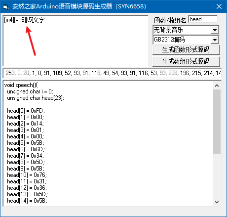
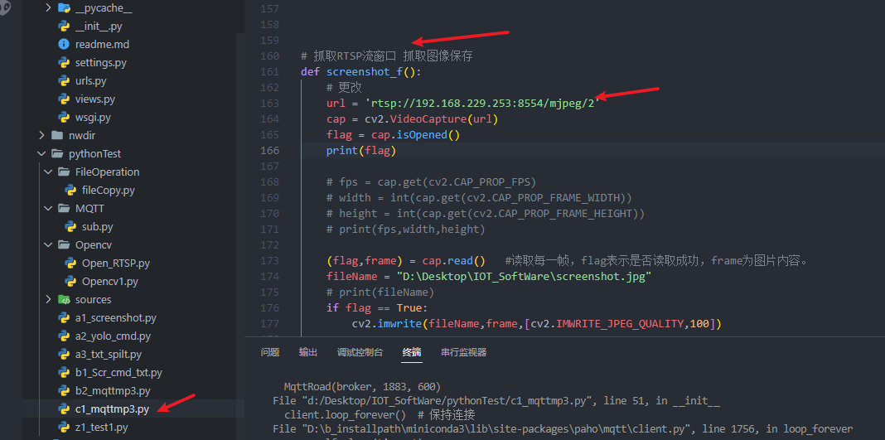
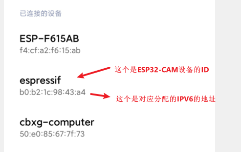
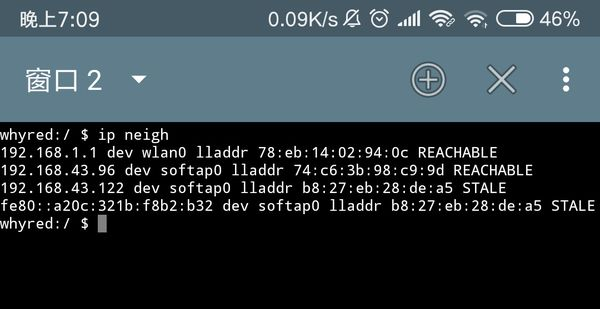

# 语音播报 ♥
<font color="#ffff00">读取本地yolo控制板 语音播报，现在硬件已经能按键触发识别 然后接收到识别的结果</font>
<font color="#ffff00">下一步就是将对应的识别信息进行播报了</font>

上传文件播放 按下按钮则播放：
[ESP8266播放音频文件 - 知乎 (zhihu.com)](https://zhuanlan.zhihu.com/p/37907663)

[图吧小白教程 篇四十：用ESP8266 WIFI模块自制MP3_音频播放器_什么值得买 (smzdm.com)](https://post.smzdm.com/p/awxq4d5g/)

😍github : [earlephilhower/ESP8266Audio：Arduino 库，可在 I3S DAC 上播放 MOD、WAV、FLAC、MIDI、RTTTL、MP2 和 AAC 文件，或在 ESP8266 和 ESP32 上使用软件模拟 Δ-Σ DAC 文件 (github.com)](https://github.com/earlephilhower/ESP8266Audio)

付费：[利用ESP8266Audio库实现ESP8266语音播报功能_物联学长的博客-CSDN博客](https://blog.csdn.net/m0_66347114/article/details/125793124)

---
# 方案1 SAM
Sam is a very small Text-To-Speech (TTS) program written in C

官网：https://simulationcorner.net/index.php?page=sam
[Website of Jan Derogee](https://janderogee.com/projects/SerialSpeechSynthesisSAM/SerialSpeechSynthesisSAM.htm)

搜索关键词：ESP8266SAM 【还是依赖的库名称】

😍付费 这个看起来目前最靠谱的：
[ESP8266SAM:使用SAM端口的ESP8266语音合成_esp32调用tts-其它代码类资源-CSDN文库](https://download.csdn.net/download/weixin_42108778/18315617?spm=1001.2101.3001.6650.13&utm_medium=distribute.pc_relevant.none-task-download-2%7Edefault%7EOPENSEARCH%7ERate-13-18315617-blog-125793124.235%5Ev29%5Epc_relevant_default_base3&depth_1-utm_source=distribute.pc_relevant.none-task-download-2%7Edefault%7EOPENSEARCH%7ERate-13-18315617-blog-125793124.235%5Ev29%5Epc_relevant_default_base3&utm_relevant_index=19)

这个是搬运的：[earlephilhower/ESP8266SAM: Speech synthesis for ESP8266 using S.A.M. port (github.com)](https://github.com/earlephilhower/ESP8266SAM)


😍github第一段有提到：[earlephilhower/ESP8266Audio: Arduino library to play MOD, WAV, FLAC, MIDI, RTTTL, MP3, and AAC files on I2S DACs or with a software emulated delta-sigma DAC on the ESP8266 and ESP32 (github.com)](https://github.com/earlephilhower/ESP8266Audio#installation)


# 方案2 TTS语音合成模块 SYN6288😍 
---
updated: 2023-04-17 21:44 #待办 

淘宝链接 资料：
[SYN6288语音合成模块 文字转语音TTS真人发音 有上位机 喇叭-tmall.com天猫](https://detail.tmall.com/item.htm?app=chrome&bxsign=scdBaNJ6P0-YdRyljFS7qv8EJupuyec0OoKmY1T-ULnOszPTlANVxcFGpWh6eDETU-eOmBWLNamfNqQ9wzo3pz2D7mi4i9EU08iJH1m3GMYH4Dp-A_c3nZRPFnGsqbqYM7j&cpp=1&id=626679473209&price=47.6-48.6&shareUniqueId=20986849964&share_crt_v=1&shareurl=true&short_name=h.UtjXdNO&sourceType=item,item&sp_abtk=gray_1_code_simpleAndroid2&sp_tk=QWxzbmRsTUdRR2c=&spm=a2159r.13376460.0.0&suid=3803e159-fe0d-4def-b3e1-6c5d2f073eb9&tbSocialPopKey=shareItem&tk=AlsndlMGQGg&un=56d835173df514b90f8768acc41474bb&un_site=0&ut_sk=1.YaV48WG3xLkDACjC6cdD9B0Y_21646297_1681732044873.Copy.1)

[Arduino 语音交互 TTS语音合成（一） (zhihu.com)](https://www.zhihu.com/tardis/zm/art/66314323?source_id=1005#:~:text=Arduino%20%E8%AF%AD%E9%9F%B3%E4%BA%A4%E4%BA%92%20TTS%E8%AF%AD%E9%9F%B3%E5%90%88%E6%88%90%EF%BC%88%E4%B8%80%EF%BC%89%201%201.%E4%BB%80%E4%B9%88%E6%98%AFTTS%20TTS%E6%98%AFText%20To%20Speech%E7%9A%84%E7%BC%A9%E5%86%99%EF%BC%8C%E5%8D%B3%E2%80%9C%E4%BB%8E%E6%96%87%E6%9C%AC%E5%88%B0%E8%AF%AD%E9%9F%B3%E2%80%9D%EF%BC%8C%E6%98%AF%E4%BA%BA%E6%9C%BA%E5%AF%B9%E8%AF%9D%E7%9A%84%E4%B8%80%E9%83%A8%E5%88%86%EF%BC%8C%E8%AE%A9%E6%9C%BA%E5%99%A8%E8%83%BD%E5%A4%9F%E8%AF%B4%E8%AF%9D%E3%80%82,...%204%204.%E7%A8%8B%E5%BA%8F%20%E7%A8%8B%E5%BA%8F%E6%98%AF%EF%BC%8C%E9%80%9A%E8%BF%87%E4%B8%B2%E5%8F%A3%EF%BC%8C%E5%B0%86%E6%8C%87%E4%BB%A4%E5%8F%8A%E8%AF%AD%E9%9F%B3%E6%95%B0%E6%8D%AE%E5%8F%91%E9%80%81%E7%BB%99TTS%E8%AF%AD%E8%A8%80%E5%90%88%E6%88%90%E6%A8%A1%E5%9D%97%E3%80%82%20%E5%86%8D%E9%80%9A%E8%BF%87%E8%80%B3%E6%9C%BA%E5%B0%86%E5%90%88%E6%88%90%E5%A5%BD%E7%9A%84%E5%A3%B0%E9%9F%B3%E6%92%AD%E6%94%BE%E5%87%BA%E6%9D%A5%E3%80%82%20...%205%205.%E6%95%88%E6%9E%9C%E5%B1%95%E7%A4%BA)
[arduino调用文本转语音的接口 - 搜索 (bing.com)](https://www.bing.com/search?q=arduino%E8%B0%83%E7%94%A8%E6%96%87%E6%9C%AC%E8%BD%AC%E8%AF%AD%E9%9F%B3%E7%9A%84%E6%8E%A5%E5%8F%A3&qs=n&form=QBRE&sp=-1&lq=0&pq=arduinodiao%27yo%E6%96%87%E6%9C%AC%E8%BD%AC%E8%AF%AD%E9%9F%B3%E7%9A%84%E6%8E%A5%E5%8F%A3&sc=0-22&sk=&cvid=471A33983B9546B48D1AA87801ECD8D2&ghsh=0&ghacc=0&ghpl=)

---
我们与这个芯片“对话”用的不是中文，得首先把中文转换它才能“念出来”，网上有很多这些转换的方法。

？ 能不能在内部现转换
或者匹配之后挨个念 定义一堆已经存好的固定字 组合就行这样子

## 实现构思
如果是逐个匹配来语音播报，那么我发布的识别消息我改成十进制的字符串发送到硬件，默认每一个种类的数量允许0-9。


在硬件处定义speech();函数 等着匹配
在硬件处收到消息后，将字符串分隔/<span style="background:#ff4d4f">拆分</span>并以类似`message == "0000"`这样判断策略对每一个进行判断和播报，中间穿插合适的过度语句播报。


[在 Arduino 中拆分字符串 | D栈 - Delft Stack](https://www.delftstack.com/zh/howto/arduino/arduino-split-string/)


```c
String My_S = "hello world";

void setup(){
    Serial.begin(9600);
}
void loop(){
    String sub_S = My_S.substring(0,5);
    Serial.println(sub_S);
    delay(1000);
}
# 输出：hello
# 字符串拆分将从 0 开始，包括 0 索引字符，并在索引 5 结束，不包括索引 5 处的字符。
```

## 代码：收到的message拆分 组合打印


```c
String message = "33333563";

void setup(){
    Serial.begin(115200);
}
void loop(){
   mp3(message);
   delay(3000);


}


void mp3(String message1){
  // 0 1 2 4 7
    String sub_0 = message.substring(0,1);//人
    String sub_1 = message.substring(1,2);//自行车
    String sub_2 = message.substring(2,3);//汽车
    String sub_4 = message.substring(4,5);//公交车
    String sub_7 = message.substring(7,8);//狗
    int sub_0_int =(sub_0).toInt();
    int sub_1_int =(sub_1).toInt();
    int sub_2_int =(sub_2).toInt();
    int sub_4_int =(sub_4).toInt();
    int sub_7_int =(sub_7).toInt();
   

   if(message == "00000000"){
    Serial.println("前方未检测到任何事物");
  }
  else{
    //在此拆分到4个变量当中 String的大的转到四个小的 int abcd变量 需要强制转换一下 貌似不需要 字符串判断就行
    Serial.print("前方共有");
    
    switch(sub_0_int){//人
      case 0: ; break; //没有检测到a 不播报
      case 1: Serial.print("1");Serial.println("个人"); break; //检测到1个a ,播报 '一'
      case 2: Serial.print("2");Serial.println("个人"); break; //检测到1个a ,播报 '一'
      case 3: Serial.print("3");Serial.println("个人"); break; //检测到1个a ,播报 '一'
    }
    

    switch(sub_1_int){//自行车
      case 0: ; break; 
      case 1: Serial.print("1");Serial.println("辆自行车"); break; //检测到1个a ,播报 '一'
      case 2: Serial.print("2");Serial.println("辆自行车"); break; //检测到1个a ,播报 '一'
      case 3: Serial.print("3");Serial.println("辆自行车"); break; //检测到1个a ,播报 '一'
    }


    switch(sub_2_int){//汽车
      case 0: ; break; 
      case 1: Serial.print("1");Serial.println("辆汽车"); break; //检测到1个a ,播报 '一'
      case 2: Serial.print("2");Serial.println("辆汽车"); break; //检测到1个a ,播报 '一'
      case 3: Serial.print("3");Serial.println("辆汽车"); break; //检测到1个a ,播报 '一'
    }


     switch(sub_4_int){//公交车
      case 0: ; break; 
      case 1: Serial.print("1");Serial.println("辆公共汽车"); break; //检测到1个a ,播报 '一'
      case 2: Serial.print("2");Serial.println("辆公共汽车"); break; //检测到1个a ,播报 '一'
      case 3: Serial.print("3");Serial.println("辆公共汽车"); break; //检测到1个a ,播报 '一'
    }


     switch(sub_7_int){//狗
      case 0: ; break; 
      case 1: Serial.print("1");Serial.println("条狗"); break; //检测到1个a ,播报 '一'
      case 2: Serial.print("2");Serial.println("条狗"); break; //检测到1个a ,播报 '一'
      case 3: Serial.print("3");Serial.println("条狗"); break; //检测到1个a ,播报 '一'
    }
 }


}

```


## 图片：串口组合实现结果 ♥
先用串口打印模拟 完全正确 完全合适


目前只支持每种物品最多三个 因为太多了我怕语音播报占空太多 我怕太卡了


## 细节：语音组合实现结果
2023.04.21 下午 正确实现了语音播报 组合播报内容


### 硬件代码需要注意
串口通信速率必须保持一致  我全设置成9600了
```c
//由于Arduino IDE编码问题，在Arduino上使用时需要将要发送的文字转化成16进制发送，请使用Arduino函数生成器转换
//此处发送内容为：[m4][v16][t5]欢迎使用绿深旗舰店SYN6288语音合成模块
//m[0~16]:0背景音乐为静音，16背景音乐音量最大
//v[0~16]:0朗读音量为静音，16朗读音量最大
//t[0~5]:0朗读语速最慢，5朗读语速最快
//其他不常用功能请参考数据手册
```

1. 语音模块源码生成器需要在前方添加三个关键字自定义背景音乐和朗读声音以及朗读语速


2. 注意延时
   这个转码时间好像不是必须的 延时是必须的 不然播报不完就停了

```c
  delay(500);//好像需要一点短暂的转码的时间 在播报之前一点短暂的延时
  speech();//假如 5s才能说完 下面就要5000ms的延时 否则播报不完全
  delay(5000); //5s的延时 等待完全播报完成
  
  delay(500);//短暂的转码下面这个句子的
  speech1();//假如3s才能说完
  delay(3000); //3s的延时 等待完全播报完成
```

### 软件代码需要注意
1. 注意摄像头RTSP流地址的替换 每次局域网自动热点分配的ip不一定


`ip的查看方式`
由于我ESP32-CAM的 RTSP方式播放程序已经烧录进去了 下次只需要插上电就会自动连接我的热点
热点名称：cbxg
热点密码：12345678


#### 如何查看连接到手机热点的ip地址
安装一个 [android terminal](https://jackpal.github.io/Android-Terminal-Emulator/downloads/Term.apk) ( 安卓命令行),这是一个开源程序，目的是在安卓上也模拟出命令行的效果，安装成功后就是一个和linux 命令行相似的界面，它可以支持部分的指令，(当一个$符号出现时，说明它在等待用户输入命令，如果没有$符号试试，按加号新建一个窗口）， 输入指令 **ip neigh** 就能获得相关的ip地址信息啦！结果图如下：
第一行 wlan0 是手机热点自身的ip地址，其后是手机"网卡"的mac地址，下面两个就是连到手机上的两个设备的ip地址,


## 运行流程


# 软件代码

```python
# tag 更改
# 融合图像识别并发布 抓取RTSP流窗口 抓取图像保存
# 2023.04.16 created by 徐梦昊
# python3.6
# -*- coding: utf-8 -*-
import paho.mqtt.client as mqtt
import random

# -*- coding: UTF-8 -*-
# cmd依赖
import os, sys, re

# 截图指定hwnd的窗口 并截图保存
# 先引入依赖包 pip install PyQt5
# 最开始运行的时候先注释掉下面的hwnd 以下的程序 因为hwnd我要先跑上面的程序获取 可以先放开下一行hwnd万金油运行一遍 这样不用注释
# 截图依赖
import win32gui
import win32con
from PyQt5.QtWidgets import QApplication
from PIL import ImageGrab

# import win32com
import win32com.client
import pythoncom

# opencv 抓取rtsp视频流
import cv2

# 文件移动
import shutil


broker = 'broker.emqx.io'
port = 1883
topic_button = "cc36e70148924ef2bb2e1d477c24675f_button" # 订阅这个主题 等待按键发布“1”
topic_mp3 = "cc36e70148924ef2bb2e1d477c24675f_mp3" # 将识别信息发布到这个主题
# generate client ID with pub prefix randomly
client_id = f'python-mqtt-{random.randint(0, 100)}'


# 订阅函数
class MqttRoad(object):
 
    def __init__(self, mqtt_host, mqtt_port, mqtt_keepalive):
        super(MqttRoad, self).__init__()
        client = mqtt.Client()
        client.on_connect = self.on_connect
        client.on_message = self.on_message
        client.on_publish = self.on_publish
        client.connect(mqtt_host, mqtt_port, mqtt_keepalive)  # 600为keepalive的时间间隔
        client.loop_forever()  # 保持连接
 
    def on_connect(self, client, userdata, flags, rc):
        print("Connected with result code: " + str(rc))
        # 订阅 #tag
        client.subscribe(topic_button)
 
 
    def on_message(self, client, userdata, msg):
        print("on_message topic:" + msg.topic + " message:" + str(msg.payload.decode('utf-8')))
        strmqtt = str(msg.payload.decode('utf-8'))
        #tag 接收消息 进行判断
        if strmqtt == "1":
            print("接收到按键请求，请求发布画面识别的语音播报,下面开始依次抓取、执行识别命令、处理文本、发布消息！")
            screenshot_f()
            print("抓取成功！下面执行yolo算法---")

            getcmd_f()
            print("执行识别命令已经成功完成！")

            file_f()
            print("图像识别画面文件移动已经成功完成！")

            txt_spilt_f()
            print("处理文本成功完成！")

            publish()
            print("识别信息已发布成功！")
        else:
            print("未收到正确按键请求 占空用")
        
 
    #   订阅回调
    def on_subscribe(self, client, userdata, mid, granted_qos):
        print("On Subscribed: qos = %d" % granted_qos)
        pass
 
    #   取消订阅回调
    def on_unsubscribe(self, client, userdata, mid):
        # print("取消订阅")
        print("On unSubscribed: qos = %d" % mid)
        pass
 
    #   发布消息回调
    def on_publish(self, client, userdata, mid):
        # print("发布消息")
        print("On onPublish: qos = %d" % mid)
        pass
 
    #   断开链接回调
    def on_disconnect(self, client, userdata, rc):
        # print("断开链接")
        print("Unexpected disconnection rc = " + str(rc))
        pass
 
# 发布函数
def publish():
    def on_connect(client, userdata, flags, rc):
        print ("链接")
        print("Connected with result code: " + str(rc))
    
    
    def on_message(client, userdata, msg):
        print ("消息内容")
        print(msg.topic + " " + str(msg.payload))
    
    
    #   订阅回调
    def on_subscribe(client, userdata, mid, granted_qos):
        print ("订阅")
        print("On Subscribed: qos = %d" % granted_qos)
        pass
    
    
    #   取消订阅回调
    def on_unsubscribe(client, userdata, mid, granted_qos):
        print ("取消订阅")
        print("On unSubscribed: qos = %d" % granted_qos)
        pass
    
    
    #   发布消息回调
    def on_publish(client, userdata, mid):
        print ("发布消息")
        print("On onPublish: qos = %d" % mid)
        pass
    
    
    #   断开链接回调
    def on_disconnect(client, userdata, rc):
        print ("断开链接")
        print("Unexpected disconnection rc = " + str(rc))
        pass
    
    
    client = mqtt.Client()
    client.on_connect = on_connect
    client.on_message = on_message
    client.on_publish = on_publish
    client.on_disconnect = on_disconnect
    client.on_unsubscribe = on_unsubscribe
    client.on_subscribe = on_subscribe
    client.connect(broker, 1883, 600) # 600为keepalive的时间间隔

    # client.publish(topic_mp3, payload='前方共有1个人 3辆汽车 1条狗 ', qos=0, retain=False) #tag发布消息
    client.publish(topic_mp3, payload = message2, qos=0, retain=False) #message1为完整信息 message2为8位代码
    


# 抓取RTSP流窗口 抓取图像保存
def screenshot_f():
    # 更改
    url = 'rtsp://192.168.229.253:8554/mjpeg/2'
    cap = cv2.VideoCapture(url)
    flag = cap.isOpened()
    print(flag)

    # fps = cap.get(cv2.CAP_PROP_FPS)
    # width = int(cap.get(cv2.CAP_PROP_FRAME_WIDTH))
    # height = int(cap.get(cv2.CAP_PROP_FRAME_HEIGHT))
    # print(fps,width,height)

    (flag,frame) = cap.read()   #读取每一帧，flag表示是否读取成功，frame为图片内容。
    fileName = "D:\Desktop\IOT_SoftWare\screenshot.jpg"
    # print(fileName)
    if flag == True:
        cv2.imwrite(fileName,frame,[cv2.IMWRITE_JPEG_QUALITY,100])

    cap.release() # 释放摄像头
    cv2.destroyAllWindows()# 释放并销毁窗口


# yolo 的cmd调用 生成覆盖的txt文本文件
def getcmd_f():
	'''
	处理图片
	:param url:图片地址
	:return: 图片中的人数
	'''
	cmd = r'd: && python D:\Desktop\yolov5-7.0\detect.py --weights yolov5s.pt --conf-thres 0.6 --source D:\Desktop\IOT_SoftWare\screenshot.jpg --save-txt --class 0 1 2 3 5 9 13 16  --exist-ok'
	text = os.popen(cmd).readlines()
	print(text) #读不出来 只好读txt文件了


# txt文本信息处理
def txt_spilt_f():
    f=open("D:/Desktop/yolov5-7.0/runs/detect/exp/labels/screenshot.txt","r", encoding = 'utf-8',errors='ignore')
    txt = [0,0,0,0,0,0,0,0]
    for line in f:
        # print(line.split(' ')[0]) # 一步到位
        # a = line.split(' ')[0] # a为以空格分隔之后的首个元素  仍为字符类型
        a = int(line.split(' ')[0]) # a为以空格分隔之后的首个元素[0]  每一行一共五列 [0]-[4] 
        # print(a)
        if a == 0:# 人
            txt[0] = txt[0] +1
        if a == 1: # 自行车
            txt[1] = txt[1] +1
        if a == 2: # 汽车
            txt[2] = txt[2] +1
        if a == 3: # 摩托车
            txt[3] = txt[3] +1
        if a == 5: # 公共汽车
            txt[4] = txt[4] +1
        if a == 9: # 交通灯
            txt[5] = txt[5] +1
        if a == 13: # 长椅
            txt[6] = txt[6] +1
        if a == 16: # 狗
            txt[7] = txt[7] +1

    message = ""
    if txt[0] != 0:# 人
        message = str(txt[0]) +"个人 "
    if txt[1] != 0: # 自行车
        message = message +  str(txt[1]) +"辆自行车 "
    if txt[2] != 0: # 汽车
        message = message +  str(txt[2]) +"辆汽车 "
    if txt[3] != 0: # 摩托车
        message = message +  str(txt[3]) +"辆摩托车 "
    if txt[4] != 0: # 公共汽车
        message = message +  str(txt[4]) +"辆公共汽车 "
    if txt[5] != 0: # 交通灯
        message = message +  str(txt[5]) +"个交通灯 "
    if txt[6] != 0: # 长椅
        message = message +  str(txt[6]) +"个长椅 "
    if txt[7] != 0: # 狗
        message = message +  str(txt[7]) +"条狗 "
    global message1 # 识别的完整结果
    global message2 # 识别结果以8个十进制数展示 ，每个种类的数目不能大于9
    message2 = str(txt[0])+str(txt[1])+str(txt[2])+str(txt[3])+str(txt[4])+str(txt[5])+str(txt[6])+str(txt[7])
    message1= "前方共有"+ message
    print("message1:",end="");print (message1)
    print("message2:",end="");print (message2)

def file_f():
        argetdir_path = 'D:\\Desktop\\yolov5-7.0\\runs\\detect\\exp\\screenshot.jpg'
        Targetfile_path = 'D:\\Desktop\\IOT_SoftWare\\app01\\static\\YoloImages\\screenshot_django.jpg'
        shutil.copyfile(argetdir_path, Targetfile_path)

 
if __name__ == '__main__':
    MqttRoad(broker, 1883, 600)

```


# 硬件代码

```c
#include <ESP8266WiFi.h>
#include <PubSubClient.h>
//GPS 经纬度提取分离 library for GPS module
#include <TinyGPS++.h> 
//GPS RX TX 软转 换软串口库
#include <SoftwareSerial.h> 
#include "Timer.h"
#include "pinMapping.h" //引脚定义 直接引用Dx
WiFiClient espClient;
PubSubClient client(espClient);
Timer t;

//SoftwareSerial类库，它可以将你的其他数字引脚通过程序模拟成串口通信引脚 【软件模拟串口】
//ESP8266需要调用软串口库才有这个功能，#include <SoftwareSerial.h>
// The serial connection to the GPS device /GPIO5 D1-RX  GPIO4 D2-TX
TinyGPSPlus gps;
SoftwareSerial ss(4, 5); //RX TX 映射
float latitude;//纬度
float longitude;//经度

// WiFi 
const char* ssid = "cbxg";
const char* password = "12345678";

// MQTT Broker
const char *mqtt_broker = "broker.emqx.io";
const char *topic1 = "cc36e70148924ef2bb2e1d477c24675f_mp3";//终端收 接收请求识别信息01234567
const char *topic2 = "cc36e70148924ef2bb2e1d477c24675f_button";//终端发 按键之后发送1 请求识别信息
const char *topic3 = "cc36e70148924ef2bb2e1d477c24675f_gps";//终端发 GPS固定时间间隔发送
const char *mqtt_username = "root";
const char *mqtt_password = "root0410";
const int mqtt_port = 1883;

//// 超声波 四个引脚 D2 D1 GND 3V3
//// define ultrasonic signal receiver pin  ECHO to D2  GPIO4
//int ECHOPin = D2;  
//// define ultrasonic signal transmitter pin  TRIG to D1  GPIO5
//int TRIGPin = D1;  

//传感器收集变量存储 定义变量
int utlDistance;  //超声波距离 变量存储
double waterHigh;//存储水位
int lightIntensity;//存储光照强度0~99

//三个反应模块 引脚定义
//int ledPinUlt = D3; //超声波距离预警灯光 保留震动用
//int ledPinWater = D4;  //水位过高震动用
int ledPinLight = D3;  //光照过低 灯光点亮提醒路人

int LED = D6;  //用于远程操控灯光  效应器

long lastMsg = 0; //定时器标头

int KEY=D5;//KEY对应D5 
char flag=1;

//GPS组合经纬度的字符串变量
char msg[50];


////////////////////////setup函数/////////////////////////////////////
void setup() {
// 用于串口通信速率设置
    //set the baud rate of serial port to 115200;
    Serial.begin(9600);
    //set the GPS baud rate to 9600;
    ss.begin(9600); 

//用于引脚模式设置
//    //远程控制的灯光 设置为输出模式
//    pinMode(LED, OUTPUT);  
//
//    //本地震动1 超声波过近震动 设置为输出模式
//    pinMode(ledPinUlt, OUTPUT);  
//
//    //本地震动2 水位过高震动 设置为输出模式
//    pinMode(ledPinWater, OUTPUT);  

    //本地光照3 光敏传感器接收的光照过低 点亮 设置为输出模式
    pinMode(ledPinLight,OUTPUT);
  
//    //超声波传感器 两个引脚定义 一个输入 一个输出
//    pinMode(ECHOPin, INPUT); // Sets the echoPin as an Input
//    pinMode(TRIGPin, OUTPUT);// Sets the trigPin as an Output

    //发送图像识别信息请求的按键
    pinMode(KEY,INPUT_PULLUP);//将GPIO14 D5 按键设置为上拉输入模式

  
//用于连接wifi
    WiFi.begin(ssid, password);
    while (WiFi.status() != WL_CONNECTED) {
        delay(500);
        Serial.println("Connecting to WiFi..");
    }
    Serial.println("Connected to the WiFi network");
	  Serial.println("IP 地址: ");
    Serial.println(WiFi.localIP());
  
  
//用于连接mqtt服务代理商
    client.setServer(mqtt_broker, mqtt_port);
    client.setCallback(callback);
    while (!client.connected()) {
        //用mac地址区分唯一ip
        String client_id = "esp8266-client-";
        client_id += String(WiFi.macAddress());
        //输出唯一mac服务地址
        Serial.println("--------Start - connects states ----------");
        Serial.printf("The client %s connects to the public mqtt broker\n", client_id.c_str());
        if (client.connect(client_id.c_str(), mqtt_username, mqtt_password)) {
            Serial.println("Public emqx mqtt broker connected");
        } else {
            Serial.print("failed with state ");
            Serial.print(client.state());
            delay(2000);
        }
        Serial.println("--------End - connects states ----------");
    }
  
  
//MQTT永久订阅以及首个发布测试
    //首个发布测试 发布按键的"1"请求识别信息
    client.publish(topic2, "the first publish test");
    //订阅主题 接收识别信息
    client.subscribe(topic1);

}//setup end


////////////////////////loop函数/////////////////////////////////////
void loop() {

//MQTT重连机制
//  if (!client.connected()) {
//    reconnect();
//  }

//MQTT不断监听信息 用于保持订阅状态
    client.loop();

//每隔两秒调用一次超声波函数 在内部调用发布函数
    long now = millis();
    if (now - lastMsg > 2000) {//延时2s
       lastMsg = now;
       push_Ultrasound_Water();
       KEY_PROS();//按键2S为一个检测周期 刚好 触发视频帧识别
       GPS_push();//GPS mqtt模拟发布
       
}

////GPS的经纬度检测函数
//    while (ss.available() > 0){
//      gps.encode(ss.read()); //The encode() method encodes the string in the encoding format specified by encoding.
//      if (gps.location.isUpdated())
//        {
//          Serial.println("--------Start - GPS - detect & publish----------");
//          latitude = gps.location.lat(); //gps.location.lat() can export latitude
//          longitude = gps.location.lng();//gps.location.lng() can export latitude
//          Serial.print("Latitude=");
//          Serial.print(latitude, 14);  
//          Serial.print(" Longitude=");
//          Serial.println(longitude, 14);
//          String s1 = String(latitude,14);
//          String s2 = String(longitude,14);
//          Serial.println(s1);
//          Serial.println(s2);
////          String data = String(latitude,14) + "," + String(longitude,14) ; 
////          Serial.println(data);
//          char c[50]; //长度50的字符串，还可以char *Buff ;
//          sprintf(c, "%s", "36.56167324381701,116.80781175110624");   
//          client.publish(topic3,c);//向GPS主题发布经纬度信息 '纬度，经度'
//          Serial.printf("Have published %s to the topic of cc36e70148924ef2bb2e1d477c24675f_gps", c); 
//          Serial.println();
//          Serial.println("--------End - GPS - detect & publish----------");
//          delay(3000);
//        }
//}
    


}


////////////////////////自定义函数/////////////////////////////////////

//用于接收消息
void callback(char *topic1, byte *payload, unsigned int length) {
    Serial.println("--------Start - Message arrived ----------");
    Serial.print("Message arrived in topic: ");
    Serial.println(topic1);
    String message;
    for (int i = 0; i < length; i++) {
        //payload 在参数里的类型是 byte*
        message = message + (char) payload[i];  // convert *byte to string
    }
    Serial.print("Message:"); 
    Serial.println(message); //需要语音播报出来
    delay(1000);
    mp3(message);//调用语音匹配函数
    delay(1000);
    Serial.println();
    Serial.println("--------End - Message arrived ----------");
}


//用于发送超声波测到的数据并在超声波测距过近提醒
void push_Ultrasound_Water() {
  

//光照检测  只本地
    Serial.println("--------Start - Light - detect----------");
    Serial.print("光照强度： "); 
    lightIntensity = shine();
    Serial.println(lightIntensity);  //串口监视器显示光照强度
//    Serial.print("\n");  //回车
    if(lightIntensity < 60){
      digitalWrite(ledPinLight,HIGH);//当光照强度小于30，点亮LED D3引脚
    }
    else{
      digitalWrite(ledPinLight,LOW);
    }
    Serial.println("--------End - Light - detect----------");
    

    
////超声波和水位以“10，10.00”形式一起发布,英文逗号分割形成完整字符串发布
//    Serial.println("--------Start - Ultrasound&&Water - publish - ----------");
//    char text[20]; //长度20的字符串，还可以char *Buff ;
//    sprintf(text, "%d%s%lf", utlDistance, "  ,  " , waterHigh); 
//    client.publish(topic,text);
//    Serial.printf("Have published %s to the topic of cc36e70148924ef2bb2e1d477c24675f", text); 
//    Serial.println("--------End - Ultrasound&&Water - publish----------");
}


//光照强度映射函数
int shine(){
  int i=analogRead(A0);//光感模拟口接esp8266AO口
  i=1023-i;
  i=i/10.23-1;   //将光照强度设置为0-99
  return i;
}


//按键处理函数
void KEY_PROS()
{
  if(digitalRead(KEY)==0){
    delay(5);
    if(digitalRead(KEY)==0){ //如果接地了
      client.publish(topic2,"1"); //发布“1” 占位
      Serial.println("已经发送1到button主题.");
    }
  }
  
  else if(digitalRead(KEY)==1){//KEY接地为0 不接地为1
  
  }
  
//  switch (temp){
//    case 1:alarm();break; //插入接地 点亮 发送邮件
//    case 0: ;break; //再插入接地 再按一下 模拟显示端反馈后 再按一下再发送代表误触的邮件
//  }
  
}

//GPS模拟处理函数
void GPS_push()
{
  char c[50]; //长度50的字符串，还可以char *Buff ;
  sprintf(c, "%s", "36.56167324381701,116.80781175110624");   
  client.publish(topic3,c);//向GPS主题发布经纬度信息 '纬度，经度'
  Serial.printf("Have published GPS to the topic of cc36e70148924ef2bb2e1d477c24675f_gps"); 

  
}


//语音播报函数
void mp3(String message){
  // 0 1 2 4 7
    String sub_0 = message.substring(0,1);//人
    String sub_1 = message.substring(1,2);//自行车
    String sub_2 = message.substring(2,3);//汽车
    String sub_4 = message.substring(4,5);//公交车
    String sub_7 = message.substring(7,8);//狗
    int sub_0_int =(sub_0).toInt();
    int sub_1_int =(sub_1).toInt();
    int sub_2_int =(sub_2).toInt();
    int sub_4_int =(sub_4).toInt();
    int sub_7_int =(sub_7).toInt();
   

   if(message == "00000000"){
    delay(1000);speech00();delay(1800);
    Serial.println("前方未检测到事物");//00
  }
  else{
    //在此拆分到4个变量当中 String的大的转到四个小的 int abcd变量 需要强制转换一下 貌似不需要 字符串判断就行
    delay(500);speech01();delay(1500);
    Serial.print("前方共有");//01
    
    switch(sub_0_int){//人
      case 0: ; break; //没有检测到a 不播报
      case 1: delay(500);speech11();delay(800);Serial.print("1");delay(500);speech0();delay(800);Serial.println("个人"); break; //检测到1个a ,播报 '一'
      case 2: delay(500);speech12();delay(800);Serial.print("2");delay(500);speech0();delay(800);Serial.println("个人"); break; 
      case 3: delay(500);speech13();delay(800);Serial.print("3");delay(500);speech0();delay(800);Serial.println("个人"); break; 
    }
    

    switch(sub_1_int){//自行车
      case 0: ; break; 
      case 1: delay(500);speech11();delay(800);Serial.print("1");delay(500);speech1();delay(1500);Serial.println("辆自行车"); break; 
      case 2: delay(500);speech12();delay(800);Serial.print("2");delay(500);speech1();delay(1500);Serial.println("辆自行车"); break;
      case 3: delay(500);speech13();delay(800);Serial.print("3");delay(500);speech1();delay(1500);Serial.println("辆自行车"); break; 
    }


    switch(sub_2_int){//汽车
      case 0: ; break; 
      case 1: delay(500);speech11();delay(800);Serial.print("1");delay(500);delay(500);speech2();delay(1000);Serial.println("辆汽车"); break;
      case 2: delay(500);speech12();delay(800);Serial.print("2");delay(500);delay(500);speech2();delay(1000);Serial.println("辆汽车"); break;
      case 3: delay(500);speech13();delay(800);Serial.print("3");delay(500);delay(500);speech2();delay(1000);Serial.println("辆汽车"); break;
    }


     switch(sub_4_int){//公交车
      case 0: ; break; 
      case 1: delay(500);speech11();delay(800);Serial.print("1");delay(500);speech4();delay(1500);Serial.println("辆公共汽车"); break;
      case 2: delay(500);speech12();delay(800);Serial.print("2");delay(500);speech4();delay(1500);Serial.println("辆公共汽车"); break; 
      case 3: delay(500);speech13();delay(800);Serial.print("3");delay(500);speech4();delay(1500);Serial.println("辆公共汽车"); break; 
    }


     switch(sub_7_int){//狗
      case 0: ; break; 
      case 1: delay(500);speech11();delay(800);Serial.print("1");delay(500);speech7();delay(800);Serial.println("条狗"); break; 
      case 2: delay(500);speech12();delay(800);Serial.print("2");delay(500);speech7();delay(800);Serial.println("条狗"); break;
      case 3: delay(500);speech13();delay(800);Serial.print("3");delay(500);speech7();delay(800);Serial.println("条狗"); break;
    }
 }


}


void speech00(){//前方未检测到事物
  unsigned char i = 0;
  unsigned char head[34];

  head[0] = 0xFD;
  head[1] = 0x00;
  head[2] = 0x1F;
  head[3] = 0x01;
  head[4] = 0x00;
  head[5] = 0x5B;
  head[6] = 0x6D;
  head[7] = 0x34;
  head[8] = 0x5D;
  head[9] = 0x5B;
  head[10] = 0x76;
  head[11] = 0x35;
  head[12] = 0x5D;
  head[13] = 0x5B;
  head[14] = 0x74;
  head[15] = 0x35;
  head[16] = 0x5D;
  head[17] = 0xC7;
  head[18] = 0xB0;
  head[19] = 0xB7;
  head[20] = 0xBD;
  head[21] = 0xCE;
  head[22] = 0xB4;
  head[23] = 0xBC;
  head[24] = 0xEC;
  head[25] = 0xB2;
  head[26] = 0xE2;
  head[27] = 0xB5;
  head[28] = 0xBD;
  head[29] = 0xCA;
  head[30] = 0xC2;
  head[31] = 0xCE;
  head[32] = 0xEF;
  head[33] = 0x98;

  for(i=0; i<34; i++){
    Serial.write(head[i]);
  }
}

void speech01(){//前方共有
  unsigned char i = 0;
  unsigned char head[26];

  head[0] = 0xFD;
  head[1] = 0x00;
  head[2] = 0x17;
  head[3] = 0x01;
  head[4] = 0x00;
  head[5] = 0x5B;
  head[6] = 0x6D;
  head[7] = 0x34;
  head[8] = 0x5D;
  head[9] = 0x5B;
  head[10] = 0x76;
  head[11] = 0x35;
  head[12] = 0x5D;
  head[13] = 0x5B;
  head[14] = 0x74;
  head[15] = 0x35;
  head[16] = 0x5D;
  head[17] = 0xC7;
  head[18] = 0xB0;
  head[19] = 0xB7;
  head[20] = 0xBD;
  head[21] = 0xB9;
  head[22] = 0xB2;
  head[23] = 0xD3;
  head[24] = 0xD0;
  head[25] = 0xC3;

  for(i=0; i<26; i++){
    Serial.write(head[i]);
  }
}

void speech0(){//个人
  unsigned char i = 0;
  unsigned char head[22];

  head[0] = 0xFD;
  head[1] = 0x00;
  head[2] = 0x13;
  head[3] = 0x01;
  head[4] = 0x00;
  head[5] = 0x5B;
  head[6] = 0x6D;
  head[7] = 0x34;
  head[8] = 0x5D;
  head[9] = 0x5B;
  head[10] = 0x76;
  head[11] = 0x35;
  head[12] = 0x5D;
  head[13] = 0x5B;
  head[14] = 0x74;
  head[15] = 0x35;
  head[16] = 0x5D;
  head[17] = 0xB8;
  head[18] = 0xF6;
  head[19] = 0xC8;
  head[20] = 0xCB;
  head[21] = 0xFF;

  for(i=0; i<22; i++){
    Serial.write(head[i]);
  }
}

void speech1(){
  unsigned char i = 0;
  unsigned char head[14];

  head[0] = 0xFD;
  head[1] = 0x00;
  head[2] = 0x0B;
  head[3] = 0x01;
  head[4] = 0x00;
  head[5] = 0xC1;
  head[6] = 0xBE;
  head[7] = 0xD7;
  head[8] = 0xD4;
  head[9] = 0xD0;
  head[10] = 0xD0;
  head[11] = 0xB3;
  head[12] = 0xB5;
  head[13] = 0x8D;

  for(i=0; i<14; i++){
    Serial.write(head[i]);
  }
}

void speech2(){
  unsigned char i = 0;
  unsigned char head[12];

  head[0] = 0xFD;
  head[1] = 0x00;
  head[2] = 0x09;
  head[3] = 0x01;
  head[4] = 0x00;
  head[5] = 0xC1;
  head[6] = 0xBE;
  head[7] = 0xC6;
  head[8] = 0xFB;
  head[9] = 0xB3;
  head[10] = 0xB5;
  head[11] = 0xB1;

  for(i=0; i<12; i++){
    Serial.write(head[i]);
  }
}

void speech4(){
  unsigned char i = 0;
  unsigned char head[16];

  head[0] = 0xFD;
  head[1] = 0x00;
  head[2] = 0x0D;
  head[3] = 0x01;
  head[4] = 0x00;
  head[5] = 0xC1;
  head[6] = 0xBE;
  head[7] = 0xB9;
  head[8] = 0xAB;
  head[9] = 0xB9;
  head[10] = 0xB2;
  head[11] = 0xC6;
  head[12] = 0xFB;
  head[13] = 0xB3;
  head[14] = 0xB5;
  head[15] = 0xAC;

  for(i=0; i<16; i++){
    Serial.write(head[i]);
  }
}

void speech7(){
  unsigned char i = 0;
  unsigned char head[10];

  head[0] = 0xFD;
  head[1] = 0x00;
  head[2] = 0x07;
  head[3] = 0x01;
  head[4] = 0x00;
  head[5] = 0xCC;
  head[6] = 0xF5;
  head[7] = 0xB9;
  head[8] = 0xB7;
  head[9] = 0xCC;

  for(i=0; i<10; i++){
    Serial.write(head[i]);
  }
}

void speech11(){//1
  unsigned char i = 0;
  unsigned char head[20];

  head[0] = 0xFD;
  head[1] = 0x00;
  head[2] = 0x11;
  head[3] = 0x01;
  head[4] = 0x00;
  head[5] = 0x5B;
  head[6] = 0x6D;
  head[7] = 0x34;
  head[8] = 0x5D;
  head[9] = 0x5B;
  head[10] = 0x76;
  head[11] = 0x35;
  head[12] = 0x5D;
  head[13] = 0x5B;
  head[14] = 0x74;
  head[15] = 0x35;
  head[16] = 0x5D;
  head[17] = 0xD2;
  head[18] = 0xBB;
  head[19] = 0xD9;

  for(i=0; i<20; i++){
    Serial.write(head[i]);
  }
}

void speech12(){//2
  unsigned char i = 0;
  unsigned char head[20];

  head[0] = 0xFD;
  head[1] = 0x00;
  head[2] = 0x11;
  head[3] = 0x01;
  head[4] = 0x00;
  head[5] = 0x5B;
  head[6] = 0x6D;
  head[7] = 0x34;
  head[8] = 0x5D;
  head[9] = 0x5B;
  head[10] = 0x76;
  head[11] = 0x35;
  head[12] = 0x5D;
  head[13] = 0x5B;
  head[14] = 0x74;
  head[15] = 0x35;
  head[16] = 0x5D;
  head[17] = 0xC1;
  head[18] = 0xBD;
  head[19] = 0xCC;

  for(i=0; i<20; i++){
    Serial.write(head[i]);
  }
}

void speech13(){//3
  unsigned char i = 0;
  unsigned char head[20];

  head[0] = 0xFD;
  head[1] = 0x00;
  head[2] = 0x11;
  head[3] = 0x01;
  head[4] = 0x00;
  head[5] = 0x5B;
  head[6] = 0x6D;
  head[7] = 0x34;
  head[8] = 0x5D;
  head[9] = 0x5B;
  head[10] = 0x76;
  head[11] = 0x35;
  head[12] = 0x5D;
  head[13] = 0x5B;
  head[14] = 0x74;
  head[15] = 0x35;
  head[16] = 0x5D;
  head[17] = 0xC8;
  head[18] = 0xFD;
  head[19] = 0x85;

  for(i=0; i<20; i++){
    Serial.write(head[i]);
  }
}


 
```
