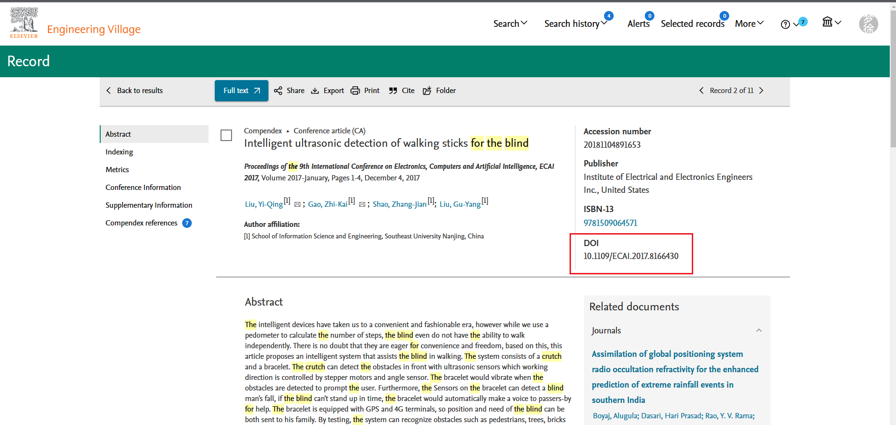
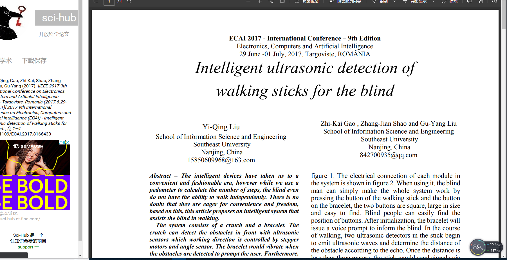

# 大致的时间线
3月中旬完成外文翻译、文献综述以及开题报告的撰写，
4月中旬完成毕业论文的初稿撰写，
5月上旬进行毕业论文查重，
5月中旬准备答辩PPT，
5月20号左右进行答辩，这是大体安排，大家尽量按照这个时间开展毕业设计相关工作。

C8T6  临时够用、RCT6、ZET6  

C8T6
微信小程序
Django

# 任务 2023.01.10通知
假期两个任务：文献综述（5千字）和外文翻译（5千字）。具体格式和参考模版见群共享文件。下学期开学时上交。注意事项：  
1.文献综述是指与你的选题方向有关的技术、应用及理论等方面的知识的总结概括，具体文献到中国知网搜索，一定注意，不是自己要做什么，而是其他人做到什么程度了。
举个栗子：题目基于Java Web的图书信息管理系统的设计与实现，文献搜索图书管理，图书分类，Java web技术，数据库技术等。  
2.外文翻译：搜索一篇相关英文论文或书籍，翻译为中文，中文部分不少于3000字。

## 任务1 文献综述
基于物联网技术的盲人守护系统的设计与实现
对于视觉障碍者来说，其梦寐以求的一件事或许就是能够在室外自由而无顾虑地行走。
根据世界卫生组织发布的首份《世界视力报告》，“目前全球有超过 22 亿人视力受损或失明，其中有超过 10 亿人是因近视、远视、青光眼和白内障等问题未得到必要的治疗所导致。”
对于视力受损的人来说，在不熟悉的路线上行走极具挑战性，因为这可能需要避开障碍物、识别物体以及在室内和室外进行寻路。
通常，视觉障碍者会使用白手杖（White Cane）、导盲犬和电子旅行辅助工具来帮助其探测、保护和辨识路况。其中，白手杖由于其轻巧方便，可有效探测障碍物及路面高低落差以帮助使用者提前规避，从而在一众行动辅具之中脱颖而出，颇受全盲或重度低视力者青睐。
但显然，人们对视觉障碍者这个特殊群体的关注力度并不够，白手杖已经有一个世纪没有进行过有效的升级改造。目前，市场上的导盲拐杖功能单一，无法满足盲人的需求。盲人外出时会遇到各种情况，如遇到障碍物，不清楚路况， 或者因为监护人不在而走丢等。因此，本文利用现代已有技术， 研究出一种新型导盲系统，通过软硬件结合，实现障碍物避障功能，语音提示功能，语音报时功能，角度测量防摔功能以及[GPS定位](https://www.21ic.com/tags/GPS%E5%AE%9A%E4%BD%8D)功能，以帮助盲人解决出行时遇到的问题。

举个栗子：题目基于Java Web的图书信息管理系统的设计与实现，文献搜索图书管理，图书分类，Java web技术，数据库技术等。  
基于物联网技术的盲人守护系统的设计与实现：Django、距离测量、障碍物感应、

## 任务2 外文翻译
[知云文献翻译官网-官方指定最新知云文献翻译及Xtranslator-win+mac版下载页面 (zhiyunwenxian.cn)](http://www.zhiyunwenxian.cn/)

---

百度翻译API 免费版本
ID：20200423000427974
KEY：W2z0fvvxySMT8zdGVGUu

---
### EI：## A Customized Weather Adaptive Blind Crutch Based on Target Recognition Research Using Deep Learning[EI下不了 网站搜不到]
基于深度学习的目标识别研究的定制化天气自适应盲杖

Accession number20213510827358

PublisherAssociation for Computing Machinery

ISBN-13[9781450390200](https://www.engineeringvillage.com/search/submit.url?CID=quickSearchCitationFormat&implicit=true&usageOrigin=recordpage&searchWord1={9781450390200}&section1=BN&database=1&yearselect=yearrange&searchtype=Quick&sort=yr)

DOI10.1145/3469213.3471347

---
### EI：## Intelligent ultrasonic detection of walking sticks for the blind  [√最终选择这个进行翻译下载]
智能超声波检测的盲人手杖
IEEE地址：[Intelligent ultrasonic detection of walking sticks for the blind | IEEE Conference Publication | IEEE Xplore](https://ieeexplore.ieee.org/document/8166430)

Accession number20181104891653

PublisherInstitute of Electrical and Electronics Engineers Inc., United States

ISBN-13[9781509064571](https://www.engineeringvillage.com/search/submit.url?CID=quickSearchCitationFormat&implicit=true&usageOrigin=recordpage&searchWord1={9781509064571}&section1=BN&database=1&yearselect=yearrange&searchtype=Quick&sort=yr)

DOI10.1109/ECAI.2017.8166430

# 任务 2023.03.06通知
近期有关毕业设计的活动:
1、3.16日第四周周四抽查部分同学，参加现场开题答辩。
2、本周周五给4个班统-辅导,针对文献综述、外文翻译、开题报告的撰写技巧、可能存在的共性问题以及注意事项。
3、请老师们以线.上或线下的形式开展小组内开题答辩活动，并查收学生的文献综述、外文翻译、开题报告，3月的最后一周将抽检上述3个文档。
4、今年毕业设计指导过程注意留痕，指导过程拍照片记录，后期也需要填毕设指导过程记录表。
5、没有了疫情的影响，今年的毕业设计质量要提高了，辛苦老师们多和学生联系，督促学生高质量完成毕业设计。

开题比较紧张，大家好好准备一下，先填写开题报告，然后是做开题的ppt，注意事项：1.态度要认真！！！2.文档格式符合标准！3.ppt要做的板正！

1. 本周周五（03.10）上午10：25-12：00，在机电楼A407举行毕业设计辅导，有关文献综述、外文翻译、开题报告等文档的撰写。
2. 同学们在毕业答辩之前，要多记录毕业设计过程，拍照或截图，包括老师指导、同学之间交流、作品制作过程、调研、图书馆查阅资料等环节，在答辩的PPT里呈现毕业设计的完成过程。
3. 拟定第四周周四（03.16）抽查部分同学，现场开题答辩，抽查名单当日公布。

---

