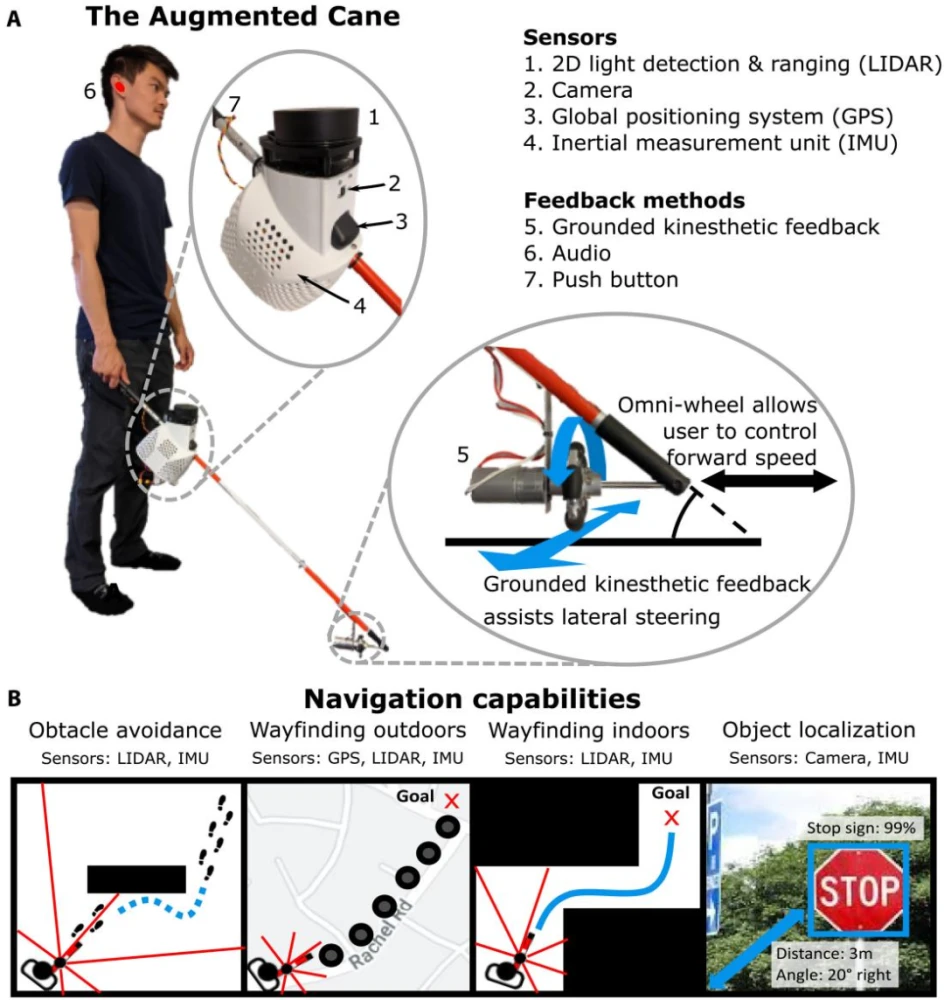
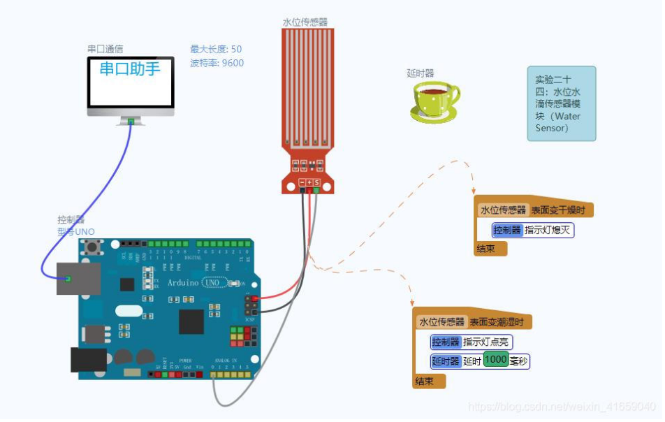
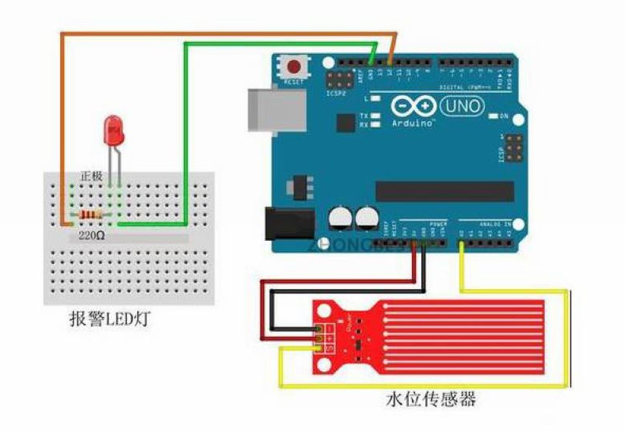
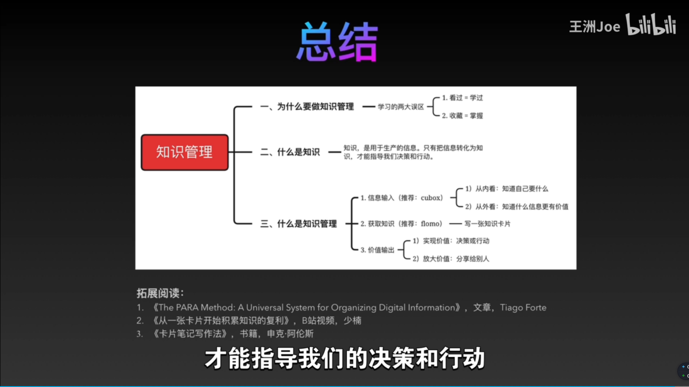

所有的一切只是辅助，需要我们每一个人重视盲人群体。 能治好最好。

一个小知识，盲人站在原地高举盲杖，是在求助，大家有余力尽量去帮忙哦

有很多的盲人选择一直不出门 以前以为没多少盲人

你可能没去了解过。大连导盲犬基地是国内唯一一家有资质的导盲犬训练基地。但从2005年成立至今共培训了240条左右，每条导盲犬工作平均8年左右。所以也就是说现存的大概在100多条。

# 基于物联网技术的盲人守护系统的设计与实现

摘要：随着物联网技术的发展，盲人守护系统已经成为一种重要的技术应用，它可以帮助盲人更加安全和自主地生活。本文提出了一种基于物联网技术的盲人守护系统的设计与实现。该系统由三个部分组成：盲人定位系统、智能安全监护系统和智能交互系统。盲人定位系统使用GPS和基站定位技术来实时监控盲人的位置，以便在紧急情况下及时发出报警信号。智能安全监护系统使用传感器网络技术，可以检测到盲人在室内的行走，并及时发出警报。智能交互系统使用语音识别技术，可以为盲人提供实时的语音指令，以帮助盲人更好地掌握周围的环境。本文将详细介绍这三个系统的设计与实现，以及它们之间的协同工作。最后，将提出一些可能的未来工作，以改善系统的性能和可靠性。

关键词：物联网；盲人守护系统；定位技术；传感器网络；语音识别

背景：中国是世界上盲人最多的国家，盲人的生理缺陷直接影响了本人的生活。基于盲人数量众多，但服务于盲人的产品却少之又少，结合物联网技术解决盲人出行不便等一系列问题。  
具体任务：  
1.设计制造出便于盲人使用的多功能拐杖样品，能够探测高速移动的障碍物，并且能够在一定范围内精准的报出障碍物与盲人的距离，具有光线感应作用，能够辨别白天与黑天，并根据光线的强弱，led灯开始闪烁，提醒行人和车辆避让。  
2.设计制造出辅助盲人到达指定目的地的智能鞋样品，安装有定位和振动装置，能够获取当前位置并根据提前规划好的路线图进行拐弯提醒，这双鞋在需要左拐的时候左鞋振动，右侧同。随着和目的地的不断接近，振动也会越来越强烈。  
3.设计制作出和盲人家人互动的警醒系统，实时检测拐杖姿态数据，当检测到拐杖掉落时提醒家人并发送盲人所处位置，拐杖设置有主动求助🆘按钮，将盲人所处位置和求救信信息发送给指定联系人。

# Sense 5——这个拐杖可以最大程度的帮助失明者感受世界，带你出行无阻!
深入了解“Sense Five拐杖” 由德国工作室Werteloberfell设计
“Sense Five拐杖”！
Sense 5看起来像是普通的拐杖，但通过将智能传感器集成到手柄中，Sense 5可以与用户进行交流，从而使他们知道周围的事物。这一切都始于感官五的塑造方式。其独特的“ 7”字形具有一定的原因，可以帮助视障人士轻松浏览周围的环境。操纵杆的倾斜设计使用户可以本能地正确握住它。手柄水平握持，摇杆自然向前倾斜，使用户在穿越空间时可以轻敲周围的环境。前面的摄像头可主动捕获图像，识别物体和障碍物，而简单的开关可让您切换手电筒以在晚上使用棍子。

到目前为止，手柄必须是我最喜欢的细节之一。它优雅，纤薄，并具有独特的动态表面，可根据指令“弹起”，几乎具有动物的本能。当摄像头注意到用户附近的障碍物时，手柄的3D表面就会栩栩如生，向用户发出警报。触觉响应非常容易识别（特别是考虑到用户的手掌一直与手柄接触），并且比音频提示更加有效，提示可能会在嘈杂的环境中丢失或在安静的环境中打扰。

然而，感官五不仅是其所有者的拐杖。它可以帮助将用户的状态传达给周围的其他人。正面的手电筒在背面配有红色的尾灯，可帮助人们在光线不足的情况下识别操纵杆和使用者。在晚上（尤其是当您需要过马路时）效果非常好，手电筒和尾灯是功能的又一个示例，这些功能超越和超越了视障用户在生活中导航时保持的安全和声音。

[他们为视障人士设计了一款智能手杖，让出行更安全更自信 - 知乎 (zhihu.com)](https://zhuanlan.zhihu.com/p/39472240)

[【技术前哨】智能手杖：无需明视，可观万物 - 知乎 (zhihu.com)](https://zhuanlan.zhihu.com/p/59785588)
[WeWALK Smart Cane – Smart Cane for the Visually Impaired](https://wewalk.io/en/)
视频：https://cbxg001.oss-cn-hangzhou.aliyuncs.com/bishe/%E6%8A%80%E6%9C%AF%E5%89%8D%E5%93%A8%20-%20%E6%99%BA%E8%83%BD%E6%89%8B%E6%9D%96%E3%80%90%E5%90%AF%E7%A4%BA%EF%BC%9A%E9%85%8D%E9%9F%B3%E8%BD%AC%E5%8F%98%2B%E6%96%B0%E9%97%BB%E8%83%8C%E6%99%AF%E9%9F%B3%E3%80%91.mp4

# 斯坦福团队推出新型盲人手杖，可代替导盲犬进行自动导航

# 智能拐杖一般都有哪些功能？ - 知乎

> 本文由 [简悦 SimpRead](http://ksria.com/simpread/) 转码， 原文地址 [www.zhihu.com](https://www.zhihu.com/question/36887137) 

**[英唐众创智能老人拐杖](https://www.zhihu.com/search?q=%E8%8B%B1%E5%94%90%E4%BC%97%E5%88%9B%E6%99%BA%E8%83%BD%E8%80%81%E4%BA%BA%E6%8B%90%E6%9D%96&search_source=Entity&hybrid_search_source=Entity&hybrid_search_extra=%7B%22sourceType%22%3A%22answer%22%2C%22sourceId%22%3A278988783%7D)解决方案**

**比较实用的功能应该就是定位寻找啦，这也是来人拐杖最主要的一个功能了。**

科技以人为本，基于这个看护难点，英唐众创推出智能拐杖方案，将核心的[定位寻踪](https://www.zhihu.com/search?q=%E5%AE%9A%E4%BD%8D%E5%AF%BB%E8%B8%AA&search_source=Entity&hybrid_search_source=Entity&hybrid_search_extra=%7B%22sourceType%22%3A%22answer%22%2C%22sourceId%22%3A278988783%7D)、一键求救、双向通话等科技功能整合到拐杖中，不仅解决老人出行安全问题，而且还能通过智能功能强化子女和老人联系。

 **[无碍智能拐杖](https://www.zhihu.com/search?q=%E6%97%A0%E7%A2%8D%E6%99%BA%E8%83%BD%E6%8B%90%E6%9D%96&search_source=Entity&hybrid_search_source=Entity&hybrid_search_extra=%7B%22sourceType%22%3A%22answer%22%2C%22sourceId%22%3A278988783%7D)正式推出心系老人智能守护**

无碍智能拐杖包括两部分：硬件和软件。软件以 APP 的形式安装在子女的手机里，硬件即为拐杖，被老人随身携带。老人在遇到突发事件时，可以通过拐杖一键向子女求助，而作为[监护人](https://www.zhihu.com/search?q=%E7%9B%91%E6%8A%A4%E4%BA%BA&search_source=Entity&hybrid_search_source=Entity&hybrid_search_extra=%7B%22sourceType%22%3A%22answer%22%2C%22sourceId%22%3A278988783%7D)的子女则可以通过安装在手机上的 APP 随时掌握老人的位置。如此一来，即使子女不在父母身边时时陪伴，也不用再担心年迈的父母意外走失和遭遇突发事件而无人知晓的窘境。

 **智能老人拐杖功能特点**

**1、SOS 紧急呼救**

1) [智能拐杖](https://www.zhihu.com/search?q=%E6%99%BA%E8%83%BD%E6%8B%90%E6%9D%96&search_source=Entity&hybrid_search_source=Entity&hybrid_search_extra=%7B%22sourceType%22%3A%22answer%22%2C%22sourceId%22%3A278988783%7D)系统开启，长按 “SOS 按键” 几秒，直到智能拐杖开始拨打 SOS 号码，才表示紧急求救功能开始工作。紧急呼救开启后，拐杖会自动循环拨打 APP 上已设置的 SOS 号码两次，如果无人接听，则拐杖会自动发出报警声 (大于 80 分贝，以便引起路人注意)。如果需要停止拨号，短按“电源键” 挂掉; 如果需要中断报警，则短按“SOS 按键”。

2) 如果关爱者没有及时接听求救电话，看到未接电话后，可以直接回拨或者通过 APP 查询拐杖使用者当前定位，了解最新状况。

**2、GPS 实时定位**

实时定位：APP 点击 “实时定位” 按钮可对智能拐杖进行反向定位，可查询拐杖使用者的最新定位信息并实现一键导航。

**3、历史轨迹查询**

历史轨迹：点击 “轨迹查询按钮” 可查看智能拐杖以往所有的行走轨迹，点击轨迹点可显示定位时间与具体位置。

**4、FM 收音机 / MP3 [播放器](https://www.zhihu.com/search?q=%E6%92%AD%E6%94%BE%E5%99%A8&search_source=Entity&hybrid_search_source=Entity&hybrid_search_extra=%7B%22sourceType%22%3A%22answer%22%2C%22sourceId%22%3A278988783%7D)**

1)“F/M”功能 ：当智能拐杖开启时，短按 “功能按键 ”，可以打开“收音机” 或“播放器”播放模式，并且可以实现搜索上一台、搜索下一台随意切换。再次短按则是在二者之间做切换模式，长按几秒可关闭。音量调节：用音量按钮 “+” 或“-”来操作。

2) MP3 功能：当智能拐杖开启时， 短按 “功能按键”，可以打开“收音机” 或“播放器”播放模式，并且可以实现上一首、下一首随意切换。再次短按则是在二者之间做切换模式，长按几秒可关闭。音量调节：用音量按钮 “+” 或“-”来操作。

**5、手电筒照明**

1)三档开关：由上至下分别为 “照明”、“闪灯”、“关闭” 三个档位。

2)“照明” 档：如果夜晚或者光线不好情况下，打开 “照明” 档，可以轻松实现。

3)“闪烁”档：如果前方有行人，打开 “闪烁” 档可以引起行人注意避让; 如果发生紧急情况，打开 “闪烁” 档还可以得到及时施救。

**6、“通话” 和 “远程聆听”**

1)点击 APP 主界面的 “拨打” 按钮，即可直接拨打智能拐杖电话号码。当智能拐杖接收到来电，会语音播报来电的号码，只要按一下 “SOS 按键” 接通即可进行通话。如果需要挂断电话，短按 “电源键” 挂断即可。

2)点击 APP 主界面的 “聆听” 按钮，输入 APP 中已设置的任一 SOS 号码，点击确认即可下发指令。手机会接收来自[手杖](https://www.zhihu.com/search?q=%E6%89%8B%E6%9D%96&search_source=Entity&hybrid_search_source=Entity&hybrid_search_extra=%7B%22sourceType%22%3A%22answer%22%2C%22sourceId%22%3A278988783%7D)号码的回拨电话，接通后，即可实现远程聆听功能。

注：为了有效防止电话骚扰，手杖只能接听 APP 中设置的 “SOS 号码” 和“[亲情号](https://www.zhihu.com/search?q=%E4%BA%B2%E6%83%85%E5%8F%B7&search_source=Entity&hybrid_search_source=Entity&hybrid_search_extra=%7B%22sourceType%22%3A%22answer%22%2C%22sourceId%22%3A278988783%7D)码”。

**7、[电子围栏](https://www.zhihu.com/search?q=%E7%94%B5%E5%AD%90%E5%9B%B4%E6%A0%8F&search_source=Entity&hybrid_search_source=Entity&hybrid_search_extra=%7B%22sourceType%22%3A%22answer%22%2C%22sourceId%22%3A278988783%7D)**

点击 APP 主界面的 “电子围栏” 按钮，可添加或更改电子围栏。如果手杖使用者离开或进入电子围栏所指定的范围，则手杖会自动发出告警到 APP 的“消息中心”，从而实现实时监护。

**8、可伸缩**

根据使用者的身高来调节智能拐杖的长度，切记不要超过可调节的安全范围。

**9、防滑**

智能拐杖的拐尖外面还套有一个防滑头，因为经常使用的原因，防滑头记得勤换。

**10、减震功能**

智能拐杖一般都有 4 节主杆，并且是可伸缩，这样可以满足不同身高的人群使用。4 节主杆中的其中一节就是带有[减震设计](https://www.zhihu.com/search?q=%E5%87%8F%E9%9C%87%E8%AE%BE%E8%AE%A1&search_source=Entity&hybrid_search_source=Entity&hybrid_search_extra=%7B%22sourceType%22%3A%22answer%22%2C%22sourceId%22%3A278988783%7D)，需要就拧开那一节，不需要则拧紧就可以了。

　　随着老年人身体机能的衰退，他们的确需要一些辅助性的[智能产品](https://www.zhihu.com/search?q=%E6%99%BA%E8%83%BD%E4%BA%A7%E5%93%81&search_source=Entity&hybrid_search_source=Entity&hybrid_search_extra=%7B%22sourceType%22%3A%22answer%22%2C%22sourceId%22%3A278988783%7D)来协助他们生活和工作。同时，在这个智能化时代，对于老年人来说，过去不会[上网](https://www.zhihu.com/search?q=%E4%B8%8A%E7%BD%91&search_source=Entity&hybrid_search_source=Entity&hybrid_search_extra=%7B%22sourceType%22%3A%22answer%22%2C%22sourceId%22%3A278988783%7D)还只是感觉 “赶不了时髦”，而今天如果不接触网络，日常生活中实实在在会有诸多不便。

　　推出[老年型智能产品](https://www.zhihu.com/search?q=%E8%80%81%E5%B9%B4%E5%9E%8B%E6%99%BA%E8%83%BD%E4%BA%A7%E5%93%81&search_source=Entity&hybrid_search_source=Entity&hybrid_search_extra=%7B%22sourceType%22%3A%22answer%22%2C%22sourceId%22%3A278988783%7D)的企业及社会各界都应为老年人提供学习掌握智能产品的机会，用最简明的符号和文字来与老年群体进行交互，降低老年人的学习成本。同时，企业在进行产品研发时，应该针对不同的使用者进行功能细分，真正站在使用者角度进行产品设计，并推出模块化智能产品，让智能真正成为老人的 “拐杖”。

---

智能拐杖内置导航系统，可以帮助使用者不迷路，为他们提供出行的安全感和直接需要的帮

助。内置的综合导航装置不仅可以指示位置，还可以作为健康管理设备使用（实时测量脉搏、血压等）并配有传感器和 SOS 求救按钮，一旦按下按钮，系统便会联系帮助中心并将使用者最近的健康资料和所在位置直接传送过去。有的还具有通话功能，方便求助。

---

最近再看一些新东西，随着视觉识别技术的 发展。

未来需要一个专为**盲人设计**的智能手杖。

*   识别前方行人
*   识别障碍物
*   识别道路 / 行人道
*   提醒使用者
*   导航等

造福社会。

---

智能拐杖与普通拐杖不同，除了能安全助行外，还多了一些科技智能的功能。就拿华海技术的智能拐杖来说吧。

功能一：GPS 定位功能，这是智能拐杖的最重要功能之一。这个功能的作用主要是防止用户走失迅速定位的。据我所了解的，有这个 GPS 定位功能的，还会有电子栅栏报警功能，就是设定一个活动范围，如果用户离开了这个范围就报警。那么在购买的时候，可以看看这个定位是否准确。

功能二：智能通话报警。这个报警就是 SOS 的求助功能，可以在拐杖上设置几组紧急求助号码，当发生迷路，摔倒等紧急意外时，用户可以通过 SOS 键向亲人求救。

功能三：照明功能。这个功能在非智能拐杖（即市面上多功能拐杖）上也是标配。亮度大，电耗小，能调节，灯泡坏了是否可更换（这个很重要）是判断标准。再此说句，华海技术智能拐杖前面有个手电筒，后面有个警示环型灯，会起到发亮警示后面行人的作用。

功能四：双向通话。这个功能跟 SOS 紧急呼救功能相关，可以设置几个亲情号码。忘记带电话的时候起到重要的作用。

功能五：MP3，收音机功能。这些功能也是智能拐杖有的。但华海技术研发的智能拐杖没有这点，据我了解，他们在智能拐杖上仅仅保留了这以上几个老人家实用功能

---

有很多老人由于身体机能老化或外力原因受伤而造成行动不便，这种情况下就需要[智能拐杖](https://www.zhihu.com/search?q=%E6%99%BA%E8%83%BD%E6%8B%90%E6%9D%96&search_source=Entity&hybrid_search_source=Entity&hybrid_search_extra=%7B%22sourceType%22%3A%22answer%22%2C%22sourceId%22%3A1590832984%7D来帮助他们出行，给他们增加外出散步的机会，同时，帮助他们完成一些简单的运动动作。如果没有智能拐杖，那么他们的生活将面临诸多不便。那么智能拐杖的功能特点是什么呢？

**1、SOS [紧急呼救](https://www.zhihu.com/search?q=%E7%B4%A7%E6%80%A5%E5%91%BC%E6%95%91&search_source=Entity&hybrid_search_source=Entity&hybrid_search_extra=%7B%22sourceType%22%3A%22answer%22%2C%22sourceId%22%3A1590832984%7D)**

（1）智能拐杖系统开启，长按 “SOS 按键” 几秒，直到智能拐杖开始拨打 SOS 号码，才表示[紧急求救](https://www.zhihu.com/search?q=%E7%B4%A7%E6%80%A5%E6%B1%82%E6%95%91&search_source=Entity&hybrid_search_source=Entity&hybrid_search_extra=%7B%22sourceType%22%3A%22answer%22%2C%22sourceId%22%3A1590832984%7D)功能开始工作。紧急呼救开启后，拐杖会自动循环拨打 APP 上已设置的 SOS 号码两次，如果无人接听，则拐杖会自动发出报警声 (大于 80 分贝，以便引起路人注意)。如果需要停止拨号，短按“电源键” 挂掉; 如果需要中断报警，则短按“SOS 按键”。

（2）如果关联者没有及时接听[求救电话](https://www.zhihu.com/search?q=%E6%B1%82%E6%95%91%E7%94%B5%E8%AF%9D&search_source=Entity&hybrid_search_source=Entity&hybrid_search_extra=%7B%22sourceType%22%3A%22answer%22%2C%22sourceId%22%3A1590832984%7D)，在看到未接电话后可以直接回拨或者通过 APP 查询拐杖使用者当前定位，了解最新状况。

**2、GPS 实时定位**

APP 点击 “实时定位” 按钮可对智能拐杖进行反向定位，可查询拐杖使用者的最新定位信息并实现一键导航。

**3、历史轨迹查询**

点击 “轨迹查询按钮” 可查看智能拐杖以往所有的行走轨迹，点击轨迹点可显示定位时间与具体位置。

**4、手电筒照明**

（1）三档开关：由上至下分别为 “照明”、“闪灯”、“关闭” 三个档位。

（2）“照明” 档：如果夜晚或者光线不好情况下，打开 “照明” 档，可以轻松实现。

（3）“闪烁”档：如果前方有行人，打开 “闪烁” 档可以引起行人注意避让；如果发生紧急情况，打开 “闪烁” 档还可以得到及时施救。

**5、“通话” 和 “远程聆听”**

（1）点击 APP 主界面的 “拨打” 按钮，即可直接拨打智能拐杖电话号码。当智能拐杖接收到来电，会语音播报来电的号码，只要按一下 “SOS 按键” 接通即可进行通话。如果需要挂断电话，短按 “电源键” 挂断即可。

（2）点击 APP 主界面的 “聆听” 按钮，输入 APP 中已设置的任一 SOS 号码，点击确认即可下发指令。手机会接收来自[手杖](https://www.zhihu.com/search?q=%E6%89%8B%E6%9D%96&search_source=Entity&hybrid_search_source=Entity&hybrid_search_extra=%7B%22sourceType%22%3A%22answer%22%2C%22sourceId%22%3A1590832984%7D)号码的回拨电话，接通后，即可实现远程聆听功能。

[老人智能拐杖](https://www.zhihu.com/search?q=%E8%80%81%E4%BA%BA%E6%99%BA%E8%83%BD%E6%8B%90%E6%9D%96&search_source=Entity&hybrid_search_source=Entity&hybrid_search_extra=%7B%22sourceType%22%3A%22answer%22%2C%22sourceId%22%3A1590832984%7D)如果能完美地做到符合以上要求，并且定价合理不虚高，那么[智能老人拐杖](https://www.zhihu.com/search?q=%E6%99%BA%E8%83%BD%E8%80%81%E4%BA%BA%E6%8B%90%E6%9D%96&search_source=Entity&hybrid_search_source=Entity&hybrid_search_extra=%7B%22sourceType%22%3A%22answer%22%2C%22sourceId%22%3A1590832984%7D)将有很大的需求市场。让老人拥有[智能产品](https://www.zhihu.com/search?q=%E6%99%BA%E8%83%BD%E4%BA%A7%E5%93%81&search_source=Entity&hybrid_search_source=Entity&hybrid_search_extra=%7B%22sourceType%22%3A%22answer%22%2C%22sourceId%22%3A1590832984%7D)的体验，追上时代的潮流，他们的生活也会方便很多，子女对老人的安全问题也会比较放心。

# 硬件相关
[单片机学习（四）——ESP8266（最全教程和说明）_sunshineQY的博客-CSDN博客](https://blog.csdn.net/sunshineQY/article/details/80084882)

[Arduino杀手在此！！ESP 8266 NodeMCU小白手把手入门（二）（解惑篇） - 滴漏咖啡 - 博客园 (cnblogs.com)](https://www.cnblogs.com/hilary0614/p/nodemcu.html)

# 画图
[「雕爷学编程」Arduino动手做（24）——水位传感器模块_water sensor原理图_驴友花雕的博客-CSDN博客](https://blog.csdn.net/weixin_41659040/article/details/100539777?utm_medium=distribute.pc_relevant.none-task-blog-2~default~baidujs_baidulandingword~default-0-100539777-blog-116221046.235^v29^pc_relevant_default_base3&spm=1001.2101.3001.4242.1&utm_relevant_index=3)

# PPT

